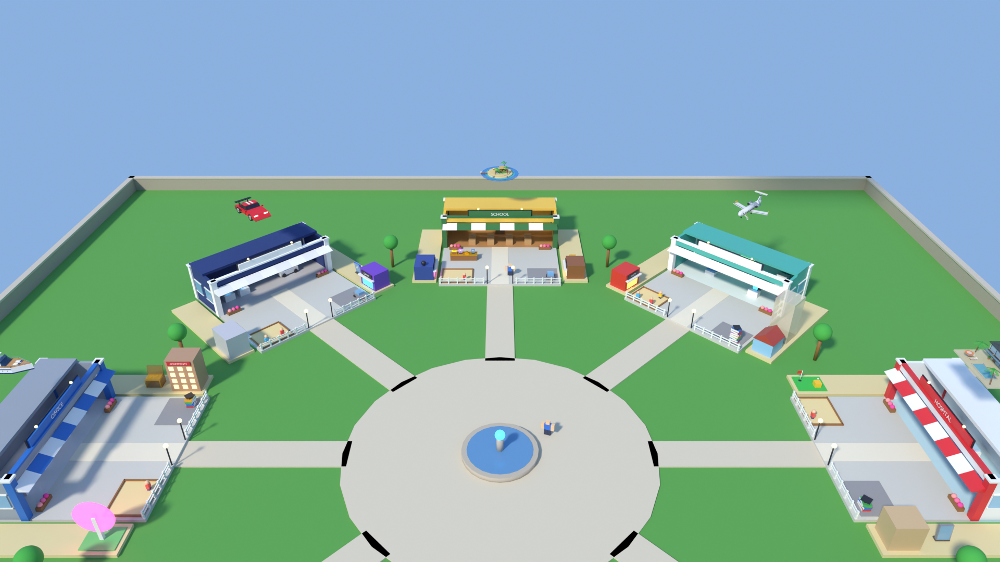

# Inventory - the world of Rags to Riches (Escape the 9 to 5) as it is now

**How this was made.** There is no place file with the world in it: the place only has a Baseplate, and
everything else is built by Luau code when the server starts (`src/server/Lobby.luau`, `src/server/World/*`).
So I ran that exact code (unchanged) on a small copy of the Roblox engine (`tools/luau/roblox_mock.luau`) and
recorded every Part it created, together with the line of code that created it (see DECISIONS.md #2-#3).

What exists:
- **At server start** (always there): the lobby hall, and 4 identical cities (one per room, 700 studs apart),
  each with its plaza, an auction room (400 studs up) and a podium room (250 studs up).
- **During a game**: each player gets a workplace (plot) in the ring around the plaza, with their kids, debts,
  Money Makers, a FOR SALE model, a showcase for investments and their floating dream. To inventory these I filled
  city 1 with 8 players in the middle of a game (one per job) - this is what players look at most.
- **Later in a game** (Catalog, not a real place): the Fast Track workplace after escaping, the locked/won dream,
  every Money Maker and investment, every debt at small and big size, and the dreams at full size.



## Summary

| | count |
|---|---|
| Parts built by the code (all areas, incl. catalog) | 3185 |
| Visible objects in the world (lobby + 4 cities + rooms, city 1 in mid-game) | 473 |
| Extra objects in the catalog (appear later in a game) | 103 |
| Different models needed (templates; color/size variants counted separately) | 125 |
| Different object types | 98 |
| SCRIPT-REFERENCED object types | 50 |

| category | object types | objects in world | objects in catalog |
|---|---|---|---|
| buildings | 18 | 41 | 15 |
| vehicles | 7 | 9 | 6 |
| props | 39 | 116 | 47 |
| nature | 3 | 37 | 1 |
| ground | 11 | 156 | 18 |
| decoration | 15 | 97 | 16 |
| signs | 5 | 17 | 0 |

## Hierarchy (Workspace)

```
Workspace
├── Baseplate                         (512 x 20 x 512 grass; scripts raycast it by name)
├── Lobby            [tag Area]       hall, room booths, trophy, palms, benches, spawn
│   └── Decor                         4 potted palms (Model)
├── City_1 .. City_4 [tag Area]       one city per room, x = 700, 1400, 2100, 2800
│   ├── Plots
│   │   └── Plot_<player> (Model)     one per player, in a ring (radius 115) around the plaza
│   │       ├── Workplace             building, yard, lots, fence, lamps, flowers, sandbox, furniture
│   │       ├── Kids                  Model 'Kid' x0-4 (tag Kid)
│   │       ├── Debts                 Model '<debt name>' + 'Pay' prompt
│   │       ├── MoneyMakers           Model '<maker name>' on the 8 lots (stacked when full)
│   │       ├── ForSale               see-through Model '<maker name>' + invisible buy button (prompt)
│   │       ├── Dream                 floating dream Model (tag Spin) / pedestal + chains on the Fast Track
│   │       └── Collection            showcase table + mini investments
│   └── Plaza                         ground, wall, plaza, paths, trees, fountain
├── AuctionRoom_1 .. _4 [tag Area]   room, stage (+ folder Item), 8 bidder desks, signs
└── PodiumRoom_1 .. _4  [tag Area]   floor, backdrop, light strips, 3 podium blocks, board
```

## Every object type, by category

Size = width x height x depth in studs (the player is 5 studs tall). `SCRIPT` = SCRIPT-REFERENCED (names and
hierarchy must stay identical). `GEOM` = code places things on it or measures it (heights/bounding box must stay).
Instances: W = in the world (all 4 cities counted), C = catalog only. Variants are the same model in another color or size.

### Buildings

| type | what it is | size (studs) | parts | instances | variants | main colors | materials | refs |
|---|---|---|---|---|---|---|---|---|
| AuctionRoom_Shell | Closed auction room: floor, walls, roof | 65 x 26 x 51 | 6 | W 4 / C 0 | 1 | `#6E1E28` `#5A3C28` `#281419` | SmoothPlastic, WoodPlanks |  |
| Dream_BeachVilla | Dream: beach villa | 40 x 13.2 x 33.4 | 77 | W 2 / C 1 | 1 | `#373A44` `#AF784B` `#966941` `#E4D7BE` | Glass, Grass, Limestone, Metal, Neon, SmoothPlastic, Wood | SCRIPT GEOM |
| Lobby_RoomBooth | Room door: arch with glowing portal, colored platform (join trigger) and sign | 27.2 x 18.8 x 21.4 | 10 | W 4 / C 0 | 4 | `#EB5050` `#F5BE28` `#282832` | Metal, Neon, SmoothPlastic | SCRIPT |
| Lobby_Walls | Lobby hall walls with gold trim | 148.8 x 27 x 100.8 | 8 | W 1 / C 0 | 1 | `#2D324B` `#F5BE28` | Metal, SmoothPlastic |  |
| Lobby_Window | Glass window in the lobby side wall | 0.6 x 10 x 14 | 1 | W 6 / C 0 | 1 | `#96D2FF` | Glass |  |
| Maker_Apartment | Money Maker / investment: Apartment | 8 x 8 x 7.2 | 7 | W 1 / C 1 | 1 | `#FFEB96` `#D2B48C` | Neon, SmoothPlastic | SCRIPT GEOM |
| Maker_ApartmentBuilding | Money Maker / investment: Apartment Building | 9 x 12 x 7.3 | 14 | W 1 / C 1 | 1 | `#FFEB96` `#BE9678` `#C83232` | Neon, SmoothPlastic | SCRIPT GEOM |
| Maker_BowlingAlley | Money Maker / investment: Bowling Alley | 10 x 8 x 8.7 | 5 | W 1 / C 1 | 1 | `#282832` `#3C50A0` `#FF78C8` `#F5F5F5` | Neon, SmoothPlastic | SCRIPT GEOM |
| Maker_CarWash | Money Maker / investment: Car Wash | 9 x 7 x 7.2 | 5 | W 2 / C 2 | 1 | `#3C8CE6` `#46A0E6` | Neon, SmoothPlastic | SCRIPT GEOM |
| Maker_CoffeeShop | Money Maker / investment: Coffee Shop | 8 x 6 x 8.2 | 4 | W 1 / C 1 | 1 | `#965F3C` `#FFDCA0` `#F5F5F5` `#282832` | Neon, SmoothPlastic | SCRIPT GEOM |
| Maker_GameStudio | Money Maker / investment: Game Studio | 9 x 7 x 8.2 | 4 | W 1 / C 1 | 1 | `#7846C8` `#50E6FF` `#F5F5F5` `#282832` | Neon, SmoothPlastic | SCRIPT GEOM |
| Maker_Hotel | Money Maker / investment: Hotel | 8 x 16 x 7.3 | 17 | W 1 / C 1 | 1 | `#FFEB96` `#F0E6D2` `#C83232` | Neon, SmoothPlastic | SCRIPT GEOM |
| Maker_HouseToRent | Money Maker / investment: House to Rent | 8.4 x 8 x 7.4 | 6 | W 1 / C 1 | 1 | `#B4463C` `#FFEB96` `#96C8F0` `#96693C` | Neon, SmoothPlastic | SCRIPT GEOM |
| Maker_PizzaRestaurant | Money Maker / investment: Pizza Restaurant | 9 x 7 x 8.2 | 4 | W 1 / C 1 | 1 | `#DC3C32` `#FFC864` `#F5F5F5` `#282832` | Neon, SmoothPlastic | SCRIPT GEOM |
| Maker_ShoppingMall | Money Maker / investment: Shopping Mall | 10 x 8 x 8.7 | 4 | W 1 / C 1 | 1 | `#C8C8D2` `#96D2FF` `#F5F5F5` `#282832` | Neon, SmoothPlastic | SCRIPT GEOM |
| Maker_ToyShop | Money Maker / investment: Toy Shop | 8 x 7 x 8.2 | 4 | W 1 / C 1 | 1 | `#F082BE` `#FFE678` `#F5F5F5` `#282832` | Neon, SmoothPlastic | SCRIPT GEOM |
| PodiumRoom_Shell | Podium room floor and dark backdrop | 80 x 34 x 64 | 2 | W 4 / C 0 | 1 | `#3C325A` `#1E1932` | Marble, SmoothPlastic |  |
| Workplace_Building | The job building at the back of each plot: walls, roof, pillars, striped awning, big sign with lamps | 49.6 x 19.4 x 22.3 | 39 | W 8 / C 2 | 9 | `#F5F5F5` `#FAC828` `#466EBE` `#96D2FF` | Glass, Metal, Neon, SmoothPlastic | SCRIPT GEOM |

### Vehicles

| type | what it is | size (studs) | parts | instances | variants | main colors | materials | refs |
|---|---|---|---|---|---|---|---|---|
| Depot_Bus | Yellow city bus in the depot | 20 x 7 x 6 | 7 | W 1 / C 0 | 1 | `#282832` `#96D2FF` `#FAC828` | Neon, SmoothPlastic |  |
| Dream_PrivateJet | Dream: private jet | 28.6 x 12.5 x 33.1 | 57 | W 1 / C 1 | 1 | `#1E2846` `#F8F8FC` `#282832` `#EBB93C` | Glass, Metal, SmoothPlastic | SCRIPT GEOM |
| Dream_Supercar | Dream: red supercar | 5.6 x 3.5 x 12.2 | 42 | W 2 / C 2 | 1 | `#19191E` `#E62332` `#D7DCE4` `#FFFFFF` | Glass, Metal, Neon, SmoothPlastic | SCRIPT GEOM |
| Dream_Yacht | Dream: yacht | 11.3 x 14.8 x 42.6 | 85 | W 2 / C 2 | 1 | `#CDD2DC` `#3C5F8C` `#F8F8FC` `#FAFAF5` | Glass, Metal, SmoothPlastic, WoodPlanks | SCRIPT GEOM |
| Garage_CarLift | Red car up on a lift | 9 x 6.9 x 4.8 | 8 | W 1 / C 0 | 1 | `#282832` `#C82828` `#96D2FF` | Glass, SmoothPlastic |  |
| Maker_FoodTruck | Money Maker / investment: Food Truck | 8 x 4.9 x 5 | 7 | W 1 / C 1 | 1 | `#282832` `#FA8C28` `#FFF078` `#C83C28` | Neon, SmoothPlastic | SCRIPT GEOM |
| Police_Car | White police car with red/blue lights | 8 x 4.4 x 4.8 | 8 | W 1 / C 0 | 1 | `#282832` `#F5F5F5` `#96D2FF` `#FF2828` | Glass, Neon, SmoothPlastic |  |

### Props

| type | what it is | size (studs) | parts | instances | variants | main colors | materials | refs |
|---|---|---|---|---|---|---|---|---|
| AuctionRoom_BidderDesk | Bidder desk (glows gold for the top bidder) | 4 x 3 x 1.5 | 1 | W 32 / C 0 | 1 | `#3C2823` | WoodPlanks | SCRIPT |
| AuctionRoom_Stage | Stage with a glowing gold edge | 30.6 x 3 x 12.6 | 2 | W 4 / C 0 | 1 | `#A02832` `#F5BE28` | Neon, SmoothPlastic | GEOM |
| Clinic_Cabinet | Tall white medicine cabinet | 4 x 8 x 2.5 | 1 | W 1 / C 0 | 1 | `#F5F5F5` | SmoothPlastic |  |
| Clinic_Chair | Dark stool | 2 x 3 x 2 | 1 | W 1 / C 0 | 1 | `#282832` | SmoothPlastic |  |
| Collection_Showcase | Wooden COLLECTION table for investments | 11.2 x 2.6 x 3.2 | 2 | W 2 / C 1 | 1 | `#96693C` `#F5BE28` | Metal, WoodPlanks | GEOM |
| Computer | Desk with a computer screen | 4 x 4.1 x 2.5 | 3 | W 7 / C 0 | 1 | `#F5F5F5` `#282832` `#50C8FF` | Neon, SmoothPlastic |  |
| Debt_BankLoan | Debt: bank vault | 3.2 x 3.2 x 3.2 | 5 | W 0 / C 2 | 2 | `#F5BE28` `#787D87` `#A0A5AF` `#282832` | Metal, SmoothPlastic | SCRIPT |
| Debt_CarLoan | Debt: grey car with LOAN sign | 3.1 x 2.5 x 4.7 | 7 | W 3 / C 2 | 4 | `#282832` `#8C8C96` `#96D2FF` `#D22828` | Glass, SmoothPlastic | SCRIPT |
| Debt_CreditCard | Debt: giant credit card on a stand | 4.4 x 3.2 x 1.4 | 5 | W 2 / C 2 | 3 | `#282832` `#285AC8` `#F5BE28` | Metal, SmoothPlastic | SCRIPT |
| Debt_OtherDebt | Debt (unknown kind): grey tied-up box | 2.3 x 2.3 x 2.3 | 3 | W 0 / C 2 | 2 | `#282832` `#828291` | Concrete, SmoothPlastic | SCRIPT |
| Debt_SchoolLoan | Debt: stack of books with a graduation cap | 3.4 x 3 x 3.4 | 9 | W 3 / C 2 | 3 | `#F5F5F5` `#282832` `#C83C3C` `#3C78D2` | SmoothPlastic | SCRIPT |
| Dream_Chains | Chains and padlock around the locked dream | 7.1 x 5.2 x 15.2 | 17 | W 0 / C 1 | 1 | `#464650` `#F5BE28` `#282832` | Metal, SmoothPlastic | GEOM |
| Dream_Pedestal | Marble pedestal for the dream (Fast Track) | 15.4 x 1.8 x 15.4 | 2 | W 0 / C 2 | 1 | `#F0EBE1` `#F5BE28` | Marble, Metal | GEOM |
| Garage_TireStack | Stack of tires | 3.5 x 4 x 3.5 | 4 | W 1 / C 0 | 1 | `#282832` | SmoothPlastic |  |
| HospitalBed | Hospital bed with pillow and blanket | 4.1 x 2.2 x 7 | 3 | W 4 / C 0 | 1 | `#F5F5F5` `#B4DCFF` `#78B4F0` | SmoothPlastic |  |
| Kid | A player's kid (hops around) | 1.3 x 3.4 x 1.2 | 3 | W 10 / C 3 | 3 | `#3C5096` `#FF5A5A` `#F0C8A0` | SmoothPlastic | SCRIPT |
| Lobby_Bench | Wooden bench in the lobby | 2.4 x 3.5 x 6 | 3 | W 4 / C 0 | 1 | `#96693C` | SmoothPlastic |  |
| Lobby_Trophy | Golden trophy on a marble pedestal | 6 x 9.9 x 6 | 6 | W 1 / C 0 | 1 | `#F5BE28` `#EBE6DC` `#FFEB96` | Marble, Metal, Neon |  |
| Lux_GlassTable | Glass coffee table | 5 x 1.2 x 3 | 1 | W 0 / C 2 | 1 | `#96D2FF` | Glass |  |
| Lux_Piano | Black piano | 6 x 3.2 x 4.1 | 2 | W 0 / C 2 | 1 | `#141419` `#F5F5F5` | SmoothPlastic |  |
| Lux_Safe | Golden safe ($$$) | 4 x 5 x 4.2 | 3 | W 0 / C 2 | 1 | `#D7AA32` `#282832` | Metal, SmoothPlastic |  |
| Lux_Sofa | White sofa | 7 x 3.4 x 3.1 | 2 | W 0 / C 4 | 1 | `#F5F5F5` | SmoothPlastic |  |
| Maker_GoldBar | Money Maker / investment: Gold Bar | 4.6 x 2.4 x 2.6 | 6 | W 2 / C 1 | 1 | `#F5BE28` | Metal | SCRIPT GEOM |
| Maker_GoldCoin | Money Maker / investment: Gold Coin | 3.8 x 4.2 x 1.4 | 4 | W 2 / C 3 | 1 | `#FFD75A` `#282832` `#F5BE28` | Metal, SmoothPlastic | SCRIPT GEOM |
| Maker_GoldTreasureChest | Money Maker / investment: Gold Treasure Chest | 5 x 6 x 4.2 | 9 | W 2 / C 1 | 1 | `#F5BE28` `#96693C` | Metal, Neon, WoodPlanks | SCRIPT GEOM |
| Maker_LemonadeStand | Money Maker / investment: Lemonade Stand | 6 x 6.3 x 6 | 5 | W 2 / C 1 | 1 | `#FADC50` `#E6AA1E` `#F5F5F5` `#FF78A0` | Neon, SmoothPlastic | SCRIPT GEOM |
| Maker_MiniGolf | Money Maker / investment: Mini Golf | 9 x 4.3 x 7 | 6 | W 1 / C 1 | 1 | `#F5F5F5` `#3CBE50` `#282832` `#E63232` | Grass, SmoothPlastic | SCRIPT GEOM |
| Maker_PokeBloxCard | Money Maker / investment: PokeBlox Card | 3.6 x 5.5 x 1.6 | 12 | W 2 / C 2 | 1 | `#AAAAB4` `#96D2FF` `#282832` `#FFD23C` | Glass, SmoothPlastic | SCRIPT GEOM |
| Maker_RarePokeBloxCard | Money Maker / investment: Rare PokeBlox Card | 3.6 x 5.5 x 1.6 | 12 | W 2 / C 5 | 4 | `#AAAAB4` `#96D2FF` `#282832` `#FFD23C` | Glass, SmoothPlastic | SCRIPT GEOM |
| Maker_ShinyPokeBloxCard | Money Maker / investment: Shiny PokeBlox Card | 3.6 x 5.5 x 1.6 | 12 | W 2 / C 1 | 1 | `#AA50FF` `#96D2FF` `#282832` `#FFD23C` | Glass, Neon, SmoothPlastic | SCRIPT GEOM |
| Maker_ThemePark | Money Maker / investment: Theme Park | 10 x 13 x 7 | 4 | W 1 / C 1 | 1 | `#F5F5F5` `#FF5AAA` `#F5BE28` `#78C878` | Neon, SmoothPlastic | SCRIPT GEOM |
| Maker_UnknownMaker | Money Maker / investment: Unknown Maker | 6 x 5 x 6.2 | 2 | W 0 / C 1 | 1 | `#F5BE28` `#F5F5F5` | SmoothPlastic | SCRIPT GEOM |
| Maker_VendingMachine | Money Maker / investment: Vending Machine | 3.5 x 6 x 2.6 | 2 | W 2 / C 1 | 1 | `#D22828` `#96D2FF` | Neon, SmoothPlastic | SCRIPT GEOM |
| Pizzeria_Counter | Counter with green top and a pizza | 16 x 4 x 2.7 | 3 | W 1 / C 0 | 1 | `#F5F5F5` `#3CA046` `#F0BE5A` | SmoothPlastic |  |
| Pizzeria_Oven | Brick pizza oven with fire | 7 x 6 x 5.2 | 2 | W 1 / C 0 | 1 | `#786E64` `#FF781E` | Brick, Neon |  |
| PodiumRoom_Block | 1st/2nd/3rd podium blocks with name signs | 26 x 9 x 6.2 | 6 | W 4 / C 0 | 1 | `#F5BE28` `#C8CDD7` `#CD8246` | SmoothPlastic | SCRIPT |
| School_StudentDesk | Student desk | 3 x 2.2 x 2 | 1 | W 8 / C 0 | 1 | `#C8A06E` | SmoothPlastic |  |
| School_TeacherDesk | Teacher's desk | 4 x 2.5 x 2.5 | 1 | W 1 / C 0 | 1 | `#96693C` | SmoothPlastic |  |
| Workplace_Sandbox | Sandbox where the kids play | 12.6 x 0.6 x 10.4 | 5 | W 8 / C 2 | 1 | `#96693C` `#EBD7A0` | Sand, SmoothPlastic | SCRIPT |

### Nature

| type | what it is | size (studs) | parts | instances | variants | main colors | materials | refs |
|---|---|---|---|---|---|---|---|---|
| Dream_PrivateIsland | Dream: private island | 51.4 x 14.3 x 50 | 79 | W 1 / C 1 | 1 | `#966941` `#3CAA50` `#59B653` `#6E4B28` | Fabric, Glass, Grass, Metal, Neon, Sand, Slate, SmoothPlastic, Wood, WoodPlanks | SCRIPT GEOM |
| Lobby_PottedPalm | Potted palm near the spawn | 8.8 x 9.7 x 8.8 | 14 | W 4 / C 0 | 2 | `#966941` `#3CAA50` `#59B653` `#6E4B28` | Grass, SmoothPlastic, Wood |  |
| Tree | Round tree between workplaces | 6 x 14.5 x 6 | 2 | W 32 / C 0 | 1 | `#96693C` `#46AA46` | Grass, SmoothPlastic |  |

### Ground

| type | what it is | size (studs) | parts | instances | variants | main colors | materials | refs |
|---|---|---|---|---|---|---|---|---|
| AuctionRoom_BidderPad | Floor pad where a bidder stands | 4.5 x 0.4 x 4 | 1 | W 32 / C 0 | 1 | `#3C2823` | WoodPlanks |  |
| Baseplate | Grass baseplate under the lobby | 512 x 20 x 512 | 1 | W 1 / C 0 | 1 | `#5B9E4C` | Grass | SCRIPT |
| City_Ground | Grass ground of a whole city | 366 x 2 x 366 | 1 | W 4 / C 0 | 1 | `#5AA04B` | Grass |  |
| Lobby_Carpet | Red carpets in the lobby | 132 x 0.1 x 59 | 2 | W 1 / C 0 | 1 | `#B42832` | Fabric |  |
| Lobby_Floor | Marble floor of the lobby hall | 148 x 1 x 100 | 1 | W 1 / C 0 | 1 | `#EBE6DC` | Marble |  |
| Lobby_Spawn | Spawn pad | 10 x 1 x 10 | 1 | W 1 / C 0 | 1 | `#C8C3B9` | Marble | SCRIPT |
| Plaza_Disc | Round stone plaza | 90 x 0.4 x 90 | 1 | W 4 / C 0 | 1 | `#D7CDB9` | Slate |  |
| Plaza_Path | Stone path from the plaza to a workplace | 10 x 0.4 x 48 | 1 | W 32 / C 0 | 1 | `#D7CDB9` | Slate |  |
| Workplace_DebtPad | Grey pad where the debt models stand | 12 x 0.2 x 10 | 1 | W 8 / C 0 | 1 | `#96969B` | Slate | SCRIPT |
| Workplace_MakerLot | Sand-colored lot beside the plot where a Money Maker stands (8 per plot) | 11 x 1 x 9.5 | 1 | W 64 / C 16 | 1 | `#E1D2A0` | Concrete | SCRIPT |
| Workplace_Yard | Yard floor in front of the building + stone path to the door | 48 x 1.1 x 30 | 2 | W 8 / C 2 | 2 | `#F5F2EB` `#BE1E2D` | Fabric, Marble | SCRIPT GEOM |

### Decoration

| type | what it is | size (studs) | parts | instances | variants | main colors | materials | refs |
|---|---|---|---|---|---|---|---|---|
| AuctionRoom_Lamp | Ceiling lamp panel | 6 x 0.5 x 6 | 1 | W 12 / C 0 | 1 | `#FFF0C8` | Neon |  |
| City_Wall | Low stone city wall with a cap (+ invisible tall barrier) | 368.6 x 6.8 x 368.6 | 8 | W 4 / C 0 | 1 | `#AFA596` `#CDC3B4` | Cobblestone, SmoothPlastic |  |
| Clinic_WallScreen | Heart monitor screen on the wall | 8 x 5 x 0.2 | 2 | W 1 / C 0 | 1 | `#1E283C` `#78FFA0` | Neon, SmoothPlastic |  |
| FastTrack_Gate | Golden gate with the FREE! sign (Fast Track version only) | 16 x 14 x 1.5 | 3 | W 0 / C 2 | 1 | `#F5BE28` | Metal, SmoothPlastic |  |
| Garage_ToolBoard | Tool board on the wall | 10 x 6 x 0.3 | 1 | W 1 / C 0 | 1 | `#C87832` | SmoothPlastic |  |
| Hospital_WallCross | Red cross on the back wall | 5 x 5 x 0.3 | 2 | W 1 / C 0 | 1 | `#DC323C` | SmoothPlastic |  |
| Lobby_Pillar | Marble pillar with gold cap and a glowing lamp | 4.6 x 26 x 4 | 3 | W 8 / C 0 | 1 | `#EBE6DC` `#F5BE28` `#FFEB96` | Metal, Neon, SmoothPlastic |  |
| Lux_Chandelier | Glowing chandelier | 2.2 x 3.6 x 2.2 | 2 | W 0 / C 2 | 1 | `#FFF0C8` `#D7AA32` | Metal, Neon |  |
| Office_Screen | Big presentation screen | 14 x 7 x 0.4 | 2 | W 1 / C 0 | 1 | `#286EC8` `#F5F5F5` | Neon, SmoothPlastic |  |
| Plaza_Fountain | Fountain in the middle of the plaza | 22 x 9 x 22 | 4 | W 4 / C 0 | 1 | `#BEB4A5` `#46A0E6` | Glass, Neon, Slate, SmoothPlastic |  |
| PodiumRoom_LightStrip | Glowing vertical light strip on the backdrop | 0.8 x 30 x 0.6 | 1 | W 16 / C 0 | 1 | `#C8A03C` | Neon |  |
| School_Blackboard | Green blackboard | 20 x 6 x 0.3 | 1 | W 1 / C 0 | 1 | `#285A3C` | SmoothPlastic |  |
| Workplace_Fence | Low white fence along the front of the plot (one each side of the entrance) | 18 x 2.6 x 0.5 | 8 | W 16 / C 4 | 1 | `#F5F5F5` | SmoothPlastic | SCRIPT |
| Workplace_FlowerBox | Wooden flower box with 3 flower balls by the building | 5 x 2.2 x 1.6 | 4 | W 16 / C 4 | 1 | `#96693C` `#FF4BAA` `#FF78AA` `#FFA5AA` | Grass, SmoothPlastic | SCRIPT |
| Workplace_LampPost | Lamp post at the plot entrance (glowing ball + PointLight) | 1.3 x 8 x 1.3 | 2 | W 16 / C 4 | 1 | `#282832` `#FFEB96` | Neon, SmoothPlastic | SCRIPT |

### Signs

| type | what it is | size (studs) | parts | instances | variants | main colors | materials | refs |
|---|---|---|---|---|---|---|---|---|
| AuctionRoom_InfoBoard | Big info board (bids are written here) | 44 x 8 x 0.4 | 1 | W 4 / C 0 | 1 | `#1E1E2D` | SmoothPlastic | SCRIPT |
| AuctionRoom_TitleSign | AUCTION sign | 30 x 4 x 0.4 | 1 | W 4 / C 0 | 1 | `#281419` | SmoothPlastic |  |
| Lobby_TitleSign | ESCAPE THE 9 TO 5 sign on the back wall | 70 x 7 x 0.4 | 1 | W 1 / C 0 | 1 | `#2D324B` | SmoothPlastic |  |
| PodiumRoom_Board | 'Also played' board | 16 x 18 x 0.4 | 1 | W 4 / C 0 | 1 | `#2D2846` | SmoothPlastic | SCRIPT |
| PodiumRoom_TitleSign | Big title (X WINS!) | 50 x 6 x 0.4 | 1 | W 4 / C 0 | 1 | `#1E1932` | SmoothPlastic | SCRIPT |

## Script references (Phase 1, step 2)

I searched `src/` for every instance name in the world and for every way the code touches a world object
after building it (tags, attributes, prompts, Touched triggers, bounding boxes, pivots, kept references).
Evidence lines are real `file:line` from the game code (`python3 tools/scriptrefs.py <src>` re-checks them).

**Things that are true for every object:** each area folder (`Lobby`, `City_N`, `AuctionRoom_N`, `PodiumRoom_N`)
is tagged `Area`, and the client moves the whole folder out of Workspace when you are not in that area
(`src/client/AreaVisibility.luau`). New models must stay inside the same folder as the old parts.

### SCRIPT-REFERENCED (names / tags / prompts / triggers / kept references)

- **AuctionRoom_BidderDesk** - Stored in self.podiums: its Color and Material change (gold Neon) for the top bidder.
  - `src/server/World/AuctionRoom.luau:80: self.podiums[index] = Props.box(folder, BASE, v(podiumX(index), 0, PODIUM_Z - 2.5), v(4, PODIUM_HEIGHT, 1.5), Color3.fro`
  - `src/server/World/AuctionRoom.luau:106: podium.Material = if isTop then Enum.Material.Neon else Enum.Material.WoodPlanks`
- **AuctionRoom_InfoBoard** - Its SurfaceGui TextLabel is found and its text changes during the auction.
  - `src/server/World/AuctionRoom.luau:75: self.infoLabel = (info:FindFirstChildOfClass("SurfaceGui") :: SurfaceGui):FindFirstChildOfClass("TextLabel") :: TextLabe`
- **Baseplate** - Props.groundY raycasts against Workspace.Baseplate by name to find the ground height.
  - `src/server/World/Props.luau:44: local baseplate = workspace:FindFirstChild("Baseplate")`
- **Debt_BankLoan, Debt_CarLoan, Debt_CreditCard, Debt_OtherDebt, Debt_SchoolLoan, Maker_Apartment, Maker_ApartmentBuilding, Maker_BowlingAlley, Maker_CarWash, Maker_CoffeeShop, Maker_FoodTruck, Maker_GameStudio, Maker_GoldBar, Maker_GoldCoin, Maker_GoldTreasureChest, Maker_Hotel, Maker_HouseToRent, Maker_LemonadeStand, Maker_MiniGolf, Maker_PizzaRestaurant, Maker_PokeBloxCard, Maker_RarePokeBloxCard, Maker_ShinyPokeBloxCard, Maker_ShoppingMall, Maker_ThemePark, Maker_ToyShop, Maker_UnknownMaker, Maker_VendingMachine** - The tutorial arrow finds the player's plot by name and points at the first Model in its ForSale/Debts folder (bounding box).
  - `src/client/Tutorial.luau:190: plotModel = workspace:FindFirstChild("Plot_" .. player.Name, true)`
  - `src/client/Tutorial.luau:203: local box, size = item:GetBoundingBox()`
- **Debt_BankLoan, Debt_CarLoan, Debt_CreditCard, Debt_OtherDebt, Debt_SchoolLoan** - Built by NAME (debt name = Model name); size grows with the amount (scale factor in code).
  - `src/server/World/Props.luau:328: local builder = debtBuilders[debtName]`
  - `src/server/World/Props.luau:327: model.Name = debtName`
- **Debt_BankLoan, Debt_CarLoan, Debt_CreditCard, Debt_OtherDebt, Debt_SchoolLoan** - A 'Pay $1,000' ProximityPrompt is parented to its MAIN PART (needs a BasePart to hold it).
  - `src/server/World/Plots.luau:383: self:addPrompt(main, "Pay " .. Format.money(piece), debt.name, "PayDebt", index, piece)`
- **Dream_BeachVilla, Dream_PrivateIsland, Dream_PrivateJet, Dream_Supercar, Dream_Yacht** - Built by NAME (DreamModels), scaled with ScaleTo from its bounding box, pivot = PrimaryPart at the bottom center.
  - `src/server/World/Props.luau:605: local builder = DreamModels[dreamName] or DreamModels["Supercar"]`
  - `src/server/World/Props.luau:608: model:ScaleTo(displaySize / math.max(size.X, size.Z))`
  - `src/shared/Models/ModelKit.luau:163: primary.PivotOffset = primary.CFrame:Inverse() * CFrame.new(0, 0, 0)`
- **Dream_BeachVilla, Dream_PrivateIsland, Dream_PrivateJet, Dream_Supercar, Dream_Yacht** - Tag 'Spin': the client spins the floating dream (PivotTo every frame).
  - `src/server/World/Props.luau:620: CollectionService:AddTag(model, "Spin")`
  - `src/client/WorldFx.luau:163: spinners[model] = model:GetPivot()`
- **Dream_BeachVilla, Dream_PrivateIsland, Dream_PrivateJet, Dream_Supercar, Dream_Yacht** - Every part's Transparency is changed to make the dream glow in as you get closer (attribute BaseTransparency).
  - `src/server/World/Props.luau:614: item:SetAttribute("BaseTransparency", item.Transparency)`
  - `src/server/World/Plots.luau:515: item.Transparency = own + (1 - own) * 0.75 * (1 - glow)`
- **Kid** - Model named 'Kid' with tag 'Kid' and a PrimaryPart; the client makes it hop with GetPivot/PivotTo.
  - `src/server/World/Props.luau:230: CollectionService:AddTag(model, "Kid")`
  - `src/server/World/Props.luau:227: model.PrimaryPart = body`
  - `src/client/WorldFx.luau:157: kids[model] = { base = model:GetPivot(), offset = math.random() * 10 }`
- **Lobby_RoomBooth** - The glowing platform is a TOUCH TRIGGER: walking onto it joins the room (keep its size and position).
  - `src/server/Lobby.luau:441: platform.Touched:Connect(function(hit)`
- **Lobby_Spawn** - SpawnLocation: players appear here (class must stay SpawnLocation).
  - `src/server/Lobby.luau:406: local spawn = Instance.new("SpawnLocation")`
- **Maker_Apartment, Maker_ApartmentBuilding, Maker_BowlingAlley, Maker_CarWash, Maker_CoffeeShop, Maker_FoodTruck, Maker_GameStudio, Maker_GoldBar, Maker_GoldCoin, Maker_GoldTreasureChest, Maker_Hotel, Maker_HouseToRent, Maker_LemonadeStand, Maker_MiniGolf, Maker_PizzaRestaurant, Maker_PokeBloxCard, Maker_RarePokeBloxCard, Maker_ShinyPokeBloxCard, Maker_ShoppingMall, Maker_ThemePark, Maker_ToyShop, Maker_UnknownMaker, Maker_VendingMachine** - Built by NAME: Props.moneyMaker looks up the builder by the deal name and names the Model after it.
  - `src/server/World/Props.luau:586: local builder = makerBuilders[name]`
  - `src/server/World/Props.luau:585: model.Name = name`
- **PodiumRoom_Block** - Front sign text is set per rank; winners stand on top (height + 3): block heights must stay.
  - `src/server/World/PodiumRoom.luau:86: self.blockLabels[rank] = label`
  - `src/server/World/PodiumRoom.luau:199: local spot = self.base * CFrame.new(block.x, block.height + 3, PODIUM_Z)`
- **PodiumRoom_Board** - Shown/hidden with Transparency and filled with a SurfaceGui list of players.
  - `src/server/World/PodiumRoom.luau:158: self.board.Transparency = if #standings > 3 then 0 else 1`
- **PodiumRoom_TitleSign** - Its SurfaceGui TextLabel shows 'X WINS!' / 'FINAL RESULTS'.
  - `src/server/World/PodiumRoom.luau:74: self.title = labelOf(title)`
- **Workplace_Building, Workplace_DebtPad, Workplace_Fence, Workplace_FlowerBox, Workplace_LampPost, Workplace_MakerLot, Workplace_Sandbox, Workplace_Yard** - Lives in folder 'Workplace' of Model 'Plot_<player>'; the folder is cleared and rebuilt as the Fast Track version on escape.
  - `src/server/World/Plots.luau:105: self.workplaceFolder = newFolder(model, "Workplace")`
  - `src/server/World/Plots.luau:528: self:buildWorkplace(Themes.luxury)`

### Geometry the code depends on (heights, bounding boxes)

- **AuctionRoom_Stage** - The item for sale is put on the stage at height 3: the stage top must stay at 3 studs.
  - `src/server/World/AuctionRoom.luau:90: Props.moneyMaker(self.itemFolder, self.base * CFrame.new(0, 3, STAGE_Z) * FACE_PLAYERS, item.name, (item :: any).value)`
- **Collection_Showcase** - Investments are placed ON the table top (2.6 studs): table height must stay.
  - `src/server/World/Plots.luau:562: local tableTop = SHOWCASE.Y + 2.6`
- **Dream_BeachVilla, Dream_Chains, Dream_PrivateIsland, Dream_PrivateJet, Dream_Supercar, Dream_Yacht** - Chains and padlock are generated around the dream's bounding box.
  - `src/server/World/Plots.luau:447: local function addChains(folder: Instance, model: Model)`
- **Dream_Pedestal** - The dream is placed at height 1.8 on it: the pedestal top must stay at 1.8 studs.
  - `src/server/World/Plots.luau:492: local model = Props.dream(self.dreamFolder, self.base * CFrame.new(0, 1.8, -9), dream.name, 13, false)`
- **Maker_Apartment, Maker_ApartmentBuilding, Maker_BowlingAlley, Maker_CarWash, Maker_CoffeeShop, Maker_FoodTruck, Maker_GameStudio, Maker_GoldBar, Maker_GoldCoin, Maker_GoldTreasureChest, Maker_Hotel, Maker_HouseToRent, Maker_LemonadeStand, Maker_MiniGolf, Maker_PizzaRestaurant, Maker_PokeBloxCard, Maker_RarePokeBloxCard, Maker_ShinyPokeBloxCard, Maker_ShoppingMall, Maker_ThemePark, Maker_ToyShop, Maker_UnknownMaker, Maker_VendingMachine** - Its BOUNDING BOX decides how high the next Money Maker is stacked and where the label floats.
  - `src/server/World/Plots.luau:416: self.slotTops[slotIndex] = box.Position.Y + size.Y / 2 - self.base.Position.Y + 0.1`
  - `src/server/World/Plots.luau:392: local cframe, size = model:GetBoundingBox()`
  - `src/server/World/Plots.luau:448: local cframe, size = model:GetBoundingBox()`
- **Maker_Apartment, Maker_ApartmentBuilding, Maker_BowlingAlley, Maker_CarWash, Maker_CoffeeShop, Maker_FoodTruck, Maker_GameStudio, Maker_GoldBar, Maker_GoldCoin, Maker_GoldTreasureChest, Maker_Hotel, Maker_HouseToRent, Maker_LemonadeStand, Maker_MiniGolf, Maker_PizzaRestaurant, Maker_PokeBloxCard, Maker_RarePokeBloxCard, Maker_ShinyPokeBloxCard, Maker_ShoppingMall, Maker_ThemePark, Maker_ToyShop, Maker_UnknownMaker, Maker_VendingMachine** - FOR SALE copies are made see-through by Props.makeGhost (every BasePart: Transparency, ForceField, no collision).
  - `src/server/World/Props.luau:199: item.Material = Enum.Material.ForceField`
  - `src/server/World/Plots.luau:435: Props.makeGhost(model)`
- **Maker_GoldBar, Maker_GoldCoin, Maker_GoldTreasureChest, Maker_PokeBloxCard, Maker_RarePokeBloxCard, Maker_ShinyPokeBloxCard** - Investments are also shrunk to 40% (ScaleTo) and put on the COLLECTION table.
  - `src/server/World/Plots.luau:567: model:ScaleTo(0.4)`
- **Maker_PokeBloxCard, Maker_RarePokeBloxCard, Maker_ShinyPokeBloxCard** - The case color (COMMON/RARE/EPIC/LEGENDARY) is chosen at runtime from the card's value.
  - `src/server/World/Props.luau:513: local case = Props.cardCase(value)`
- **Workplace_Building, Workplace_Yard** - Players are teleported onto the yard (stand spot) and the turn camera looks at the building: floor heights must stay.
  - `src/server/World/Plots.luau:597: return self.base * CFrame.new(0, 4, -18) * CFrame.Angles(0, math.pi, 0)`
  - `src/server/World/Plots.luau:602: local eye = (self.base * CFrame.new(0, 28, -58)).Position`

### Name search

Names found as strings in `src/` (`"Name"`):

- `Apartment`: src/server/World/Props.luau:412, src/shared/Config.luau:188
- `Apartment Building`: src/server/World/Props.luau:479, src/shared/Config.luau:213
- `Bank Loan`: src/server/PlayerMoney.luau:16, src/server/PlayerMoney.luau:30, src/server/PlayerMoney.luau:105, src/server/World/Props.luau:313
- `Baseplate`: src/server/World/Props.luau:44
- `BeachVilla`: src/shared/Models/BeachVillaBuilder.luau:29
- `Bowling Alley`: src/server/World/Props.luau:455, src/shared/Config.luau:206
- `Car Loan`: src/server/World/Props.luau:266, src/shared/Config.luau:121, src/shared/Config.luau:142, src/shared/Config.luau:149
- `Car Wash`: src/server/World/Props.luau:416, src/shared/Config.luau:189
- `Coffee Shop`: src/server/World/Props.luau:451, src/shared/Config.luau:205
- `Collection`: src/server/World/Plots.luau:113
- `Credit Card`: src/server/World/Props.luau:251, src/shared/Config.luau:114, src/shared/Config.luau:163
- `Debts`: src/client/Tutorial.luau:30, src/client/Tutorial.luau:59, src/server/World/Plots.luau:109
- `Decor`: src/server/Lobby.luau:381
- `Dream`: src/server/World/Plots.luau:112
- `Food Truck`: src/server/World/Props.luau:425, src/shared/Config.luau:194
- `ForSale`: src/client/Tutorial.luau:30, src/client/Tutorial.luau:57, src/server/World/Plots.luau:111
- `Game Studio`: src/server/World/Props.luau:464, src/shared/Config.luau:208
- `Gold Bar`: src/server/World/Props.luau:555, src/shared/Config.luau:200
- `Gold Coin`: src/server/World/Props.luau:547, src/shared/Config.luau:191
- `Gold Treasure Chest`: src/server/World/Props.luau:566, src/shared/Config.luau:215
- `Hotel`: src/server/World/Props.luau:460, src/shared/Config.luau:207
- `House to Rent`: src/server/World/Props.luau:441, src/shared/Config.luau:197
- `Item`: src/server/World/AuctionRoom.luau:66
- `Kid`: src/client/WorldFx.luau:3, src/client/WorldFx.luau:156, src/server/World/Props.luau:219, src/server/World/Props.luau:222 ...
- `Kids`: src/server/World/Plots.luau:108
- `Lemonade Stand`: src/server/World/Props.luau:399, src/shared/Config.luau:186
- `Lid`: src/server/World/Props.luau:572
- `Lobby`: src/client/Sounds.luau:56, src/client/WorldFx.luau:22, src/client/init.client.luau:40, src/client/init.client.luau:169 ...
- `Mini Golf`: src/server/World/Props.luau:487, src/shared/Config.luau:196
- `MoneyMakers`: src/server/Match.luau:362, src/server/Match.luau:771, src/server/Match.luau:1116, src/server/Match.luau:1123 ...
- `Pizza Restaurant`: src/server/World/Props.luau:483, src/shared/Config.luau:198
- `Plaza`: src/server/World/Plaza.luau:26
- `Plots`: src/server/Match.luau:107
- `PokeBlox Card`: src/server/World/Props.luau:534, src/shared/Config.luau:190
- `PrivateIsland`: src/shared/Models/PrivateIslandBuilder.luau:31
- `PrivateJet`: src/shared/Models/PrivateJetBuilder.luau:27
- `Rare PokeBlox Card`: src/server/World/Props.luau:538, src/shared/Config.luau:199
- `Remotes`: src/client/init.client.luau:63, src/server/Lobby.luau:464
- `School Loan`: src/server/World/Props.luau:284, src/shared/Config.luau:128, src/shared/Config.luau:135, src/shared/Config.luau:156
- `Shiny PokeBlox Card`: src/server/World/Props.luau:542, src/shared/Config.luau:209
- `Shopping Mall`: src/server/World/Props.luau:468, src/shared/Config.luau:212
- `Supercar`: src/server/ModelPreview.server.luau:33, src/server/World/Props.luau:605, src/shared/Config.luau:169, src/shared/Models/DreamModels.luau:4 ...
- `Theme Park`: src/server/World/Props.luau:472, src/shared/Config.luau:214
- `Toy Shop`: src/server/World/Props.luau:437, src/shared/Config.luau:195
- `Vending Machine`: src/server/World/Props.luau:407, src/shared/Config.luau:187
- `Workplace`: src/server/World/Plots.luau:105
- `Yacht`: src/server/ModelPreview.server.luau:32, src/shared/Config.luau:170, src/shared/Models/DreamModels.luau:5, src/shared/Models/YachtBuilder.luau:38

Note: the treasure chest lid is named `Lid` but no script uses that name. Money Maker, debt and dream names
are the keys of `Config.Deals` / `Config.Jobs` / `Config.Dreams`: the code picks the model by that name.

## Invisible parts (kept as they are, not remodelled)

| area | what | count |
|---|---|---|
| City | buy button (FOR SALE prompt) | 8 |
| City | invisible wall (BarrierHeight 150) | 16 |
| City | label anchor (BillboardGui) | 57 |
| Lobby | invisible wall (BarrierHeight 150) | 4 |
| Lobby | label anchor (BillboardGui) | 7 |

## Every visible object (full list)

Position = the object's origin (the spot a new model drops into) in Roblox world studs; the same list is in
`data/objects.csv` and, with every part id, in `data/objects.json`.

<details><summary>576 objects (click to open)</summary>

| object | template | path | category | size | position | main color | material | parts |
|---|---|---|---|---|---|---|---|---|
| Baseplate | Baseplate | Workspace | ground | 512 x 20 x 512 | 0, 0, 0 | `#5C9E4C` | Grass | 1 |
| Lobby/Lobby_Floor/1 | Lobby_Floor | Workspace.Lobby | ground | 148 x 1 x 100 | 0, 0, 0 | `#EBE6DC` | Marble | 1 |
| Lobby/Lobby_Carpet/1 | Lobby_Carpet | Workspace.Lobby | ground | 132 x 0.1 x 59 | 0, 0, 0 | `#B42832` | Fabric | 2 |
| Lobby/Lobby_Walls/1 | Lobby_Walls | Workspace.Lobby | buildings | 148.8 x 27 x 100.8 | 0, 0, 0 | `#2D324B` | SmoothPlastic | 8 |
| Lobby/Lobby_TitleSign/1 | Lobby_TitleSign | Workspace.Lobby | signs | 70 x 7 x 0.4 | 0, 17.5, -47.7 | `#2D324B` | SmoothPlastic | 1 |
| Lobby/Lobby_Pillar/1.1 | Lobby_Pillar | Workspace.Lobby | decoration | 4.6 x 26 x 4 | -70.2, 0.5, -36 | `#EBE6DC` | SmoothPlastic | 3 |
| Lobby/Lobby_Pillar/1.2 | Lobby_Pillar | Workspace.Lobby | decoration | 4.6 x 26 x 4 | -70.2, 0.5, -12 | `#EBE6DC` | SmoothPlastic | 3 |
| Lobby/Lobby_Pillar/1.3 | Lobby_Pillar | Workspace.Lobby | decoration | 4.6 x 26 x 4 | -70.2, 0.5, 12 | `#EBE6DC` | SmoothPlastic | 3 |
| Lobby/Lobby_Pillar/1.4 | Lobby_Pillar | Workspace.Lobby | decoration | 4.6 x 26 x 4 | -70.2, 0.5, 36 | `#EBE6DC` | SmoothPlastic | 3 |
| Lobby/Lobby_Pillar/1.5 | Lobby_Pillar | Workspace.Lobby | decoration | 4.6 x 26 x 4 | 70.2, 0.5, -36 | `#EBE6DC` | SmoothPlastic | 3 |
| Lobby/Lobby_Pillar/1.6 | Lobby_Pillar | Workspace.Lobby | decoration | 4.6 x 26 x 4 | 70.2, 0.5, -12 | `#EBE6DC` | SmoothPlastic | 3 |
| Lobby/Lobby_Pillar/1.7 | Lobby_Pillar | Workspace.Lobby | decoration | 4.6 x 26 x 4 | 70.2, 0.5, 12 | `#EBE6DC` | SmoothPlastic | 3 |
| Lobby/Lobby_Pillar/1.8 | Lobby_Pillar | Workspace.Lobby | decoration | 4.6 x 26 x 4 | 70.2, 0.5, 36 | `#EBE6DC` | SmoothPlastic | 3 |
| Lobby/Lobby_Window/1.1 | Lobby_Window | Workspace.Lobby | buildings | 0.6 x 10 x 14 | -72.2, 7, -24 | `#96D2FF` | Glass | 1 |
| Lobby/Lobby_Window/1.2 | Lobby_Window | Workspace.Lobby | buildings | 0.6 x 10 x 14 | -72.2, 7, 0 | `#96D2FF` | Glass | 1 |
| Lobby/Lobby_Window/1.3 | Lobby_Window | Workspace.Lobby | buildings | 0.6 x 10 x 14 | -72.2, 7, 24 | `#96D2FF` | Glass | 1 |
| Lobby/Lobby_Window/1.4 | Lobby_Window | Workspace.Lobby | buildings | 0.6 x 10 x 14 | 72.2, 7, -24 | `#96D2FF` | Glass | 1 |
| Lobby/Lobby_Window/1.5 | Lobby_Window | Workspace.Lobby | buildings | 0.6 x 10 x 14 | 72.2, 7, 0 | `#96D2FF` | Glass | 1 |
| Lobby/Lobby_Window/1.6 | Lobby_Window | Workspace.Lobby | buildings | 0.6 x 10 x 14 | 72.2, 7, 24 | `#96D2FF` | Glass | 1 |
| Lobby/Lobby_Bench/1.1 | Lobby_Bench | Workspace.Lobby | props | 2.4 x 3.5 x 6 | -66, 1, 0 | `#96693C` | SmoothPlastic | 3 |
| Lobby/Lobby_Bench/1.2 | Lobby_Bench | Workspace.Lobby | props | 2.4 x 3.5 x 6 | -66, 1, 24 | `#96693C` | SmoothPlastic | 3 |
| Lobby/Lobby_Bench/1.3 | Lobby_Bench | Workspace.Lobby | props | 2.4 x 3.5 x 6 | 66, 1, 0 | `#96693C` | SmoothPlastic | 3 |
| Lobby/Lobby_Bench/1.4 | Lobby_Bench | Workspace.Lobby | props | 2.4 x 3.5 x 6 | 66, 1, 24 | `#96693C` | SmoothPlastic | 3 |
| Lobby/Lobby_PottedPalm/1.1 | Lobby_PottedPalm | Workspace.Lobby.Decor | nature | 8.8 x 9.7 x 8.8 | -65, 1, 20 | `#C86E46` | SmoothPlastic | 14 |
| Lobby/Lobby_PottedPalm/1.2 | Lobby_PottedPalm | Workspace.Lobby.Decor | nature | 8.8 x 9.7 x 8.8 | -65, 1, 44 | `#C86E46` | SmoothPlastic | 14 |
| Lobby/Lobby_PottedPalm/1.3 | Lobby_PottedPalm_v2 | Workspace.Lobby.Decor | nature | 8.8 x 9.7 x 8.8 | 65, 1, 20 | `#C86E46` | SmoothPlastic | 14 |
| Lobby/Lobby_PottedPalm/1.4 | Lobby_PottedPalm_v2 | Workspace.Lobby.Decor | nature | 8.8 x 9.7 x 8.8 | 65, 1, 44 | `#C86E46` | SmoothPlastic | 14 |
| Lobby/Lobby_Trophy/1 | Lobby_Trophy | Workspace.Lobby | props | 6 x 9.9 x 6 | 0, 1, 6 | `#EBE6DC` | Marble | 6 |
| Lobby/Lobby_Spawn/1 | Lobby_Spawn | Workspace.Lobby | ground | 10 x 1 x 10 | 0, 0.5, 38 | `#C8C3B9` | Marble | 1 |
| Lobby/Lobby_RoomBooth/1.1 | Lobby_RoomBooth | Workspace.Lobby | buildings | 27.2 x 18.8 x 21.4 | -48, 1, -31 | `#282832` | SmoothPlastic | 10 |
| Lobby/Lobby_RoomBooth/1.2 | Lobby_RoomBooth_v2 | Workspace.Lobby | buildings | 27.2 x 18.8 x 21.4 | -16, 1, -31 | `#282832` | SmoothPlastic | 10 |
| Lobby/Lobby_RoomBooth/1.3 | Lobby_RoomBooth_v3 | Workspace.Lobby | buildings | 27.2 x 18.8 x 21.4 | 16, 1, -31 | `#282832` | SmoothPlastic | 10 |
| Lobby/Lobby_RoomBooth/1.4 | Lobby_RoomBooth_v4 | Workspace.Lobby | buildings | 27.2 x 18.8 x 21.4 | 48, 1, -31 | `#282832` | SmoothPlastic | 10 |
| City_1.Plots.Plot_Player1/Workplace_Yard/84 | Workplace_Yard_v2 | Workspace.City_1.Plots.Plot_Player1.Workplace | ground | 48 x 1.1 x 30 | 700, 1, 115 | `#CDCDC8` | Concrete | 2 |
| City_1.Plots.Plot_Player1/Workplace_Building/84 | Workplace_Building_PIZZERIA | Workspace.City_1.Plots.Plot_Player1.Workplace | buildings | 49.6 x 19.4 x 22.3 | 700, 1, 115 | `#F0EBE1` | SmoothPlastic | 39 |
| City_1.Plots.Plot_Player1/Pizzeria_Counter/86 | Pizzeria_Counter | Workspace.City_1.Plots.Plot_Player1.Workplace | props | 16 x 4 x 2.7 | 700, 1, 126 | `#F5F5F5` | SmoothPlastic | 3 |
| City_1.Plots.Plot_Player1/Pizzeria_Oven/86 | Pizzeria_Oven | Workspace.City_1.Plots.Plot_Player1.Workplace | props | 7 x 6 x 5.2 | 686, 1, 134.9 | `#786E64` | Brick | 2 |
| City_1.Plots.Plot_Player1/Workplace_MakerLot/84.1 | Workplace_MakerLot | Workspace.City_1.Plots.Plot_Player1.Workplace | ground | 11 x 1 x 9.5 | 670, 0, 99 | `#E1D2A0` | Concrete | 1 |
| City_1.Plots.Plot_Player1/Workplace_MakerLot/84.2 | Workplace_MakerLot | Workspace.City_1.Plots.Plot_Player1.Workplace | ground | 11 x 1 x 9.5 | 730, 0, 99 | `#E1D2A0` | Concrete | 1 |
| City_1.Plots.Plot_Player1/Workplace_MakerLot/84.3 | Workplace_MakerLot | Workspace.City_1.Plots.Plot_Player1.Workplace | ground | 11 x 1 x 9.5 | 670, 0, 110 | `#E1D2A0` | Concrete | 1 |
| City_1.Plots.Plot_Player1/Workplace_MakerLot/84.4 | Workplace_MakerLot | Workspace.City_1.Plots.Plot_Player1.Workplace | ground | 11 x 1 x 9.5 | 730, 0, 110 | `#E1D2A0` | Concrete | 1 |
| City_1.Plots.Plot_Player1/Workplace_MakerLot/84.5 | Workplace_MakerLot | Workspace.City_1.Plots.Plot_Player1.Workplace | ground | 11 x 1 x 9.5 | 670, 0, 121 | `#E1D2A0` | Concrete | 1 |
| City_1.Plots.Plot_Player1/Workplace_MakerLot/84.6 | Workplace_MakerLot | Workspace.City_1.Plots.Plot_Player1.Workplace | ground | 11 x 1 x 9.5 | 730, 0, 121 | `#E1D2A0` | Concrete | 1 |
| City_1.Plots.Plot_Player1/Workplace_MakerLot/84.7 | Workplace_MakerLot | Workspace.City_1.Plots.Plot_Player1.Workplace | ground | 11 x 1 x 9.5 | 670, 0, 132 | `#E1D2A0` | Concrete | 1 |
| City_1.Plots.Plot_Player1/Workplace_MakerLot/84.8 | Workplace_MakerLot | Workspace.City_1.Plots.Plot_Player1.Workplace | ground | 11 x 1 x 9.5 | 730, 0, 132 | `#E1D2A0` | Concrete | 1 |
| City_1.Plots.Plot_Player1/Workplace_Fence/84.1 | Workplace_Fence | Workspace.City_1.Plots.Plot_Player1.Workplace | decoration | 18 x 2.6 x 0.5 | 685, 1, 91.5 | `#F5F5F5` | SmoothPlastic | 8 |
| City_1.Plots.Plot_Player1/Workplace_Fence/84.2 | Workplace_Fence | Workspace.City_1.Plots.Plot_Player1.Workplace | decoration | 18 x 2.6 x 0.5 | 715, 1, 91.5 | `#F5F5F5` | SmoothPlastic | 8 |
| City_1.Plots.Plot_Player1/Workplace_LampPost/84.1 | Workplace_LampPost | Workspace.City_1.Plots.Plot_Player1.Workplace | decoration | 1.3 x 8 x 1.3 | 695, 1, 91.5 | `#FFEB96` | Neon | 2 |
| City_1.Plots.Plot_Player1/Workplace_LampPost/84.2 | Workplace_LampPost | Workspace.City_1.Plots.Plot_Player1.Workplace | decoration | 1.3 x 8 x 1.3 | 705, 1, 91.5 | `#FFEB96` | Neon | 2 |
| City_1.Plots.Plot_Player1/Workplace_FlowerBox/84.1 | Workplace_FlowerBox | Workspace.City_1.Plots.Plot_Player1.Workplace | decoration | 5 x 2.2 x 1.6 | 681, 1, 119.5 | `#96693C` | SmoothPlastic | 4 |
| City_1.Plots.Plot_Player1/Workplace_FlowerBox/84.2 | Workplace_FlowerBox | Workspace.City_1.Plots.Plot_Player1.Workplace | decoration | 5 x 2.2 x 1.6 | 719, 1, 119.5 | `#96693C` | SmoothPlastic | 4 |
| City_1.Plots.Plot_Player1/Workplace_Sandbox/84 | Workplace_Sandbox | Workspace.City_1.Plots.Plot_Player1.Workplace | props | 12.6 x 0.6 x 10.4 | 717, 1, 97 | `#EBD7A0` | Sand | 5 |
| City_1.Plots.Plot_Player1/Workplace_DebtPad/84 | Workplace_DebtPad | Workspace.City_1.Plots.Plot_Player1.Workplace | ground | 12 x 0.2 x 10 | 683, 1, 98 | `#96969B` | Slate | 1 |
| City_1.Plots.Plot_Player1/Debt_CreditCard#91 | Debt_CreditCard | Workspace.City_1.Plots.Plot_Player1.Debts.Credit Card | props | 4.4 x 3.2 x 1.4 | 680, 1, 95 | `#285AC8` | SmoothPlastic | 5 |
| City_1.Plots.Plot_Player1/Maker_LemonadeStand#96 | Maker_LemonadeStand | Workspace.City_1.Plots.Plot_Player1.MoneyMakers.Lemonade Stand | props | 6 x 6.3 x 6 | 670, 1, 99 | `#FADC50` | SmoothPlastic | 5 |
| City_1.Plots.Plot_Player1/Maker_FoodTruck#99 | Maker_FoodTruck | Workspace.City_1.Plots.Plot_Player1.MoneyMakers.Food Truck | vehicles | 8 x 4.9 x 5 | 730, 1, 99 | `#FA8C28` | SmoothPlastic | 7 |
| City_1.Plots.Plot_Player1/Maker_CarWash#103 | Maker_CarWash | Workspace.City_1.Plots.Plot_Player1.ForSale.Car Wash | buildings | 9 x 7 x 7.2 | 670, 1, 110 | `#3C8CE6` | ForceField | 5 |
| City_1.Plots.Plot_Player1/Dream_Supercar#107 | Dream_Supercar | Workspace.City_1.Plots.Plot_Player1.Dream.Supercar | vehicles | 7.3 x 4.5 x 16 | 700, 31, 130 | `#E62332` | SmoothPlastic | 42 |
| City_1.Plots.Plot_Player2/Workplace_Yard/108 | Workplace_Yard_v2 | Workspace.City_1.Plots.Plot_Player2.Workplace | ground | 48 x 1.1 x 30 | 781.3, 1, 81.3 | `#CDCDC8` | Concrete | 2 |
| City_1.Plots.Plot_Player2/Workplace_Building/108 | Workplace_Building_BUSDEPOT | Workspace.City_1.Plots.Plot_Player2.Workplace | buildings | 49.6 x 19.4 x 22.3 | 781.3, 1, 81.3 | `#5A5A5F` | SmoothPlastic | 39 |
| City_1.Plots.Plot_Player2/Depot_Bus/110 | Depot_Bus | Workspace.City_1.Plots.Plot_Player2.Workplace | vehicles | 20 x 7 x 6 | 791.9, 1, 91.9 | `#FAC828` | SmoothPlastic | 7 |
| City_1.Plots.Plot_Player2/Workplace_MakerLot/108.1 | Workplace_MakerLot | Workspace.City_1.Plots.Plot_Player2.Workplace | ground | 11 x 1 x 9.5 | 748.8, 0, 91.2 | `#E1D2A0` | Concrete | 1 |
| City_1.Plots.Plot_Player2/Workplace_MakerLot/108.2 | Workplace_MakerLot | Workspace.City_1.Plots.Plot_Player2.Workplace | ground | 11 x 1 x 9.5 | 791.2, 0, 48.8 | `#E1D2A0` | Concrete | 1 |
| City_1.Plots.Plot_Player2/Workplace_MakerLot/108.3 | Workplace_MakerLot | Workspace.City_1.Plots.Plot_Player2.Workplace | ground | 11 x 1 x 9.5 | 756.6, 0, 99 | `#E1D2A0` | Concrete | 1 |
| City_1.Plots.Plot_Player2/Workplace_MakerLot/108.4 | Workplace_MakerLot | Workspace.City_1.Plots.Plot_Player2.Workplace | ground | 11 x 1 x 9.5 | 799, 0, 56.6 | `#E1D2A0` | Concrete | 1 |
| City_1.Plots.Plot_Player2/Workplace_MakerLot/108.5 | Workplace_MakerLot | Workspace.City_1.Plots.Plot_Player2.Workplace | ground | 11 x 1 x 9.5 | 764.3, 0, 106.8 | `#E1D2A0` | Concrete | 1 |
| City_1.Plots.Plot_Player2/Workplace_MakerLot/108.6 | Workplace_MakerLot | Workspace.City_1.Plots.Plot_Player2.Workplace | ground | 11 x 1 x 9.5 | 806.8, 0, 64.3 | `#E1D2A0` | Concrete | 1 |
| City_1.Plots.Plot_Player2/Workplace_MakerLot/108.7 | Workplace_MakerLot | Workspace.City_1.Plots.Plot_Player2.Workplace | ground | 11 x 1 x 9.5 | 772.1, 0, 114.6 | `#E1D2A0` | Concrete | 1 |
| City_1.Plots.Plot_Player2/Workplace_MakerLot/108.8 | Workplace_MakerLot | Workspace.City_1.Plots.Plot_Player2.Workplace | ground | 11 x 1 x 9.5 | 814.6, 0, 72.1 | `#E1D2A0` | Concrete | 1 |
| City_1.Plots.Plot_Player2/Workplace_Fence/108.1 | Workplace_Fence | Workspace.City_1.Plots.Plot_Player2.Workplace | decoration | 18 x 2.6 x 0.5 | 754.1, 1, 75.3 | `#F5F5F5` | SmoothPlastic | 8 |
| City_1.Plots.Plot_Player2/Workplace_Fence/108.2 | Workplace_Fence | Workspace.City_1.Plots.Plot_Player2.Workplace | decoration | 18 x 2.6 x 0.5 | 775.3, 1, 54.1 | `#F5F5F5` | SmoothPlastic | 8 |
| City_1.Plots.Plot_Player2/Workplace_LampPost/108.1 | Workplace_LampPost | Workspace.City_1.Plots.Plot_Player2.Workplace | decoration | 1.3 x 8 x 1.3 | 761.2, 1, 68.2 | `#FFEB96` | Neon | 2 |
| City_1.Plots.Plot_Player2/Workplace_LampPost/108.2 | Workplace_LampPost | Workspace.City_1.Plots.Plot_Player2.Workplace | decoration | 1.3 x 8 x 1.3 | 768.2, 1, 61.2 | `#FFEB96` | Neon | 2 |
| City_1.Plots.Plot_Player2/Workplace_FlowerBox/108.1 | Workplace_FlowerBox | Workspace.City_1.Plots.Plot_Player2.Workplace | decoration | 5 x 2.2 x 1.6 | 771.1, 1, 97.9 | `#96693C` | SmoothPlastic | 4 |
| City_1.Plots.Plot_Player2/Workplace_FlowerBox/108.2 | Workplace_FlowerBox | Workspace.City_1.Plots.Plot_Player2.Workplace | decoration | 5 x 2.2 x 1.6 | 797.9, 1, 71.1 | `#96693C` | SmoothPlastic | 4 |
| City_1.Plots.Plot_Player2/Workplace_Sandbox/108 | Workplace_Sandbox | Workspace.City_1.Plots.Plot_Player2.Workplace | props | 12.6 x 0.6 x 10.4 | 780.6, 1, 56.6 | `#EBD7A0` | Sand | 5 |
| City_1.Plots.Plot_Player2/Workplace_DebtPad/108 | Workplace_DebtPad | Workspace.City_1.Plots.Plot_Player2.Workplace | ground | 12 x 0.2 x 10 | 757.3, 1, 81.3 | `#96969B` | Slate | 1 |
| City_1.Plots.Plot_Player2/Kid#120 | Kid | Workspace.City_1.Plots.Plot_Player2.Kids.Kid | props | 1.3 x 3.4 x 1.2 | 776.4, 1, 56.6 | `#F0C8A0` | SmoothPlastic | 3 |
| City_1.Plots.Plot_Player2/Kid#121 | Kid_v2 | Workspace.City_1.Plots.Plot_Player2.Kids.Kid | props | 1.3 x 3.4 x 1.2 | 780.6, 1, 52.3 | `#F0C8A0` | SmoothPlastic | 3 |
| City_1.Plots.Plot_Player2/Debt_CarLoan#124 | Debt_CarLoan | Workspace.City_1.Plots.Plot_Player2.Debts.Car Loan | props | 3.1 x 2.5 x 4.7 | 753, 1, 81.3 | `#8C8C96` | SmoothPlastic | 7 |
| City_1.Plots.Plot_Player2/Maker_VendingMachine#129 | Maker_VendingMachine | Workspace.City_1.Plots.Plot_Player2.MoneyMakers.Vending Machine | props | 3.5 x 6 x 2.6 | 748.8, 1, 91.2 | `#D22828` | SmoothPlastic | 2 |
| City_1.Plots.Plot_Player2/Maker_ToyShop#131 | Maker_ToyShop | Workspace.City_1.Plots.Plot_Player2.MoneyMakers.Toy Shop | buildings | 8 x 7 x 8.2 | 791.2, 1, 48.8 | `#F082BE` | SmoothPlastic | 4 |
| City_1.Plots.Plot_Player2/Maker_GoldCoin#135 | Maker_GoldCoin | Workspace.City_1.Plots.Plot_Player2.ForSale.Gold Coin | props | 3.8 x 4.2 x 1.4 | 756.6, 1, 99 | `#F5BE28` | ForceField | 4 |
| City_1.Plots.Plot_Player2/Dream_Yacht#139 | Dream_Yacht | Workspace.City_1.Plots.Plot_Player2.Dream.Yacht | vehicles | 4.2 x 5.6 x 16 | 791.9, 31, 91.9 | `#F8F8FC` | SmoothPlastic | 85 |
| City_1.Plots.Plot_Player2/Collection_Showcase/112 | Collection_Showcase | Workspace.City_1.Plots.Plot_Player2.Collection | props | 11.2 x 2.6 x 3.2 | 789.1, 1, 67.9 | `#96693C` | WoodPlanks | 2 |
| City_1.Plots.Plot_Player2/Maker_GoldCoin#113 | Maker_GoldCoin | Workspace.City_1.Plots.Plot_Player2.Collection.Gold Coin | props | 1.5 x 1.7 x 0.6 | 786.3, 3.6, 70.6 | `#F5BE28` | Metal | 4 |
| City_1.Plots.Plot_Player2/Maker_PokeBloxCard#115 | Maker_PokeBloxCard | Workspace.City_1.Plots.Plot_Player2.Collection.PokeBlox Card | props | 1.4 x 2.2 x 0.7 | 788.2, 3.8, 68.8 | `#FFD23C` | SmoothPlastic | 12 |
| City_1.Plots.Plot_Player3/Workplace_Yard/140 | Workplace_Yard_v2 | Workspace.City_1.Plots.Plot_Player3.Workplace | ground | 48 x 1.1 x 30 | 815, 1, 0 | `#CDCDC8` | Concrete | 2 |
| City_1.Plots.Plot_Player3/Workplace_Building/140 | Workplace_Building_HOSPITAL | Workspace.City_1.Plots.Plot_Player3.Workplace | buildings | 49.6 x 19.4 x 22.3 | 815, 1, 0 | `#BEE1F0` | SmoothPlastic | 39 |
| City_1.Plots.Plot_Player3/HospitalBed/142.1 | HospitalBed | Workspace.City_1.Plots.Plot_Player3.Workplace | props | 4.1 x 2.2 x 7 | 832, 1, -12 | `#F5F5F5` | SmoothPlastic | 3 |
| City_1.Plots.Plot_Player3/HospitalBed/142.2 | HospitalBed | Workspace.City_1.Plots.Plot_Player3.Workplace | props | 4.1 x 2.2 x 7 | 832, 1, 0 | `#F5F5F5` | SmoothPlastic | 3 |
| City_1.Plots.Plot_Player3/HospitalBed/142.3 | HospitalBed | Workspace.City_1.Plots.Plot_Player3.Workplace | props | 4.1 x 2.2 x 7 | 832, 1, 12 | `#F5F5F5` | SmoothPlastic | 3 |
| City_1.Plots.Plot_Player3/Hospital_WallCross/142 | Hospital_WallCross | Workspace.City_1.Plots.Plot_Player3.Workplace | decoration | 5 x 5 x 0.3 | 838, 10, -0 | `#DC323C` | SmoothPlastic | 2 |
| City_1.Plots.Plot_Player3/Workplace_MakerLot/140.1 | Workplace_MakerLot | Workspace.City_1.Plots.Plot_Player3.Workplace | ground | 11 x 1 x 9.5 | 799, 0, 30 | `#E1D2A0` | Concrete | 1 |
| City_1.Plots.Plot_Player3/Workplace_MakerLot/140.2 | Workplace_MakerLot | Workspace.City_1.Plots.Plot_Player3.Workplace | ground | 11 x 1 x 9.5 | 799, 0, -30 | `#E1D2A0` | Concrete | 1 |
| City_1.Plots.Plot_Player3/Workplace_MakerLot/140.3 | Workplace_MakerLot | Workspace.City_1.Plots.Plot_Player3.Workplace | ground | 11 x 1 x 9.5 | 810, 0, 30 | `#E1D2A0` | Concrete | 1 |
| City_1.Plots.Plot_Player3/Workplace_MakerLot/140.4 | Workplace_MakerLot | Workspace.City_1.Plots.Plot_Player3.Workplace | ground | 11 x 1 x 9.5 | 810, 0, -30 | `#E1D2A0` | Concrete | 1 |
| City_1.Plots.Plot_Player3/Workplace_MakerLot/140.5 | Workplace_MakerLot | Workspace.City_1.Plots.Plot_Player3.Workplace | ground | 11 x 1 x 9.5 | 821, 0, 30 | `#E1D2A0` | Concrete | 1 |
| City_1.Plots.Plot_Player3/Workplace_MakerLot/140.6 | Workplace_MakerLot | Workspace.City_1.Plots.Plot_Player3.Workplace | ground | 11 x 1 x 9.5 | 821, 0, -30 | `#E1D2A0` | Concrete | 1 |
| City_1.Plots.Plot_Player3/Workplace_MakerLot/140.7 | Workplace_MakerLot | Workspace.City_1.Plots.Plot_Player3.Workplace | ground | 11 x 1 x 9.5 | 832, 0, 30 | `#E1D2A0` | Concrete | 1 |
| City_1.Plots.Plot_Player3/Workplace_MakerLot/140.8 | Workplace_MakerLot | Workspace.City_1.Plots.Plot_Player3.Workplace | ground | 11 x 1 x 9.5 | 832, 0, -30 | `#E1D2A0` | Concrete | 1 |
| City_1.Plots.Plot_Player3/Workplace_Fence/140.1 | Workplace_Fence | Workspace.City_1.Plots.Plot_Player3.Workplace | decoration | 18 x 2.6 x 0.5 | 791.5, 1, -15 | `#F5F5F5` | SmoothPlastic | 8 |
| City_1.Plots.Plot_Player3/Workplace_Fence/140.2 | Workplace_Fence | Workspace.City_1.Plots.Plot_Player3.Workplace | decoration | 18 x 2.6 x 0.5 | 791.5, 1, 15 | `#F5F5F5` | SmoothPlastic | 8 |
| City_1.Plots.Plot_Player3/Workplace_LampPost/140.1 | Workplace_LampPost | Workspace.City_1.Plots.Plot_Player3.Workplace | decoration | 1.3 x 8 x 1.3 | 791.5, 1, -5 | `#FFEB96` | Neon | 2 |
| City_1.Plots.Plot_Player3/Workplace_LampPost/140.2 | Workplace_LampPost | Workspace.City_1.Plots.Plot_Player3.Workplace | decoration | 1.3 x 8 x 1.3 | 791.5, 1, 5 | `#FFEB96` | Neon | 2 |
| City_1.Plots.Plot_Player3/Workplace_FlowerBox/140.1 | Workplace_FlowerBox | Workspace.City_1.Plots.Plot_Player3.Workplace | decoration | 5 x 2.2 x 1.6 | 819.5, 1, -19 | `#96693C` | SmoothPlastic | 4 |
| City_1.Plots.Plot_Player3/Workplace_FlowerBox/140.2 | Workplace_FlowerBox | Workspace.City_1.Plots.Plot_Player3.Workplace | decoration | 5 x 2.2 x 1.6 | 819.5, 1, 19 | `#96693C` | SmoothPlastic | 4 |
| City_1.Plots.Plot_Player3/Workplace_Sandbox/140 | Workplace_Sandbox | Workspace.City_1.Plots.Plot_Player3.Workplace | props | 12.6 x 0.6 x 10.4 | 797, 1, -17 | `#EBD7A0` | Sand | 5 |
| City_1.Plots.Plot_Player3/Workplace_DebtPad/140 | Workplace_DebtPad | Workspace.City_1.Plots.Plot_Player3.Workplace | ground | 12 x 0.2 x 10 | 798, 1, 17 | `#96969B` | Slate | 1 |
| City_1.Plots.Plot_Player3/Kid#146 | Kid | Workspace.City_1.Plots.Plot_Player3.Kids.Kid | props | 1.3 x 3.4 x 1.2 | 794, 1, -14 | `#F0C8A0` | SmoothPlastic | 3 |
| City_1.Plots.Plot_Player3/Debt_SchoolLoan#149 | Debt_SchoolLoan | Workspace.City_1.Plots.Plot_Player3.Debts.School Loan | props | 3.4 x 3 x 3.4 | 795, 1, 20 | `#C83C3C` | SmoothPlastic | 9 |
| City_1.Plots.Plot_Player3/Maker_Apartment#153 | Maker_Apartment | Workspace.City_1.Plots.Plot_Player3.MoneyMakers.Apartment | buildings | 8 x 8 x 7.2 | 799, 1, 30 | `#D2B48C` | SmoothPlastic | 7 |
| City_1.Plots.Plot_Player3/Maker_MiniGolf#155 | Maker_MiniGolf | Workspace.City_1.Plots.Plot_Player3.MoneyMakers.Mini Golf | props | 9 x 4.3 x 7 | 799, 1, -30 | `#3CBE50` | Grass | 6 |
| City_1.Plots.Plot_Player3/Maker_PokeBloxCard#158 | Maker_PokeBloxCard | Workspace.City_1.Plots.Plot_Player3.ForSale.PokeBlox Card | props | 3.6 x 5.5 x 1.6 | 810, 1, 30 | `#FFD23C` | ForceField | 12 |
| City_1.Plots.Plot_Player3/Dream_BeachVilla#163 | Dream_BeachVilla | Workspace.City_1.Plots.Plot_Player3.Dream.BeachVilla | buildings | 16 x 5.3 x 13.4 | 830, 31, 0 | `#FAFAF8` | SmoothPlastic | 77 |
| City_1.Plots.Plot_Player4/Workplace_Yard/166 | Workplace_Yard_v2 | Workspace.City_1.Plots.Plot_Player4.Workplace | ground | 48 x 1.1 x 30 | 781.3, 1, -81.3 | `#CDCDC8` | Concrete | 2 |
| City_1.Plots.Plot_Player4/Workplace_Building/166 | Workplace_Building_CLINIC | Workspace.City_1.Plots.Plot_Player4.Workplace | buildings | 49.6 x 19.4 x 22.3 | 781.3, 1, -81.3 | `#EBF5F5` | SmoothPlastic | 39 |
| City_1.Plots.Plot_Player4/HospitalBed/168 | HospitalBed | Workspace.City_1.Plots.Plot_Player4.Workplace | props | 4.1 x 2.2 x 7 | 786.3, 1, -100.4 | `#F5F5F5` | SmoothPlastic | 3 |
| City_1.Plots.Plot_Player4/Computer/168 | Computer | Workspace.City_1.Plots.Plot_Player4.Workplace | props | 4 x 4.1 x 2.5 | 796.9, 1, -82.7 | `#F5F5F5` | SmoothPlastic | 3 |
| City_1.Plots.Plot_Player4/Clinic_Chair/168 | Clinic_Chair | Workspace.City_1.Plots.Plot_Player4.Workplace | props | 2 x 3 x 2 | 798.6, 1, -84.5 | `#282832` | SmoothPlastic | 1 |
| City_1.Plots.Plot_Player4/Clinic_Cabinet/168 | Clinic_Cabinet | Workspace.City_1.Plots.Plot_Player4.Workplace | props | 4 x 8 x 2.5 | 807.5, 1, -84.9 | `#F5F5F5` | SmoothPlastic | 1 |
| City_1.Plots.Plot_Player4/Clinic_WallScreen/168 | Clinic_WallScreen | Workspace.City_1.Plots.Plot_Player4.Workplace | decoration | 8 x 5 x 0.2 | 797.6, 7, -97.6 | `#1E283C` | SmoothPlastic | 2 |
| City_1.Plots.Plot_Player4/Workplace_MakerLot/166.1 | Workplace_MakerLot | Workspace.City_1.Plots.Plot_Player4.Workplace | ground | 11 x 1 x 9.5 | 791.2, 0, -48.8 | `#E1D2A0` | Concrete | 1 |
| City_1.Plots.Plot_Player4/Workplace_MakerLot/166.2 | Workplace_MakerLot | Workspace.City_1.Plots.Plot_Player4.Workplace | ground | 11 x 1 x 9.5 | 748.8, 0, -91.2 | `#E1D2A0` | Concrete | 1 |
| City_1.Plots.Plot_Player4/Workplace_MakerLot/166.3 | Workplace_MakerLot | Workspace.City_1.Plots.Plot_Player4.Workplace | ground | 11 x 1 x 9.5 | 799, 0, -56.6 | `#E1D2A0` | Concrete | 1 |
| City_1.Plots.Plot_Player4/Workplace_MakerLot/166.4 | Workplace_MakerLot | Workspace.City_1.Plots.Plot_Player4.Workplace | ground | 11 x 1 x 9.5 | 756.6, 0, -99 | `#E1D2A0` | Concrete | 1 |
| City_1.Plots.Plot_Player4/Workplace_MakerLot/166.5 | Workplace_MakerLot | Workspace.City_1.Plots.Plot_Player4.Workplace | ground | 11 x 1 x 9.5 | 806.8, 0, -64.3 | `#E1D2A0` | Concrete | 1 |
| City_1.Plots.Plot_Player4/Workplace_MakerLot/166.6 | Workplace_MakerLot | Workspace.City_1.Plots.Plot_Player4.Workplace | ground | 11 x 1 x 9.5 | 764.3, 0, -106.8 | `#E1D2A0` | Concrete | 1 |
| City_1.Plots.Plot_Player4/Workplace_MakerLot/166.7 | Workplace_MakerLot | Workspace.City_1.Plots.Plot_Player4.Workplace | ground | 11 x 1 x 9.5 | 814.6, 0, -72.1 | `#E1D2A0` | Concrete | 1 |
| City_1.Plots.Plot_Player4/Workplace_MakerLot/166.8 | Workplace_MakerLot | Workspace.City_1.Plots.Plot_Player4.Workplace | ground | 11 x 1 x 9.5 | 772.1, 0, -114.6 | `#E1D2A0` | Concrete | 1 |
| City_1.Plots.Plot_Player4/Workplace_Fence/166.1 | Workplace_Fence | Workspace.City_1.Plots.Plot_Player4.Workplace | decoration | 18 x 2.6 x 0.5 | 754.1, 1, -75.3 | `#F5F5F5` | SmoothPlastic | 8 |
| City_1.Plots.Plot_Player4/Workplace_Fence/166.2 | Workplace_Fence | Workspace.City_1.Plots.Plot_Player4.Workplace | decoration | 18 x 2.6 x 0.5 | 775.3, 1, -54.1 | `#F5F5F5` | SmoothPlastic | 8 |
| City_1.Plots.Plot_Player4/Workplace_LampPost/166.1 | Workplace_LampPost | Workspace.City_1.Plots.Plot_Player4.Workplace | decoration | 1.3 x 8 x 1.3 | 761.2, 1, -68.2 | `#FFEB96` | Neon | 2 |
| City_1.Plots.Plot_Player4/Workplace_LampPost/166.2 | Workplace_LampPost | Workspace.City_1.Plots.Plot_Player4.Workplace | decoration | 1.3 x 8 x 1.3 | 768.2, 1, -61.2 | `#FFEB96` | Neon | 2 |
| City_1.Plots.Plot_Player4/Workplace_FlowerBox/166.1 | Workplace_FlowerBox | Workspace.City_1.Plots.Plot_Player4.Workplace | decoration | 5 x 2.2 x 1.6 | 771.1, 1, -97.9 | `#96693C` | SmoothPlastic | 4 |
| City_1.Plots.Plot_Player4/Workplace_FlowerBox/166.2 | Workplace_FlowerBox | Workspace.City_1.Plots.Plot_Player4.Workplace | decoration | 5 x 2.2 x 1.6 | 797.9, 1, -71.1 | `#96693C` | SmoothPlastic | 4 |
| City_1.Plots.Plot_Player4/Workplace_Sandbox/166 | Workplace_Sandbox | Workspace.City_1.Plots.Plot_Player4.Workplace | props | 12.6 x 0.6 x 10.4 | 756.6, 1, -80.6 | `#EBD7A0` | Sand | 5 |
| City_1.Plots.Plot_Player4/Workplace_DebtPad/166 | Workplace_DebtPad | Workspace.City_1.Plots.Plot_Player4.Workplace | ground | 12 x 0.2 x 10 | 781.3, 1, -57.3 | `#96969B` | Slate | 1 |
| City_1.Plots.Plot_Player4/Kid#172 | Kid | Workspace.City_1.Plots.Plot_Player4.Kids.Kid | props | 1.3 x 3.4 x 1.2 | 756.6, 1, -76.4 | `#F0C8A0` | SmoothPlastic | 3 |
| City_1.Plots.Plot_Player4/Kid#173 | Kid_v2 | Workspace.City_1.Plots.Plot_Player4.Kids.Kid | props | 1.3 x 3.4 x 1.2 | 752.3, 1, -80.6 | `#F0C8A0` | SmoothPlastic | 3 |
| City_1.Plots.Plot_Player4/Kid#174 | Kid_v3 | Workspace.City_1.Plots.Plot_Player4.Kids.Kid | props | 1.3 x 3.4 x 1.2 | 760.8, 1, -80.6 | `#F0C8A0` | SmoothPlastic | 3 |
| City_1.Plots.Plot_Player4/Debt_SchoolLoan#177 | Debt_SchoolLoan_v2 | Workspace.City_1.Plots.Plot_Player4.Debts.School Loan | props | 3.4 x 6.2 x 3.4 | 781.3, 1, -53 | `#C83C3C` | SmoothPlastic | 17 |
| City_1.Plots.Plot_Player4/Maker_HouseToRent#181 | Maker_HouseToRent | Workspace.City_1.Plots.Plot_Player4.MoneyMakers.House to Rent | buildings | 8.4 x 8 x 7.4 | 791.2, 1, -48.8 | `#96C8F0` | SmoothPlastic | 6 |
| City_1.Plots.Plot_Player4/Maker_PizzaRestaurant#183 | Maker_PizzaRestaurant | Workspace.City_1.Plots.Plot_Player4.MoneyMakers.Pizza Restaurant | buildings | 9 x 7 x 8.2 | 748.8, 1, -91.2 | `#DC3C32` | SmoothPlastic | 4 |
| City_1.Plots.Plot_Player4/Maker_Hotel#187 | Maker_Hotel | Workspace.City_1.Plots.Plot_Player4.ForSale.Hotel | buildings | 8 x 16 x 7.3 | 799, 1, -56.6 | `#F0E6D2` | ForceField | 17 |
| City_1.Plots.Plot_Player4/Dream_PrivateJet#191 | Dream_PrivateJet | Workspace.City_1.Plots.Plot_Player4.Dream.PrivateJet | vehicles | 13.8 x 6 x 16 | 791.9, 31, -91.9 | `#F8F8FC` | SmoothPlastic | 57 |
| City_1.Plots.Plot_Player5/Workplace_Yard/192 | Workplace_Yard_v2 | Workspace.City_1.Plots.Plot_Player5.Workplace | ground | 48 x 1.1 x 30 | 700, 1, -115 | `#CDCDC8` | Concrete | 2 |
| City_1.Plots.Plot_Player5/Workplace_Building/192 | Workplace_Building_SCHOOL | Workspace.City_1.Plots.Plot_Player5.Workplace | buildings | 49.6 x 19.4 x 22.3 | 700, 1, -115 | `#BE8C5A` | SmoothPlastic | 39 |
| City_1.Plots.Plot_Player5/School_Blackboard/194 | School_Blackboard | Workspace.City_1.Plots.Plot_Player5.Workplace | decoration | 20 x 6 x 0.3 | 700, 5, -138 | `#285A3C` | SmoothPlastic | 1 |
| City_1.Plots.Plot_Player5/School_TeacherDesk/194 | School_TeacherDesk | Workspace.City_1.Plots.Plot_Player5.Workplace | props | 4 x 2.5 x 2.5 | 700, 1, -134.5 | `#96693C` | SmoothPlastic | 1 |
| City_1.Plots.Plot_Player5/School_StudentDesk/194.1 | School_StudentDesk | Workspace.City_1.Plots.Plot_Player5.Workplace | props | 3 x 2.2 x 2 | 712, 1, -124 | `#C8A06E` | SmoothPlastic | 1 |
| City_1.Plots.Plot_Player5/School_StudentDesk/194.2 | School_StudentDesk | Workspace.City_1.Plots.Plot_Player5.Workplace | props | 3 x 2.2 x 2 | 712, 1, -128.5 | `#C8A06E` | SmoothPlastic | 1 |
| City_1.Plots.Plot_Player5/School_StudentDesk/194.3 | School_StudentDesk | Workspace.City_1.Plots.Plot_Player5.Workplace | props | 3 x 2.2 x 2 | 704, 1, -124 | `#C8A06E` | SmoothPlastic | 1 |
| City_1.Plots.Plot_Player5/School_StudentDesk/194.4 | School_StudentDesk | Workspace.City_1.Plots.Plot_Player5.Workplace | props | 3 x 2.2 x 2 | 704, 1, -128.5 | `#C8A06E` | SmoothPlastic | 1 |
| City_1.Plots.Plot_Player5/School_StudentDesk/194.5 | School_StudentDesk | Workspace.City_1.Plots.Plot_Player5.Workplace | props | 3 x 2.2 x 2 | 696, 1, -124 | `#C8A06E` | SmoothPlastic | 1 |
| City_1.Plots.Plot_Player5/School_StudentDesk/194.6 | School_StudentDesk | Workspace.City_1.Plots.Plot_Player5.Workplace | props | 3 x 2.2 x 2 | 696, 1, -128.5 | `#C8A06E` | SmoothPlastic | 1 |
| City_1.Plots.Plot_Player5/School_StudentDesk/194.7 | School_StudentDesk | Workspace.City_1.Plots.Plot_Player5.Workplace | props | 3 x 2.2 x 2 | 688, 1, -124 | `#C8A06E` | SmoothPlastic | 1 |
| City_1.Plots.Plot_Player5/School_StudentDesk/194.8 | School_StudentDesk | Workspace.City_1.Plots.Plot_Player5.Workplace | props | 3 x 2.2 x 2 | 688, 1, -128.5 | `#C8A06E` | SmoothPlastic | 1 |
| City_1.Plots.Plot_Player5/Workplace_MakerLot/192.1 | Workplace_MakerLot | Workspace.City_1.Plots.Plot_Player5.Workplace | ground | 11 x 1 x 9.5 | 730, 0, -99 | `#E1D2A0` | Concrete | 1 |
| City_1.Plots.Plot_Player5/Workplace_MakerLot/192.2 | Workplace_MakerLot | Workspace.City_1.Plots.Plot_Player5.Workplace | ground | 11 x 1 x 9.5 | 670, 0, -99 | `#E1D2A0` | Concrete | 1 |
| City_1.Plots.Plot_Player5/Workplace_MakerLot/192.3 | Workplace_MakerLot | Workspace.City_1.Plots.Plot_Player5.Workplace | ground | 11 x 1 x 9.5 | 730, 0, -110 | `#E1D2A0` | Concrete | 1 |
| City_1.Plots.Plot_Player5/Workplace_MakerLot/192.4 | Workplace_MakerLot | Workspace.City_1.Plots.Plot_Player5.Workplace | ground | 11 x 1 x 9.5 | 670, 0, -110 | `#E1D2A0` | Concrete | 1 |
| City_1.Plots.Plot_Player5/Workplace_MakerLot/192.5 | Workplace_MakerLot | Workspace.City_1.Plots.Plot_Player5.Workplace | ground | 11 x 1 x 9.5 | 730, 0, -121 | `#E1D2A0` | Concrete | 1 |
| City_1.Plots.Plot_Player5/Workplace_MakerLot/192.6 | Workplace_MakerLot | Workspace.City_1.Plots.Plot_Player5.Workplace | ground | 11 x 1 x 9.5 | 670, 0, -121 | `#E1D2A0` | Concrete | 1 |
| City_1.Plots.Plot_Player5/Workplace_MakerLot/192.7 | Workplace_MakerLot | Workspace.City_1.Plots.Plot_Player5.Workplace | ground | 11 x 1 x 9.5 | 730, 0, -132 | `#E1D2A0` | Concrete | 1 |
| City_1.Plots.Plot_Player5/Workplace_MakerLot/192.8 | Workplace_MakerLot | Workspace.City_1.Plots.Plot_Player5.Workplace | ground | 11 x 1 x 9.5 | 670, 0, -132 | `#E1D2A0` | Concrete | 1 |
| City_1.Plots.Plot_Player5/Workplace_Fence/192.1 | Workplace_Fence | Workspace.City_1.Plots.Plot_Player5.Workplace | decoration | 18 x 2.6 x 0.5 | 685, 1, -91.5 | `#F5F5F5` | SmoothPlastic | 8 |
| City_1.Plots.Plot_Player5/Workplace_Fence/192.2 | Workplace_Fence | Workspace.City_1.Plots.Plot_Player5.Workplace | decoration | 18 x 2.6 x 0.5 | 715, 1, -91.5 | `#F5F5F5` | SmoothPlastic | 8 |
| City_1.Plots.Plot_Player5/Workplace_LampPost/192.1 | Workplace_LampPost | Workspace.City_1.Plots.Plot_Player5.Workplace | decoration | 1.3 x 8 x 1.3 | 695, 1, -91.5 | `#FFEB96` | Neon | 2 |
| City_1.Plots.Plot_Player5/Workplace_LampPost/192.2 | Workplace_LampPost | Workspace.City_1.Plots.Plot_Player5.Workplace | decoration | 1.3 x 8 x 1.3 | 705, 1, -91.5 | `#FFEB96` | Neon | 2 |
| City_1.Plots.Plot_Player5/Workplace_FlowerBox/192.1 | Workplace_FlowerBox | Workspace.City_1.Plots.Plot_Player5.Workplace | decoration | 5 x 2.2 x 1.6 | 681, 1, -119.5 | `#96693C` | SmoothPlastic | 4 |
| City_1.Plots.Plot_Player5/Workplace_FlowerBox/192.2 | Workplace_FlowerBox | Workspace.City_1.Plots.Plot_Player5.Workplace | decoration | 5 x 2.2 x 1.6 | 719, 1, -119.5 | `#96693C` | SmoothPlastic | 4 |
| City_1.Plots.Plot_Player5/Workplace_Sandbox/192 | Workplace_Sandbox | Workspace.City_1.Plots.Plot_Player5.Workplace | props | 12.6 x 0.6 x 10.4 | 683, 1, -97 | `#EBD7A0` | Sand | 5 |
| City_1.Plots.Plot_Player5/Workplace_DebtPad/192 | Workplace_DebtPad | Workspace.City_1.Plots.Plot_Player5.Workplace | ground | 12 x 0.2 x 10 | 717, 1, -98 | `#96969B` | Slate | 1 |
| City_1.Plots.Plot_Player5/Kid#207 | Kid | Workspace.City_1.Plots.Plot_Player5.Kids.Kid | props | 1.3 x 3.4 x 1.2 | 686, 1, -94 | `#F0C8A0` | SmoothPlastic | 3 |
| City_1.Plots.Plot_Player5/Debt_CarLoan#210 | Debt_CarLoan_v3 | Workspace.City_1.Plots.Plot_Player5.Debts.Car Loan | props | 3.3 x 2.7 x 5 | 720, 1, -95 | `#8C8C96` | SmoothPlastic | 7 |
| City_1.Plots.Plot_Player5/Maker_CoffeeShop#215 | Maker_CoffeeShop | Workspace.City_1.Plots.Plot_Player5.MoneyMakers.Coffee Shop | buildings | 8 x 6 x 8.2 | 730, 1, -99 | `#965F3C` | SmoothPlastic | 4 |
| City_1.Plots.Plot_Player5/Maker_BowlingAlley#218 | Maker_BowlingAlley | Workspace.City_1.Plots.Plot_Player5.MoneyMakers.Bowling Alley | buildings | 10 x 8 x 8.7 | 670, 1, -99 | `#3C50A0` | SmoothPlastic | 5 |
| City_1.Plots.Plot_Player5/Maker_GoldBar#222 | Maker_GoldBar | Workspace.City_1.Plots.Plot_Player5.ForSale.Gold Bar | props | 4.6 x 2.4 x 2.6 | 730, 1, -110 | `#F5BE28` | ForceField | 6 |
| City_1.Plots.Plot_Player5/Dream_PrivateIsland#225 | Dream_PrivateIsland | Workspace.City_1.Plots.Plot_Player5.Dream.PrivateIsland | nature | 16 x 4.5 x 15.6 | 700, 31, -130 | `#F0DCA5` | Sand | 79 |
| City_1.Plots.Plot_Player5/Collection_Showcase/196 | Collection_Showcase | Workspace.City_1.Plots.Plot_Player5.Collection | props | 11.2 x 2.6 x 3.2 | 685, 1, -111 | `#96693C` | WoodPlanks | 2 |
| City_1.Plots.Plot_Player5/Maker_RarePokeBloxCard#197 | Maker_RarePokeBloxCard_v2 | Workspace.City_1.Plots.Plot_Player5.Collection.Rare PokeBlox Card | props | 1.4 x 2.2 x 0.7 | 688.9, 3.8, -111 | `#FFD23C` | SmoothPlastic | 12 |
| City_1.Plots.Plot_Player5/Maker_GoldBar#200 | Maker_GoldBar | Workspace.City_1.Plots.Plot_Player5.Collection.Gold Bar | props | 1.8 x 1 x 1 | 686.3, 3.6, -111 | `#F5BE28` | Metal | 6 |
| City_1.Plots.Plot_Player5/Maker_ShinyPokeBloxCard#201 | Maker_ShinyPokeBloxCard | Workspace.City_1.Plots.Plot_Player5.Collection.Shiny PokeBlox Card | props | 1.4 x 2.2 x 0.7 | 683.7, 3.8, -111 | `#FFD23C` | SmoothPlastic | 12 |
| City_1.Plots.Plot_Player5/Maker_GoldTreasureChest#204 | Maker_GoldTreasureChest | Workspace.City_1.Plots.Plot_Player5.Collection.Gold Treasure Chest | props | 2 x 2.4 x 1.7 | 681.1, 3.6, -111 | `#96693C` | WoodPlanks | 9 |
| City_1.Plots.Plot_Player6/Workplace_Yard/229 | Workplace_Yard_v2 | Workspace.City_1.Plots.Plot_Player6.Workplace | ground | 48 x 1.1 x 30 | 618.7, 1, -81.3 | `#CDCDC8` | Concrete | 2 |
| City_1.Plots.Plot_Player6/Workplace_Building/229 | Workplace_Building_POLICE | Workspace.City_1.Plots.Plot_Player6.Workplace | buildings | 49.6 x 19.4 x 22.3 | 618.7, 1, -81.3 | `#C8C8CD` | SmoothPlastic | 39 |
| City_1.Plots.Plot_Player6/Police_Car/231 | Police_Car | Workspace.City_1.Plots.Plot_Player6.Workplace | vehicles | 8 x 4.4 x 4.8 | 614.4, 1, -99.7 | `#F5F5F5` | SmoothPlastic | 8 |
| City_1.Plots.Plot_Player6/Computer/231.1 | Computer | Workspace.City_1.Plots.Plot_Player6.Workplace | props | 4 x 4.1 x 2.5 | 597.5, 1, -79.9 | `#F5F5F5` | SmoothPlastic | 3 |
| City_1.Plots.Plot_Player6/Computer/231.2 | Computer | Workspace.City_1.Plots.Plot_Player6.Workplace | props | 4 x 4.1 x 2.5 | 601.7, 1, -84.1 | `#F5F5F5` | SmoothPlastic | 3 |
| City_1.Plots.Plot_Player6/Workplace_MakerLot/229.1 | Workplace_MakerLot | Workspace.City_1.Plots.Plot_Player6.Workplace | ground | 11 x 1 x 9.5 | 651.2, 0, -91.2 | `#E1D2A0` | Concrete | 1 |
| City_1.Plots.Plot_Player6/Workplace_MakerLot/229.2 | Workplace_MakerLot | Workspace.City_1.Plots.Plot_Player6.Workplace | ground | 11 x 1 x 9.5 | 608.8, 0, -48.8 | `#E1D2A0` | Concrete | 1 |
| City_1.Plots.Plot_Player6/Workplace_MakerLot/229.3 | Workplace_MakerLot | Workspace.City_1.Plots.Plot_Player6.Workplace | ground | 11 x 1 x 9.5 | 643.4, 0, -99 | `#E1D2A0` | Concrete | 1 |
| City_1.Plots.Plot_Player6/Workplace_MakerLot/229.4 | Workplace_MakerLot | Workspace.City_1.Plots.Plot_Player6.Workplace | ground | 11 x 1 x 9.5 | 601, 0, -56.6 | `#E1D2A0` | Concrete | 1 |
| City_1.Plots.Plot_Player6/Workplace_MakerLot/229.5 | Workplace_MakerLot | Workspace.City_1.Plots.Plot_Player6.Workplace | ground | 11 x 1 x 9.5 | 635.7, 0, -106.8 | `#E1D2A0` | Concrete | 1 |
| City_1.Plots.Plot_Player6/Workplace_MakerLot/229.6 | Workplace_MakerLot | Workspace.City_1.Plots.Plot_Player6.Workplace | ground | 11 x 1 x 9.5 | 593.2, 0, -64.3 | `#E1D2A0` | Concrete | 1 |
| City_1.Plots.Plot_Player6/Workplace_MakerLot/229.7 | Workplace_MakerLot | Workspace.City_1.Plots.Plot_Player6.Workplace | ground | 11 x 1 x 9.5 | 627.9, 0, -114.6 | `#E1D2A0` | Concrete | 1 |
| City_1.Plots.Plot_Player6/Workplace_MakerLot/229.8 | Workplace_MakerLot | Workspace.City_1.Plots.Plot_Player6.Workplace | ground | 11 x 1 x 9.5 | 585.4, 0, -72.1 | `#E1D2A0` | Concrete | 1 |
| City_1.Plots.Plot_Player6/Workplace_Fence/229.1 | Workplace_Fence | Workspace.City_1.Plots.Plot_Player6.Workplace | decoration | 18 x 2.6 x 0.5 | 624.7, 1, -54.1 | `#F5F5F5` | SmoothPlastic | 8 |
| City_1.Plots.Plot_Player6/Workplace_Fence/229.2 | Workplace_Fence | Workspace.City_1.Plots.Plot_Player6.Workplace | decoration | 18 x 2.6 x 0.5 | 645.9, 1, -75.3 | `#F5F5F5` | SmoothPlastic | 8 |
| City_1.Plots.Plot_Player6/Workplace_LampPost/229.1 | Workplace_LampPost | Workspace.City_1.Plots.Plot_Player6.Workplace | decoration | 1.3 x 8 x 1.3 | 631.8, 1, -61.2 | `#FFEB96` | Neon | 2 |
| City_1.Plots.Plot_Player6/Workplace_LampPost/229.2 | Workplace_LampPost | Workspace.City_1.Plots.Plot_Player6.Workplace | decoration | 1.3 x 8 x 1.3 | 638.8, 1, -68.2 | `#FFEB96` | Neon | 2 |
| City_1.Plots.Plot_Player6/Workplace_FlowerBox/229.1 | Workplace_FlowerBox | Workspace.City_1.Plots.Plot_Player6.Workplace | decoration | 5 x 2.2 x 1.6 | 602.1, 1, -71.1 | `#96693C` | SmoothPlastic | 4 |
| City_1.Plots.Plot_Player6/Workplace_FlowerBox/229.2 | Workplace_FlowerBox | Workspace.City_1.Plots.Plot_Player6.Workplace | decoration | 5 x 2.2 x 1.6 | 628.9, 1, -97.9 | `#96693C` | SmoothPlastic | 4 |
| City_1.Plots.Plot_Player6/Workplace_Sandbox/229 | Workplace_Sandbox | Workspace.City_1.Plots.Plot_Player6.Workplace | props | 12.6 x 0.6 x 10.4 | 619.4, 1, -56.6 | `#EBD7A0` | Sand | 5 |
| City_1.Plots.Plot_Player6/Workplace_DebtPad/229 | Workplace_DebtPad | Workspace.City_1.Plots.Plot_Player6.Workplace | ground | 12 x 0.2 x 10 | 642.7, 1, -81.3 | `#96969B` | Slate | 1 |
| City_1.Plots.Plot_Player6/Kid#236 | Kid | Workspace.City_1.Plots.Plot_Player6.Kids.Kid | props | 1.3 x 3.4 x 1.2 | 623.6, 1, -56.6 | `#F0C8A0` | SmoothPlastic | 3 |
| City_1.Plots.Plot_Player6/Kid#237 | Kid_v2 | Workspace.City_1.Plots.Plot_Player6.Kids.Kid | props | 1.3 x 3.4 x 1.2 | 619.4, 1, -52.3 | `#F0C8A0` | SmoothPlastic | 3 |
| City_1.Plots.Plot_Player6/Debt_CarLoan#240 | Debt_CarLoan_v4 | Workspace.City_1.Plots.Plot_Player6.Debts.Car Loan | props | 3.5 x 2.8 x 5.3 | 647, 1, -81.3 | `#8C8C96` | SmoothPlastic | 7 |
| City_1.Plots.Plot_Player6/Maker_GameStudio#245 | Maker_GameStudio | Workspace.City_1.Plots.Plot_Player6.MoneyMakers.Game Studio | buildings | 9 x 7 x 8.2 | 651.2, 1, -91.2 | `#7846C8` | SmoothPlastic | 4 |
| City_1.Plots.Plot_Player6/Maker_ShoppingMall#248 | Maker_ShoppingMall | Workspace.City_1.Plots.Plot_Player6.MoneyMakers.Shopping Mall | buildings | 10 x 8 x 8.7 | 608.8, 1, -48.8 | `#C8C8D2` | SmoothPlastic | 4 |
| City_1.Plots.Plot_Player6/Maker_RarePokeBloxCard#252 | Maker_RarePokeBloxCard | Workspace.City_1.Plots.Plot_Player6.ForSale.Rare PokeBlox Card | props | 3.6 x 5.5 x 1.6 | 643.4, 1, -99 | `#FFD23C` | ForceField | 12 |
| City_1.Plots.Plot_Player6/Dream_Supercar#257 | Dream_Supercar | Workspace.City_1.Plots.Plot_Player6.Dream.Supercar | vehicles | 7.3 x 4.5 x 16 | 608.1, 31, -91.9 | `#E62332` | SmoothPlastic | 42 |
| City_1.Plots.Plot_Player7/Workplace_Yard/258 | Workplace_Yard_v2 | Workspace.City_1.Plots.Plot_Player7.Workplace | ground | 48 x 1.1 x 30 | 585, 1, 0 | `#CDCDC8` | Concrete | 2 |
| City_1.Plots.Plot_Player7/Workplace_Building/258 | Workplace_Building_OFFICE | Workspace.City_1.Plots.Plot_Player7.Workplace | buildings | 49.6 x 19.4 x 22.3 | 585, 1, 0 | `#D7D7DC` | SmoothPlastic | 39 |
| City_1.Plots.Plot_Player7/Computer/260.1 | Computer | Workspace.City_1.Plots.Plot_Player7.Workplace | props | 4 x 4.1 x 2.5 | 573, 1, -14 | `#F5F5F5` | SmoothPlastic | 3 |
| City_1.Plots.Plot_Player7/Computer/260.2 | Computer | Workspace.City_1.Plots.Plot_Player7.Workplace | props | 4 x 4.1 x 2.5 | 573, 1, -5 | `#F5F5F5` | SmoothPlastic | 3 |
| City_1.Plots.Plot_Player7/Computer/260.3 | Computer | Workspace.City_1.Plots.Plot_Player7.Workplace | props | 4 x 4.1 x 2.5 | 573, 1, 5 | `#F5F5F5` | SmoothPlastic | 3 |
| City_1.Plots.Plot_Player7/Computer/260.4 | Computer | Workspace.City_1.Plots.Plot_Player7.Workplace | props | 4 x 4.1 x 2.5 | 573, 1, 14 | `#F5F5F5` | SmoothPlastic | 3 |
| City_1.Plots.Plot_Player7/Office_Screen/260 | Office_Screen | Workspace.City_1.Plots.Plot_Player7.Workplace | decoration | 14 x 7 x 0.4 | 562, 5, 0 | `#286EC8` | SmoothPlastic | 2 |
| City_1.Plots.Plot_Player7/Workplace_MakerLot/258.1 | Workplace_MakerLot | Workspace.City_1.Plots.Plot_Player7.Workplace | ground | 11 x 1 x 9.5 | 601, 0, -30 | `#E1D2A0` | Concrete | 1 |
| City_1.Plots.Plot_Player7/Workplace_MakerLot/258.2 | Workplace_MakerLot | Workspace.City_1.Plots.Plot_Player7.Workplace | ground | 11 x 1 x 9.5 | 601, 0, 30 | `#E1D2A0` | Concrete | 1 |
| City_1.Plots.Plot_Player7/Workplace_MakerLot/258.3 | Workplace_MakerLot | Workspace.City_1.Plots.Plot_Player7.Workplace | ground | 11 x 1 x 9.5 | 590, 0, -30 | `#E1D2A0` | Concrete | 1 |
| City_1.Plots.Plot_Player7/Workplace_MakerLot/258.4 | Workplace_MakerLot | Workspace.City_1.Plots.Plot_Player7.Workplace | ground | 11 x 1 x 9.5 | 590, 0, 30 | `#E1D2A0` | Concrete | 1 |
| City_1.Plots.Plot_Player7/Workplace_MakerLot/258.5 | Workplace_MakerLot | Workspace.City_1.Plots.Plot_Player7.Workplace | ground | 11 x 1 x 9.5 | 579, 0, -30 | `#E1D2A0` | Concrete | 1 |
| City_1.Plots.Plot_Player7/Workplace_MakerLot/258.6 | Workplace_MakerLot | Workspace.City_1.Plots.Plot_Player7.Workplace | ground | 11 x 1 x 9.5 | 579, 0, 30 | `#E1D2A0` | Concrete | 1 |
| City_1.Plots.Plot_Player7/Workplace_MakerLot/258.7 | Workplace_MakerLot | Workspace.City_1.Plots.Plot_Player7.Workplace | ground | 11 x 1 x 9.5 | 568, 0, -30 | `#E1D2A0` | Concrete | 1 |
| City_1.Plots.Plot_Player7/Workplace_MakerLot/258.8 | Workplace_MakerLot | Workspace.City_1.Plots.Plot_Player7.Workplace | ground | 11 x 1 x 9.5 | 568, 0, 30 | `#E1D2A0` | Concrete | 1 |
| City_1.Plots.Plot_Player7/Workplace_Fence/258.1 | Workplace_Fence | Workspace.City_1.Plots.Plot_Player7.Workplace | decoration | 18 x 2.6 x 0.5 | 608.5, 1, -15 | `#F5F5F5` | SmoothPlastic | 8 |
| City_1.Plots.Plot_Player7/Workplace_Fence/258.2 | Workplace_Fence | Workspace.City_1.Plots.Plot_Player7.Workplace | decoration | 18 x 2.6 x 0.5 | 608.5, 1, 15 | `#F5F5F5` | SmoothPlastic | 8 |
| City_1.Plots.Plot_Player7/Workplace_LampPost/258.1 | Workplace_LampPost | Workspace.City_1.Plots.Plot_Player7.Workplace | decoration | 1.3 x 8 x 1.3 | 608.5, 1, -5 | `#FFEB96` | Neon | 2 |
| City_1.Plots.Plot_Player7/Workplace_LampPost/258.2 | Workplace_LampPost | Workspace.City_1.Plots.Plot_Player7.Workplace | decoration | 1.3 x 8 x 1.3 | 608.5, 1, 5 | `#FFEB96` | Neon | 2 |
| City_1.Plots.Plot_Player7/Workplace_FlowerBox/258.1 | Workplace_FlowerBox | Workspace.City_1.Plots.Plot_Player7.Workplace | decoration | 5 x 2.2 x 1.6 | 580.5, 1, -19 | `#96693C` | SmoothPlastic | 4 |
| City_1.Plots.Plot_Player7/Workplace_FlowerBox/258.2 | Workplace_FlowerBox | Workspace.City_1.Plots.Plot_Player7.Workplace | decoration | 5 x 2.2 x 1.6 | 580.5, 1, 19 | `#96693C` | SmoothPlastic | 4 |
| City_1.Plots.Plot_Player7/Workplace_Sandbox/258 | Workplace_Sandbox | Workspace.City_1.Plots.Plot_Player7.Workplace | props | 12.6 x 0.6 x 10.4 | 603, 1, 17 | `#EBD7A0` | Sand | 5 |
| City_1.Plots.Plot_Player7/Workplace_DebtPad/258 | Workplace_DebtPad | Workspace.City_1.Plots.Plot_Player7.Workplace | ground | 12 x 0.2 x 10 | 602, 1, -17 | `#96969B` | Slate | 1 |
| City_1.Plots.Plot_Player7/Kid#264 | Kid | Workspace.City_1.Plots.Plot_Player7.Kids.Kid | props | 1.3 x 3.4 x 1.2 | 606, 1, 14 | `#F0C8A0` | SmoothPlastic | 3 |
| City_1.Plots.Plot_Player7/Debt_SchoolLoan#267 | Debt_SchoolLoan_v3 | Workspace.City_1.Plots.Plot_Player7.Debts.School Loan | props | 3.4 x 3.8 x 3.4 | 605, 1, -20 | `#C83C3C` | SmoothPlastic | 11 |
| City_1.Plots.Plot_Player7/Maker_ApartmentBuilding#271 | Maker_ApartmentBuilding | Workspace.City_1.Plots.Plot_Player7.MoneyMakers.Apartment Building | buildings | 9 x 12 x 7.3 | 601, 1, -30 | `#BE9678` | SmoothPlastic | 14 |
| City_1.Plots.Plot_Player7/Maker_ThemePark#274 | Maker_ThemePark | Workspace.City_1.Plots.Plot_Player7.MoneyMakers.Theme Park | props | 10 x 13 x 7 | 601, 1, 30 | `#FF5AAA` | Neon | 4 |
| City_1.Plots.Plot_Player7/Maker_GoldTreasureChest#277 | Maker_GoldTreasureChest | Workspace.City_1.Plots.Plot_Player7.ForSale.Gold Treasure Chest | props | 5 x 6 x 4.2 | 590, 1, -30 | `#96693C` | ForceField | 9 |
| City_1.Plots.Plot_Player7/Dream_Yacht#280 | Dream_Yacht | Workspace.City_1.Plots.Plot_Player7.Dream.Yacht | vehicles | 4.2 x 5.6 x 16 | 570, 31, -0 | `#F8F8FC` | SmoothPlastic | 85 |
| City_1.Plots.Plot_Player8/Workplace_Yard/281 | Workplace_Yard_v2 | Workspace.City_1.Plots.Plot_Player8.Workplace | ground | 48 x 1.1 x 30 | 618.7, 1, 81.3 | `#CDCDC8` | Concrete | 2 |
| City_1.Plots.Plot_Player8/Workplace_Building/281 | Workplace_Building_GARAGE | Workspace.City_1.Plots.Plot_Player8.Workplace | buildings | 49.6 x 19.4 x 22.3 | 618.7, 1, 81.3 | `#6E6E73` | SmoothPlastic | 39 |
| City_1.Plots.Plot_Player8/Garage_CarLift/283 | Garage_CarLift | Workspace.City_1.Plots.Plot_Player8.Workplace | vehicles | 9 x 6.9 x 4.8 | 608.1, 1, 91.9 | `#C82828` | SmoothPlastic | 8 |
| City_1.Plots.Plot_Player8/Garage_ToolBoard/283 | Garage_ToolBoard | Workspace.City_1.Plots.Plot_Player8.Workplace | decoration | 10 x 6 x 0.3 | 612.3, 4, 107.5 | `#C87832` | SmoothPlastic | 1 |
| City_1.Plots.Plot_Player8/Garage_TireStack/283 | Garage_TireStack | Workspace.City_1.Plots.Plot_Player8.Workplace | props | 3.5 x 4 x 3.5 | 592.5, 1, 83.4 | `#282832` | SmoothPlastic | 4 |
| City_1.Plots.Plot_Player8/Workplace_MakerLot/281.1 | Workplace_MakerLot | Workspace.City_1.Plots.Plot_Player8.Workplace | ground | 11 x 1 x 9.5 | 608.8, 0, 48.8 | `#E1D2A0` | Concrete | 1 |
| City_1.Plots.Plot_Player8/Workplace_MakerLot/281.2 | Workplace_MakerLot | Workspace.City_1.Plots.Plot_Player8.Workplace | ground | 11 x 1 x 9.5 | 651.2, 0, 91.2 | `#E1D2A0` | Concrete | 1 |
| City_1.Plots.Plot_Player8/Workplace_MakerLot/281.3 | Workplace_MakerLot | Workspace.City_1.Plots.Plot_Player8.Workplace | ground | 11 x 1 x 9.5 | 601, 0, 56.6 | `#E1D2A0` | Concrete | 1 |
| City_1.Plots.Plot_Player8/Workplace_MakerLot/281.4 | Workplace_MakerLot | Workspace.City_1.Plots.Plot_Player8.Workplace | ground | 11 x 1 x 9.5 | 643.4, 0, 99 | `#E1D2A0` | Concrete | 1 |
| City_1.Plots.Plot_Player8/Workplace_MakerLot/281.5 | Workplace_MakerLot | Workspace.City_1.Plots.Plot_Player8.Workplace | ground | 11 x 1 x 9.5 | 593.2, 0, 64.3 | `#E1D2A0` | Concrete | 1 |
| City_1.Plots.Plot_Player8/Workplace_MakerLot/281.6 | Workplace_MakerLot | Workspace.City_1.Plots.Plot_Player8.Workplace | ground | 11 x 1 x 9.5 | 635.7, 0, 106.8 | `#E1D2A0` | Concrete | 1 |
| City_1.Plots.Plot_Player8/Workplace_MakerLot/281.7 | Workplace_MakerLot | Workspace.City_1.Plots.Plot_Player8.Workplace | ground | 11 x 1 x 9.5 | 585.4, 0, 72.1 | `#E1D2A0` | Concrete | 1 |
| City_1.Plots.Plot_Player8/Workplace_MakerLot/281.8 | Workplace_MakerLot | Workspace.City_1.Plots.Plot_Player8.Workplace | ground | 11 x 1 x 9.5 | 627.9, 0, 114.6 | `#E1D2A0` | Concrete | 1 |
| City_1.Plots.Plot_Player8/Workplace_Fence/281.1 | Workplace_Fence | Workspace.City_1.Plots.Plot_Player8.Workplace | decoration | 18 x 2.6 x 0.5 | 624.7, 1, 54.1 | `#F5F5F5` | SmoothPlastic | 8 |
| City_1.Plots.Plot_Player8/Workplace_Fence/281.2 | Workplace_Fence | Workspace.City_1.Plots.Plot_Player8.Workplace | decoration | 18 x 2.6 x 0.5 | 645.9, 1, 75.3 | `#F5F5F5` | SmoothPlastic | 8 |
| City_1.Plots.Plot_Player8/Workplace_LampPost/281.1 | Workplace_LampPost | Workspace.City_1.Plots.Plot_Player8.Workplace | decoration | 1.3 x 8 x 1.3 | 631.8, 1, 61.2 | `#FFEB96` | Neon | 2 |
| City_1.Plots.Plot_Player8/Workplace_LampPost/281.2 | Workplace_LampPost | Workspace.City_1.Plots.Plot_Player8.Workplace | decoration | 1.3 x 8 x 1.3 | 638.8, 1, 68.2 | `#FFEB96` | Neon | 2 |
| City_1.Plots.Plot_Player8/Workplace_FlowerBox/281.1 | Workplace_FlowerBox | Workspace.City_1.Plots.Plot_Player8.Workplace | decoration | 5 x 2.2 x 1.6 | 602.1, 1, 71.1 | `#96693C` | SmoothPlastic | 4 |
| City_1.Plots.Plot_Player8/Workplace_FlowerBox/281.2 | Workplace_FlowerBox | Workspace.City_1.Plots.Plot_Player8.Workplace | decoration | 5 x 2.2 x 1.6 | 628.9, 1, 97.9 | `#96693C` | SmoothPlastic | 4 |
| City_1.Plots.Plot_Player8/Workplace_Sandbox/281 | Workplace_Sandbox | Workspace.City_1.Plots.Plot_Player8.Workplace | props | 12.6 x 0.6 x 10.4 | 643.4, 1, 80.6 | `#EBD7A0` | Sand | 5 |
| City_1.Plots.Plot_Player8/Workplace_DebtPad/281 | Workplace_DebtPad | Workspace.City_1.Plots.Plot_Player8.Workplace | ground | 12 x 0.2 x 10 | 618.7, 1, 57.3 | `#96969B` | Slate | 1 |
| City_1.Plots.Plot_Player8/Debt_CreditCard#289 | Debt_CreditCard_v3 | Workspace.City_1.Plots.Plot_Player8.Debts.Credit Card | props | 4.8 x 3.4 x 1.4 | 618.7, 1, 53 | `#285AC8` | SmoothPlastic | 5 |
| City_1.Plots.Plot_Player8/Maker_LemonadeStand#294 | Maker_LemonadeStand | Workspace.City_1.Plots.Plot_Player8.MoneyMakers.Lemonade Stand | props | 6 x 6.3 x 6 | 608.8, 1, 48.8 | `#FADC50` | SmoothPlastic | 5 |
| City_1.Plots.Plot_Player8/Maker_CarWash#297 | Maker_CarWash | Workspace.City_1.Plots.Plot_Player8.MoneyMakers.Car Wash | buildings | 9 x 7 x 7.2 | 651.2, 1, 91.2 | `#3C8CE6` | SmoothPlastic | 5 |
| City_1.Plots.Plot_Player8/Maker_VendingMachine#300 | Maker_VendingMachine | Workspace.City_1.Plots.Plot_Player8.MoneyMakers.Vending Machine | props | 3.5 x 6 x 2.6 | 601, 1, 56.6 | `#D22828` | SmoothPlastic | 2 |
| City_1.Plots.Plot_Player8/Maker_ShinyPokeBloxCard#303 | Maker_ShinyPokeBloxCard | Workspace.City_1.Plots.Plot_Player8.ForSale.Shiny PokeBlox Card | props | 3.6 x 5.5 x 1.6 | 643.4, 1, 99 | `#FFD23C` | ForceField | 12 |
| City_1.Plots.Plot_Player8/Dream_BeachVilla#308 | Dream_BeachVilla | Workspace.City_1.Plots.Plot_Player8.Dream.BeachVilla | buildings | 16 x 5.3 x 13.4 | 608.1, 31, 91.9 | `#FAFAF8` | SmoothPlastic | 77 |
| City_1/City_Ground/16 | City_Ground | Workspace.City_1.Plaza | ground | 366 x 2 x 366 | 700, 0, 0 | `#5AA04B` | Grass | 1 |
| City_1/City_Wall/16 | City_Wall | Workspace.City_1.Plaza | decoration | 368.6 x 6.8 x 368.6 | 700, 0, -0 | `#AFA596` | Cobblestone | 8 |
| City_1/Plaza_Disc/16 | Plaza_Disc | Workspace.City_1.Plaza | ground | 90 x 0.4 x 90 | 700, 0, 0 | `#D7CDB9` | Slate | 1 |
| City_1/Plaza_Path/16.1 | Plaza_Path | Workspace.City_1.Plaza | ground | 10 x 0.4 x 48 | 700, 0, 67 | `#D7CDB9` | Slate | 1 |
| City_1/Plaza_Path/16.2 | Plaza_Path | Workspace.City_1.Plaza | ground | 10 x 0.4 x 48 | 747.4, 0, 47.4 | `#D7CDB9` | Slate | 1 |
| City_1/Plaza_Path/16.3 | Plaza_Path | Workspace.City_1.Plaza | ground | 10 x 0.4 x 48 | 767, 0, -0 | `#D7CDB9` | Slate | 1 |
| City_1/Plaza_Path/16.4 | Plaza_Path | Workspace.City_1.Plaza | ground | 10 x 0.4 x 48 | 747.4, 0, -47.4 | `#D7CDB9` | Slate | 1 |
| City_1/Plaza_Path/16.5 | Plaza_Path | Workspace.City_1.Plaza | ground | 10 x 0.4 x 48 | 700, 0, -67 | `#D7CDB9` | Slate | 1 |
| City_1/Plaza_Path/16.6 | Plaza_Path | Workspace.City_1.Plaza | ground | 10 x 0.4 x 48 | 652.6, 0, -47.4 | `#D7CDB9` | Slate | 1 |
| City_1/Plaza_Path/16.7 | Plaza_Path | Workspace.City_1.Plaza | ground | 10 x 0.4 x 48 | 633, 0, -0 | `#D7CDB9` | Slate | 1 |
| City_1/Plaza_Path/16.8 | Plaza_Path | Workspace.City_1.Plaza | ground | 10 x 0.4 x 48 | 652.6, 0, 47.4 | `#D7CDB9` | Slate | 1 |
| City_1/Tree#17 | Tree | Workspace.City_1.Plaza | nature | 6 x 14.5 x 6 | 744, 0, 106.2 | `#46AA46` | Grass | 2 |
| City_1/Tree#18 | Tree | Workspace.City_1.Plaza | nature | 6 x 14.5 x 6 | 806.2, 0, 44 | `#46AA46` | Grass | 2 |
| City_1/Tree#19 | Tree | Workspace.City_1.Plaza | nature | 6 x 14.5 x 6 | 806.2, 0, -44 | `#46AA46` | Grass | 2 |
| City_1/Tree#20 | Tree | Workspace.City_1.Plaza | nature | 6 x 14.5 x 6 | 744, 0, -106.2 | `#46AA46` | Grass | 2 |
| City_1/Tree#21 | Tree | Workspace.City_1.Plaza | nature | 6 x 14.5 x 6 | 656, 0, -106.2 | `#46AA46` | Grass | 2 |
| City_1/Tree#22 | Tree | Workspace.City_1.Plaza | nature | 6 x 14.5 x 6 | 593.8, 0, -44 | `#46AA46` | Grass | 2 |
| City_1/Tree#23 | Tree | Workspace.City_1.Plaza | nature | 6 x 14.5 x 6 | 593.8, 0, 44 | `#46AA46` | Grass | 2 |
| City_1/Tree#24 | Tree | Workspace.City_1.Plaza | nature | 6 x 14.5 x 6 | 656, 0, 106.2 | `#46AA46` | Grass | 2 |
| City_1/Plaza_Fountain/16 | Plaza_Fountain | Workspace.City_1.Plaza | decoration | 22 x 9 x 22 | 700, 0, 0 | `#BEB4A5` | Slate | 4 |
| AuctionRoom_1/AuctionRoom_Shell/25 | AuctionRoom_Shell | Workspace.AuctionRoom_1 | buildings | 65 x 26 x 51 | 700, 400, 0 | `#5A3C28` | WoodPlanks | 6 |
| AuctionRoom_1/AuctionRoom_Lamp/25.1 | AuctionRoom_Lamp | Workspace.AuctionRoom_1 | decoration | 6 x 0.5 x 6 | 682, 423, 0 | `#FFF0C8` | Neon | 1 |
| AuctionRoom_1/AuctionRoom_Lamp/25.2 | AuctionRoom_Lamp | Workspace.AuctionRoom_1 | decoration | 6 x 0.5 x 6 | 700, 423, 0 | `#FFF0C8` | Neon | 1 |
| AuctionRoom_1/AuctionRoom_Lamp/25.3 | AuctionRoom_Lamp | Workspace.AuctionRoom_1 | decoration | 6 x 0.5 x 6 | 718, 423, 0 | `#FFF0C8` | Neon | 1 |
| AuctionRoom_1/AuctionRoom_Stage/25 | AuctionRoom_Stage | Workspace.AuctionRoom_1 | props | 30.6 x 3 x 12.6 | 700, 400, -12.2 | `#A02832` | SmoothPlastic | 2 |
| AuctionRoom_1/AuctionRoom_TitleSign/25 | AuctionRoom_TitleSign | Workspace.AuctionRoom_1 | signs | 30 x 4 x 0.4 | 700, 418, -24.3 | `#281419` | SmoothPlastic | 1 |
| AuctionRoom_1/AuctionRoom_InfoBoard/25 | AuctionRoom_InfoBoard | Workspace.AuctionRoom_1 | signs | 44 x 8 x 0.4 | 700, 408, -24.3 | `#1E1E2D` | SmoothPlastic | 1 |
| AuctionRoom_1/AuctionRoom_BidderDesk/25.1 | AuctionRoom_BidderDesk | Workspace.AuctionRoom_1 | props | 4 x 3 x 1.5 | 677.2, 400, 5.5 | `#3C2823` | WoodPlanks | 1 |
| AuctionRoom_1/AuctionRoom_BidderDesk/25.2 | AuctionRoom_BidderDesk | Workspace.AuctionRoom_1 | props | 4 x 3 x 1.5 | 683.8, 400, 5.5 | `#3C2823` | WoodPlanks | 1 |
| AuctionRoom_1/AuctionRoom_BidderDesk/25.3 | AuctionRoom_BidderDesk | Workspace.AuctionRoom_1 | props | 4 x 3 x 1.5 | 690.2, 400, 5.5 | `#3C2823` | WoodPlanks | 1 |
| AuctionRoom_1/AuctionRoom_BidderDesk/25.4 | AuctionRoom_BidderDesk | Workspace.AuctionRoom_1 | props | 4 x 3 x 1.5 | 696.8, 400, 5.5 | `#3C2823` | WoodPlanks | 1 |
| AuctionRoom_1/AuctionRoom_BidderDesk/25.5 | AuctionRoom_BidderDesk | Workspace.AuctionRoom_1 | props | 4 x 3 x 1.5 | 703.2, 400, 5.5 | `#3C2823` | WoodPlanks | 1 |
| AuctionRoom_1/AuctionRoom_BidderDesk/25.6 | AuctionRoom_BidderDesk | Workspace.AuctionRoom_1 | props | 4 x 3 x 1.5 | 709.8, 400, 5.5 | `#3C2823` | WoodPlanks | 1 |
| AuctionRoom_1/AuctionRoom_BidderDesk/25.7 | AuctionRoom_BidderDesk | Workspace.AuctionRoom_1 | props | 4 x 3 x 1.5 | 716.2, 400, 5.5 | `#3C2823` | WoodPlanks | 1 |
| AuctionRoom_1/AuctionRoom_BidderDesk/25.8 | AuctionRoom_BidderDesk | Workspace.AuctionRoom_1 | props | 4 x 3 x 1.5 | 722.8, 400, 5.5 | `#3C2823` | WoodPlanks | 1 |
| AuctionRoom_1/AuctionRoom_BidderPad/25.1 | AuctionRoom_BidderPad | Workspace.AuctionRoom_1 | ground | 4.5 x 0.4 x 4 | 677.2, 400, 8 | `#3C2823` | WoodPlanks | 1 |
| AuctionRoom_1/AuctionRoom_BidderPad/25.2 | AuctionRoom_BidderPad | Workspace.AuctionRoom_1 | ground | 4.5 x 0.4 x 4 | 683.8, 400, 8 | `#3C2823` | WoodPlanks | 1 |
| AuctionRoom_1/AuctionRoom_BidderPad/25.3 | AuctionRoom_BidderPad | Workspace.AuctionRoom_1 | ground | 4.5 x 0.4 x 4 | 690.2, 400, 8 | `#3C2823` | WoodPlanks | 1 |
| AuctionRoom_1/AuctionRoom_BidderPad/25.4 | AuctionRoom_BidderPad | Workspace.AuctionRoom_1 | ground | 4.5 x 0.4 x 4 | 696.8, 400, 8 | `#3C2823` | WoodPlanks | 1 |
| AuctionRoom_1/AuctionRoom_BidderPad/25.5 | AuctionRoom_BidderPad | Workspace.AuctionRoom_1 | ground | 4.5 x 0.4 x 4 | 703.2, 400, 8 | `#3C2823` | WoodPlanks | 1 |
| AuctionRoom_1/AuctionRoom_BidderPad/25.6 | AuctionRoom_BidderPad | Workspace.AuctionRoom_1 | ground | 4.5 x 0.4 x 4 | 709.8, 400, 8 | `#3C2823` | WoodPlanks | 1 |
| AuctionRoom_1/AuctionRoom_BidderPad/25.7 | AuctionRoom_BidderPad | Workspace.AuctionRoom_1 | ground | 4.5 x 0.4 x 4 | 716.2, 400, 8 | `#3C2823` | WoodPlanks | 1 |
| AuctionRoom_1/AuctionRoom_BidderPad/25.8 | AuctionRoom_BidderPad | Workspace.AuctionRoom_1 | ground | 4.5 x 0.4 x 4 | 722.8, 400, 8 | `#3C2823` | WoodPlanks | 1 |
| PodiumRoom_1/PodiumRoom_Shell/28 | PodiumRoom_Shell | Workspace.PodiumRoom_1 | buildings | 80 x 34 x 64 | 700, 250, 0 | `#3C325A` | Marble | 2 |
| PodiumRoom_1/PodiumRoom_LightStrip/28.1 | PodiumRoom_LightStrip | Workspace.PodiumRoom_1 | decoration | 0.8 x 30 x 0.6 | 670, 250, -19 | `#C8A03C` | Neon | 1 |
| PodiumRoom_1/PodiumRoom_LightStrip/28.2 | PodiumRoom_LightStrip | Workspace.PodiumRoom_1 | decoration | 0.8 x 30 x 0.6 | 685, 250, -19 | `#C8A03C` | Neon | 1 |
| PodiumRoom_1/PodiumRoom_LightStrip/28.3 | PodiumRoom_LightStrip | Workspace.PodiumRoom_1 | decoration | 0.8 x 30 x 0.6 | 715, 250, -19 | `#C8A03C` | Neon | 1 |
| PodiumRoom_1/PodiumRoom_LightStrip/28.4 | PodiumRoom_LightStrip | Workspace.PodiumRoom_1 | decoration | 0.8 x 30 x 0.6 | 730, 250, -19 | `#C8A03C` | Neon | 1 |
| PodiumRoom_1/PodiumRoom_TitleSign/28 | PodiumRoom_TitleSign | Workspace.PodiumRoom_1 | signs | 50 x 6 x 0.4 | 700, 271, -19.3 | `#1E1932` | SmoothPlastic | 1 |
| PodiumRoom_1/PodiumRoom_Block/28 | PodiumRoom_Block | Workspace.PodiumRoom_1 | props | 26 x 9 x 6.2 | 700, 250, -7.9 | `#F5BE28` | SmoothPlastic | 6 |
| PodiumRoom_1/PodiumRoom_Board/28 | PodiumRoom_Board | Workspace.PodiumRoom_1 | signs | 16 x 18 x 0.4 | 727, 251, -10 | `#2D2846` | SmoothPlastic | 1 |
| City_2/City_Ground/33 | City_Ground | Workspace.City_2.Plaza | ground | 366 x 2 x 366 | 1400, 0, 0 | `#5AA04B` | Grass | 1 |
| City_2/City_Wall/33 | City_Wall | Workspace.City_2.Plaza | decoration | 368.6 x 6.8 x 368.6 | 1400, 0, -0 | `#AFA596` | Cobblestone | 8 |
| City_2/Plaza_Disc/33 | Plaza_Disc | Workspace.City_2.Plaza | ground | 90 x 0.4 x 90 | 1400, 0, 0 | `#D7CDB9` | Slate | 1 |
| City_2/Plaza_Path/33.1 | Plaza_Path | Workspace.City_2.Plaza | ground | 10 x 0.4 x 48 | 1400, 0, 67 | `#D7CDB9` | Slate | 1 |
| City_2/Plaza_Path/33.2 | Plaza_Path | Workspace.City_2.Plaza | ground | 10 x 0.4 x 48 | 1447.4, 0, 47.4 | `#D7CDB9` | Slate | 1 |
| City_2/Plaza_Path/33.3 | Plaza_Path | Workspace.City_2.Plaza | ground | 10 x 0.4 x 48 | 1467, 0, 0 | `#D7CDB9` | Slate | 1 |
| City_2/Plaza_Path/33.4 | Plaza_Path | Workspace.City_2.Plaza | ground | 10 x 0.4 x 48 | 1447.4, 0, -47.4 | `#D7CDB9` | Slate | 1 |
| City_2/Plaza_Path/33.5 | Plaza_Path | Workspace.City_2.Plaza | ground | 10 x 0.4 x 48 | 1400, 0, -67 | `#D7CDB9` | Slate | 1 |
| City_2/Plaza_Path/33.6 | Plaza_Path | Workspace.City_2.Plaza | ground | 10 x 0.4 x 48 | 1352.6, 0, -47.4 | `#D7CDB9` | Slate | 1 |
| City_2/Plaza_Path/33.7 | Plaza_Path | Workspace.City_2.Plaza | ground | 10 x 0.4 x 48 | 1333, 0, 0 | `#D7CDB9` | Slate | 1 |
| City_2/Plaza_Path/33.8 | Plaza_Path | Workspace.City_2.Plaza | ground | 10 x 0.4 x 48 | 1352.6, 0, 47.4 | `#D7CDB9` | Slate | 1 |
| City_2/Tree#34 | Tree | Workspace.City_2.Plaza | nature | 6 x 14.5 x 6 | 1444, 0, 106.2 | `#46AA46` | Grass | 2 |
| City_2/Tree#35 | Tree | Workspace.City_2.Plaza | nature | 6 x 14.5 x 6 | 1506.2, 0, 44 | `#46AA46` | Grass | 2 |
| City_2/Tree#36 | Tree | Workspace.City_2.Plaza | nature | 6 x 14.5 x 6 | 1506.2, 0, -44 | `#46AA46` | Grass | 2 |
| City_2/Tree#37 | Tree | Workspace.City_2.Plaza | nature | 6 x 14.5 x 6 | 1444, 0, -106.2 | `#46AA46` | Grass | 2 |
| City_2/Tree#38 | Tree | Workspace.City_2.Plaza | nature | 6 x 14.5 x 6 | 1356, 0, -106.2 | `#46AA46` | Grass | 2 |
| City_2/Tree#39 | Tree | Workspace.City_2.Plaza | nature | 6 x 14.5 x 6 | 1293.8, 0, -44 | `#46AA46` | Grass | 2 |
| City_2/Tree#40 | Tree | Workspace.City_2.Plaza | nature | 6 x 14.5 x 6 | 1293.8, 0, 44 | `#46AA46` | Grass | 2 |
| City_2/Tree#41 | Tree | Workspace.City_2.Plaza | nature | 6 x 14.5 x 6 | 1356, 0, 106.2 | `#46AA46` | Grass | 2 |
| City_2/Plaza_Fountain/33 | Plaza_Fountain | Workspace.City_2.Plaza | decoration | 22 x 9 x 22 | 1400, 0, 0 | `#BEB4A5` | Slate | 4 |
| AuctionRoom_2/AuctionRoom_Shell/42 | AuctionRoom_Shell | Workspace.AuctionRoom_2 | buildings | 65 x 26 x 51 | 1400, 400, 0 | `#5A3C28` | WoodPlanks | 6 |
| AuctionRoom_2/AuctionRoom_Lamp/42.1 | AuctionRoom_Lamp | Workspace.AuctionRoom_2 | decoration | 6 x 0.5 x 6 | 1382, 423, 0 | `#FFF0C8` | Neon | 1 |
| AuctionRoom_2/AuctionRoom_Lamp/42.2 | AuctionRoom_Lamp | Workspace.AuctionRoom_2 | decoration | 6 x 0.5 x 6 | 1400, 423, 0 | `#FFF0C8` | Neon | 1 |
| AuctionRoom_2/AuctionRoom_Lamp/42.3 | AuctionRoom_Lamp | Workspace.AuctionRoom_2 | decoration | 6 x 0.5 x 6 | 1418, 423, 0 | `#FFF0C8` | Neon | 1 |
| AuctionRoom_2/AuctionRoom_Stage/42 | AuctionRoom_Stage | Workspace.AuctionRoom_2 | props | 30.6 x 3 x 12.6 | 1400, 400, -12.2 | `#A02832` | SmoothPlastic | 2 |
| AuctionRoom_2/AuctionRoom_TitleSign/42 | AuctionRoom_TitleSign | Workspace.AuctionRoom_2 | signs | 30 x 4 x 0.4 | 1400, 418, -24.3 | `#281419` | SmoothPlastic | 1 |
| AuctionRoom_2/AuctionRoom_InfoBoard/42 | AuctionRoom_InfoBoard | Workspace.AuctionRoom_2 | signs | 44 x 8 x 0.4 | 1400, 408, -24.3 | `#1E1E2D` | SmoothPlastic | 1 |
| AuctionRoom_2/AuctionRoom_BidderDesk/42.1 | AuctionRoom_BidderDesk | Workspace.AuctionRoom_2 | props | 4 x 3 x 1.5 | 1377.2, 400, 5.5 | `#3C2823` | WoodPlanks | 1 |
| AuctionRoom_2/AuctionRoom_BidderDesk/42.2 | AuctionRoom_BidderDesk | Workspace.AuctionRoom_2 | props | 4 x 3 x 1.5 | 1383.8, 400, 5.5 | `#3C2823` | WoodPlanks | 1 |
| AuctionRoom_2/AuctionRoom_BidderDesk/42.3 | AuctionRoom_BidderDesk | Workspace.AuctionRoom_2 | props | 4 x 3 x 1.5 | 1390.2, 400, 5.5 | `#3C2823` | WoodPlanks | 1 |
| AuctionRoom_2/AuctionRoom_BidderDesk/42.4 | AuctionRoom_BidderDesk | Workspace.AuctionRoom_2 | props | 4 x 3 x 1.5 | 1396.8, 400, 5.5 | `#3C2823` | WoodPlanks | 1 |
| AuctionRoom_2/AuctionRoom_BidderDesk/42.5 | AuctionRoom_BidderDesk | Workspace.AuctionRoom_2 | props | 4 x 3 x 1.5 | 1403.2, 400, 5.5 | `#3C2823` | WoodPlanks | 1 |
| AuctionRoom_2/AuctionRoom_BidderDesk/42.6 | AuctionRoom_BidderDesk | Workspace.AuctionRoom_2 | props | 4 x 3 x 1.5 | 1409.8, 400, 5.5 | `#3C2823` | WoodPlanks | 1 |
| AuctionRoom_2/AuctionRoom_BidderDesk/42.7 | AuctionRoom_BidderDesk | Workspace.AuctionRoom_2 | props | 4 x 3 x 1.5 | 1416.2, 400, 5.5 | `#3C2823` | WoodPlanks | 1 |
| AuctionRoom_2/AuctionRoom_BidderDesk/42.8 | AuctionRoom_BidderDesk | Workspace.AuctionRoom_2 | props | 4 x 3 x 1.5 | 1422.8, 400, 5.5 | `#3C2823` | WoodPlanks | 1 |
| AuctionRoom_2/AuctionRoom_BidderPad/42.1 | AuctionRoom_BidderPad | Workspace.AuctionRoom_2 | ground | 4.5 x 0.4 x 4 | 1377.2, 400, 8 | `#3C2823` | WoodPlanks | 1 |
| AuctionRoom_2/AuctionRoom_BidderPad/42.2 | AuctionRoom_BidderPad | Workspace.AuctionRoom_2 | ground | 4.5 x 0.4 x 4 | 1383.8, 400, 8 | `#3C2823` | WoodPlanks | 1 |
| AuctionRoom_2/AuctionRoom_BidderPad/42.3 | AuctionRoom_BidderPad | Workspace.AuctionRoom_2 | ground | 4.5 x 0.4 x 4 | 1390.2, 400, 8 | `#3C2823` | WoodPlanks | 1 |
| AuctionRoom_2/AuctionRoom_BidderPad/42.4 | AuctionRoom_BidderPad | Workspace.AuctionRoom_2 | ground | 4.5 x 0.4 x 4 | 1396.8, 400, 8 | `#3C2823` | WoodPlanks | 1 |
| AuctionRoom_2/AuctionRoom_BidderPad/42.5 | AuctionRoom_BidderPad | Workspace.AuctionRoom_2 | ground | 4.5 x 0.4 x 4 | 1403.2, 400, 8 | `#3C2823` | WoodPlanks | 1 |
| AuctionRoom_2/AuctionRoom_BidderPad/42.6 | AuctionRoom_BidderPad | Workspace.AuctionRoom_2 | ground | 4.5 x 0.4 x 4 | 1409.8, 400, 8 | `#3C2823` | WoodPlanks | 1 |
| AuctionRoom_2/AuctionRoom_BidderPad/42.7 | AuctionRoom_BidderPad | Workspace.AuctionRoom_2 | ground | 4.5 x 0.4 x 4 | 1416.2, 400, 8 | `#3C2823` | WoodPlanks | 1 |
| AuctionRoom_2/AuctionRoom_BidderPad/42.8 | AuctionRoom_BidderPad | Workspace.AuctionRoom_2 | ground | 4.5 x 0.4 x 4 | 1422.8, 400, 8 | `#3C2823` | WoodPlanks | 1 |
| PodiumRoom_2/PodiumRoom_Shell/45 | PodiumRoom_Shell | Workspace.PodiumRoom_2 | buildings | 80 x 34 x 64 | 1400, 250, 0 | `#3C325A` | Marble | 2 |
| PodiumRoom_2/PodiumRoom_LightStrip/45.1 | PodiumRoom_LightStrip | Workspace.PodiumRoom_2 | decoration | 0.8 x 30 x 0.6 | 1370, 250, -19 | `#C8A03C` | Neon | 1 |
| PodiumRoom_2/PodiumRoom_LightStrip/45.2 | PodiumRoom_LightStrip | Workspace.PodiumRoom_2 | decoration | 0.8 x 30 x 0.6 | 1385, 250, -19 | `#C8A03C` | Neon | 1 |
| PodiumRoom_2/PodiumRoom_LightStrip/45.3 | PodiumRoom_LightStrip | Workspace.PodiumRoom_2 | decoration | 0.8 x 30 x 0.6 | 1415, 250, -19 | `#C8A03C` | Neon | 1 |
| PodiumRoom_2/PodiumRoom_LightStrip/45.4 | PodiumRoom_LightStrip | Workspace.PodiumRoom_2 | decoration | 0.8 x 30 x 0.6 | 1430, 250, -19 | `#C8A03C` | Neon | 1 |
| PodiumRoom_2/PodiumRoom_TitleSign/45 | PodiumRoom_TitleSign | Workspace.PodiumRoom_2 | signs | 50 x 6 x 0.4 | 1400, 271, -19.3 | `#1E1932` | SmoothPlastic | 1 |
| PodiumRoom_2/PodiumRoom_Block/45 | PodiumRoom_Block | Workspace.PodiumRoom_2 | props | 26 x 9 x 6.2 | 1400, 250, -7.9 | `#F5BE28` | SmoothPlastic | 6 |
| PodiumRoom_2/PodiumRoom_Board/45 | PodiumRoom_Board | Workspace.PodiumRoom_2 | signs | 16 x 18 x 0.4 | 1427, 251, -10 | `#2D2846` | SmoothPlastic | 1 |
| City_3/City_Ground/50 | City_Ground | Workspace.City_3.Plaza | ground | 366 x 2 x 366 | 2100, 0, 0 | `#5AA04B` | Grass | 1 |
| City_3/City_Wall/50 | City_Wall | Workspace.City_3.Plaza | decoration | 368.6 x 6.8 x 368.6 | 2100, 0, -0 | `#AFA596` | Cobblestone | 8 |
| City_3/Plaza_Disc/50 | Plaza_Disc | Workspace.City_3.Plaza | ground | 90 x 0.4 x 90 | 2100, 0, 0 | `#D7CDB9` | Slate | 1 |
| City_3/Plaza_Path/50.1 | Plaza_Path | Workspace.City_3.Plaza | ground | 10 x 0.4 x 48 | 2100, 0, 67 | `#D7CDB9` | Slate | 1 |
| City_3/Plaza_Path/50.2 | Plaza_Path | Workspace.City_3.Plaza | ground | 10 x 0.4 x 48 | 2147.4, 0, 47.4 | `#D7CDB9` | Slate | 1 |
| City_3/Plaza_Path/50.3 | Plaza_Path | Workspace.City_3.Plaza | ground | 10 x 0.4 x 48 | 2167, 0, -0 | `#D7CDB9` | Slate | 1 |
| City_3/Plaza_Path/50.4 | Plaza_Path | Workspace.City_3.Plaza | ground | 10 x 0.4 x 48 | 2147.4, 0, -47.4 | `#D7CDB9` | Slate | 1 |
| City_3/Plaza_Path/50.5 | Plaza_Path | Workspace.City_3.Plaza | ground | 10 x 0.4 x 48 | 2100, 0, -67 | `#D7CDB9` | Slate | 1 |
| City_3/Plaza_Path/50.6 | Plaza_Path | Workspace.City_3.Plaza | ground | 10 x 0.4 x 48 | 2052.6, 0, -47.4 | `#D7CDB9` | Slate | 1 |
| City_3/Plaza_Path/50.7 | Plaza_Path | Workspace.City_3.Plaza | ground | 10 x 0.4 x 48 | 2033, 0, 0 | `#D7CDB9` | Slate | 1 |
| City_3/Plaza_Path/50.8 | Plaza_Path | Workspace.City_3.Plaza | ground | 10 x 0.4 x 48 | 2052.6, 0, 47.4 | `#D7CDB9` | Slate | 1 |
| City_3/Tree#51 | Tree | Workspace.City_3.Plaza | nature | 6 x 14.5 x 6 | 2144, 0, 106.2 | `#46AA46` | Grass | 2 |
| City_3/Tree#52 | Tree | Workspace.City_3.Plaza | nature | 6 x 14.5 x 6 | 2206.2, 0, 44 | `#46AA46` | Grass | 2 |
| City_3/Tree#53 | Tree | Workspace.City_3.Plaza | nature | 6 x 14.5 x 6 | 2206.2, 0, -44 | `#46AA46` | Grass | 2 |
| City_3/Tree#54 | Tree | Workspace.City_3.Plaza | nature | 6 x 14.5 x 6 | 2144, 0, -106.2 | `#46AA46` | Grass | 2 |
| City_3/Tree#55 | Tree | Workspace.City_3.Plaza | nature | 6 x 14.5 x 6 | 2056, 0, -106.2 | `#46AA46` | Grass | 2 |
| City_3/Tree#56 | Tree | Workspace.City_3.Plaza | nature | 6 x 14.5 x 6 | 1993.8, 0, -44 | `#46AA46` | Grass | 2 |
| City_3/Tree#57 | Tree | Workspace.City_3.Plaza | nature | 6 x 14.5 x 6 | 1993.8, 0, 44 | `#46AA46` | Grass | 2 |
| City_3/Tree#58 | Tree | Workspace.City_3.Plaza | nature | 6 x 14.5 x 6 | 2056, 0, 106.2 | `#46AA46` | Grass | 2 |
| City_3/Plaza_Fountain/50 | Plaza_Fountain | Workspace.City_3.Plaza | decoration | 22 x 9 x 22 | 2100, 0, 0 | `#BEB4A5` | Slate | 4 |
| AuctionRoom_3/AuctionRoom_Shell/59 | AuctionRoom_Shell | Workspace.AuctionRoom_3 | buildings | 65 x 26 x 51 | 2100, 400, 0 | `#5A3C28` | WoodPlanks | 6 |
| AuctionRoom_3/AuctionRoom_Lamp/59.1 | AuctionRoom_Lamp | Workspace.AuctionRoom_3 | decoration | 6 x 0.5 x 6 | 2082, 423, 0 | `#FFF0C8` | Neon | 1 |
| AuctionRoom_3/AuctionRoom_Lamp/59.2 | AuctionRoom_Lamp | Workspace.AuctionRoom_3 | decoration | 6 x 0.5 x 6 | 2100, 423, 0 | `#FFF0C8` | Neon | 1 |
| AuctionRoom_3/AuctionRoom_Lamp/59.3 | AuctionRoom_Lamp | Workspace.AuctionRoom_3 | decoration | 6 x 0.5 x 6 | 2118, 423, 0 | `#FFF0C8` | Neon | 1 |
| AuctionRoom_3/AuctionRoom_Stage/59 | AuctionRoom_Stage | Workspace.AuctionRoom_3 | props | 30.6 x 3 x 12.6 | 2100, 400, -12.2 | `#A02832` | SmoothPlastic | 2 |
| AuctionRoom_3/AuctionRoom_TitleSign/59 | AuctionRoom_TitleSign | Workspace.AuctionRoom_3 | signs | 30 x 4 x 0.4 | 2100, 418, -24.3 | `#281419` | SmoothPlastic | 1 |
| AuctionRoom_3/AuctionRoom_InfoBoard/59 | AuctionRoom_InfoBoard | Workspace.AuctionRoom_3 | signs | 44 x 8 x 0.4 | 2100, 408, -24.3 | `#1E1E2D` | SmoothPlastic | 1 |
| AuctionRoom_3/AuctionRoom_BidderDesk/59.1 | AuctionRoom_BidderDesk | Workspace.AuctionRoom_3 | props | 4 x 3 x 1.5 | 2077.2, 400, 5.5 | `#3C2823` | WoodPlanks | 1 |
| AuctionRoom_3/AuctionRoom_BidderDesk/59.2 | AuctionRoom_BidderDesk | Workspace.AuctionRoom_3 | props | 4 x 3 x 1.5 | 2083.8, 400, 5.5 | `#3C2823` | WoodPlanks | 1 |
| AuctionRoom_3/AuctionRoom_BidderDesk/59.3 | AuctionRoom_BidderDesk | Workspace.AuctionRoom_3 | props | 4 x 3 x 1.5 | 2090.2, 400, 5.5 | `#3C2823` | WoodPlanks | 1 |
| AuctionRoom_3/AuctionRoom_BidderDesk/59.4 | AuctionRoom_BidderDesk | Workspace.AuctionRoom_3 | props | 4 x 3 x 1.5 | 2096.8, 400, 5.5 | `#3C2823` | WoodPlanks | 1 |
| AuctionRoom_3/AuctionRoom_BidderDesk/59.5 | AuctionRoom_BidderDesk | Workspace.AuctionRoom_3 | props | 4 x 3 x 1.5 | 2103.2, 400, 5.5 | `#3C2823` | WoodPlanks | 1 |
| AuctionRoom_3/AuctionRoom_BidderDesk/59.6 | AuctionRoom_BidderDesk | Workspace.AuctionRoom_3 | props | 4 x 3 x 1.5 | 2109.8, 400, 5.5 | `#3C2823` | WoodPlanks | 1 |
| AuctionRoom_3/AuctionRoom_BidderDesk/59.7 | AuctionRoom_BidderDesk | Workspace.AuctionRoom_3 | props | 4 x 3 x 1.5 | 2116.2, 400, 5.5 | `#3C2823` | WoodPlanks | 1 |
| AuctionRoom_3/AuctionRoom_BidderDesk/59.8 | AuctionRoom_BidderDesk | Workspace.AuctionRoom_3 | props | 4 x 3 x 1.5 | 2122.8, 400, 5.5 | `#3C2823` | WoodPlanks | 1 |
| AuctionRoom_3/AuctionRoom_BidderPad/59.1 | AuctionRoom_BidderPad | Workspace.AuctionRoom_3 | ground | 4.5 x 0.4 x 4 | 2077.2, 400, 8 | `#3C2823` | WoodPlanks | 1 |
| AuctionRoom_3/AuctionRoom_BidderPad/59.2 | AuctionRoom_BidderPad | Workspace.AuctionRoom_3 | ground | 4.5 x 0.4 x 4 | 2083.8, 400, 8 | `#3C2823` | WoodPlanks | 1 |
| AuctionRoom_3/AuctionRoom_BidderPad/59.3 | AuctionRoom_BidderPad | Workspace.AuctionRoom_3 | ground | 4.5 x 0.4 x 4 | 2090.2, 400, 8 | `#3C2823` | WoodPlanks | 1 |
| AuctionRoom_3/AuctionRoom_BidderPad/59.4 | AuctionRoom_BidderPad | Workspace.AuctionRoom_3 | ground | 4.5 x 0.4 x 4 | 2096.8, 400, 8 | `#3C2823` | WoodPlanks | 1 |
| AuctionRoom_3/AuctionRoom_BidderPad/59.5 | AuctionRoom_BidderPad | Workspace.AuctionRoom_3 | ground | 4.5 x 0.4 x 4 | 2103.2, 400, 8 | `#3C2823` | WoodPlanks | 1 |
| AuctionRoom_3/AuctionRoom_BidderPad/59.6 | AuctionRoom_BidderPad | Workspace.AuctionRoom_3 | ground | 4.5 x 0.4 x 4 | 2109.8, 400, 8 | `#3C2823` | WoodPlanks | 1 |
| AuctionRoom_3/AuctionRoom_BidderPad/59.7 | AuctionRoom_BidderPad | Workspace.AuctionRoom_3 | ground | 4.5 x 0.4 x 4 | 2116.2, 400, 8 | `#3C2823` | WoodPlanks | 1 |
| AuctionRoom_3/AuctionRoom_BidderPad/59.8 | AuctionRoom_BidderPad | Workspace.AuctionRoom_3 | ground | 4.5 x 0.4 x 4 | 2122.8, 400, 8 | `#3C2823` | WoodPlanks | 1 |
| PodiumRoom_3/PodiumRoom_Shell/62 | PodiumRoom_Shell | Workspace.PodiumRoom_3 | buildings | 80 x 34 x 64 | 2100, 250, 0 | `#3C325A` | Marble | 2 |
| PodiumRoom_3/PodiumRoom_LightStrip/62.1 | PodiumRoom_LightStrip | Workspace.PodiumRoom_3 | decoration | 0.8 x 30 x 0.6 | 2070, 250, -19 | `#C8A03C` | Neon | 1 |
| PodiumRoom_3/PodiumRoom_LightStrip/62.2 | PodiumRoom_LightStrip | Workspace.PodiumRoom_3 | decoration | 0.8 x 30 x 0.6 | 2085, 250, -19 | `#C8A03C` | Neon | 1 |
| PodiumRoom_3/PodiumRoom_LightStrip/62.3 | PodiumRoom_LightStrip | Workspace.PodiumRoom_3 | decoration | 0.8 x 30 x 0.6 | 2115, 250, -19 | `#C8A03C` | Neon | 1 |
| PodiumRoom_3/PodiumRoom_LightStrip/62.4 | PodiumRoom_LightStrip | Workspace.PodiumRoom_3 | decoration | 0.8 x 30 x 0.6 | 2130, 250, -19 | `#C8A03C` | Neon | 1 |
| PodiumRoom_3/PodiumRoom_TitleSign/62 | PodiumRoom_TitleSign | Workspace.PodiumRoom_3 | signs | 50 x 6 x 0.4 | 2100, 271, -19.3 | `#1E1932` | SmoothPlastic | 1 |
| PodiumRoom_3/PodiumRoom_Block/62 | PodiumRoom_Block | Workspace.PodiumRoom_3 | props | 26 x 9 x 6.2 | 2100, 250, -7.9 | `#F5BE28` | SmoothPlastic | 6 |
| PodiumRoom_3/PodiumRoom_Board/62 | PodiumRoom_Board | Workspace.PodiumRoom_3 | signs | 16 x 18 x 0.4 | 2127, 251, -10 | `#2D2846` | SmoothPlastic | 1 |
| City_4/City_Ground/67 | City_Ground | Workspace.City_4.Plaza | ground | 366 x 2 x 366 | 2800, 0, 0 | `#5AA04B` | Grass | 1 |
| City_4/City_Wall/67 | City_Wall | Workspace.City_4.Plaza | decoration | 368.6 x 6.8 x 368.6 | 2800, 0, -0 | `#AFA596` | Cobblestone | 8 |
| City_4/Plaza_Disc/67 | Plaza_Disc | Workspace.City_4.Plaza | ground | 90 x 0.4 x 90 | 2800, 0, 0 | `#D7CDB9` | Slate | 1 |
| City_4/Plaza_Path/67.1 | Plaza_Path | Workspace.City_4.Plaza | ground | 10 x 0.4 x 48 | 2800, 0, 67 | `#D7CDB9` | Slate | 1 |
| City_4/Plaza_Path/67.2 | Plaza_Path | Workspace.City_4.Plaza | ground | 10 x 0.4 x 48 | 2847.4, 0, 47.4 | `#D7CDB9` | Slate | 1 |
| City_4/Plaza_Path/67.3 | Plaza_Path | Workspace.City_4.Plaza | ground | 10 x 0.4 x 48 | 2867, 0, 0 | `#D7CDB9` | Slate | 1 |
| City_4/Plaza_Path/67.4 | Plaza_Path | Workspace.City_4.Plaza | ground | 10 x 0.4 x 48 | 2847.4, 0, -47.4 | `#D7CDB9` | Slate | 1 |
| City_4/Plaza_Path/67.5 | Plaza_Path | Workspace.City_4.Plaza | ground | 10 x 0.4 x 48 | 2800, 0, -67 | `#D7CDB9` | Slate | 1 |
| City_4/Plaza_Path/67.6 | Plaza_Path | Workspace.City_4.Plaza | ground | 10 x 0.4 x 48 | 2752.6, 0, -47.4 | `#D7CDB9` | Slate | 1 |
| City_4/Plaza_Path/67.7 | Plaza_Path | Workspace.City_4.Plaza | ground | 10 x 0.4 x 48 | 2733, 0, 0 | `#D7CDB9` | Slate | 1 |
| City_4/Plaza_Path/67.8 | Plaza_Path | Workspace.City_4.Plaza | ground | 10 x 0.4 x 48 | 2752.6, 0, 47.4 | `#D7CDB9` | Slate | 1 |
| City_4/Tree#68 | Tree | Workspace.City_4.Plaza | nature | 6 x 14.5 x 6 | 2844, 0, 106.2 | `#46AA46` | Grass | 2 |
| City_4/Tree#69 | Tree | Workspace.City_4.Plaza | nature | 6 x 14.5 x 6 | 2906.2, 0, 44 | `#46AA46` | Grass | 2 |
| City_4/Tree#70 | Tree | Workspace.City_4.Plaza | nature | 6 x 14.5 x 6 | 2906.2, 0, -44 | `#46AA46` | Grass | 2 |
| City_4/Tree#71 | Tree | Workspace.City_4.Plaza | nature | 6 x 14.5 x 6 | 2844, 0, -106.2 | `#46AA46` | Grass | 2 |
| City_4/Tree#72 | Tree | Workspace.City_4.Plaza | nature | 6 x 14.5 x 6 | 2756, 0, -106.2 | `#46AA46` | Grass | 2 |
| City_4/Tree#73 | Tree | Workspace.City_4.Plaza | nature | 6 x 14.5 x 6 | 2693.8, 0, -44 | `#46AA46` | Grass | 2 |
| City_4/Tree#74 | Tree | Workspace.City_4.Plaza | nature | 6 x 14.5 x 6 | 2693.8, 0, 44 | `#46AA46` | Grass | 2 |
| City_4/Tree#75 | Tree | Workspace.City_4.Plaza | nature | 6 x 14.5 x 6 | 2756, 0, 106.2 | `#46AA46` | Grass | 2 |
| City_4/Plaza_Fountain/67 | Plaza_Fountain | Workspace.City_4.Plaza | decoration | 22 x 9 x 22 | 2800, 0, 0 | `#BEB4A5` | Slate | 4 |
| AuctionRoom_4/AuctionRoom_Shell/76 | AuctionRoom_Shell | Workspace.AuctionRoom_4 | buildings | 65 x 26 x 51 | 2800, 400, 0 | `#5A3C28` | WoodPlanks | 6 |
| AuctionRoom_4/AuctionRoom_Lamp/76.1 | AuctionRoom_Lamp | Workspace.AuctionRoom_4 | decoration | 6 x 0.5 x 6 | 2782, 423, 0 | `#FFF0C8` | Neon | 1 |
| AuctionRoom_4/AuctionRoom_Lamp/76.2 | AuctionRoom_Lamp | Workspace.AuctionRoom_4 | decoration | 6 x 0.5 x 6 | 2800, 423, 0 | `#FFF0C8` | Neon | 1 |
| AuctionRoom_4/AuctionRoom_Lamp/76.3 | AuctionRoom_Lamp | Workspace.AuctionRoom_4 | decoration | 6 x 0.5 x 6 | 2818, 423, 0 | `#FFF0C8` | Neon | 1 |
| AuctionRoom_4/AuctionRoom_Stage/76 | AuctionRoom_Stage | Workspace.AuctionRoom_4 | props | 30.6 x 3 x 12.6 | 2800, 400, -12.2 | `#A02832` | SmoothPlastic | 2 |
| AuctionRoom_4/AuctionRoom_TitleSign/76 | AuctionRoom_TitleSign | Workspace.AuctionRoom_4 | signs | 30 x 4 x 0.4 | 2800, 418, -24.3 | `#281419` | SmoothPlastic | 1 |
| AuctionRoom_4/AuctionRoom_InfoBoard/76 | AuctionRoom_InfoBoard | Workspace.AuctionRoom_4 | signs | 44 x 8 x 0.4 | 2800, 408, -24.3 | `#1E1E2D` | SmoothPlastic | 1 |
| AuctionRoom_4/AuctionRoom_BidderDesk/76.1 | AuctionRoom_BidderDesk | Workspace.AuctionRoom_4 | props | 4 x 3 x 1.5 | 2777.2, 400, 5.5 | `#3C2823` | WoodPlanks | 1 |
| AuctionRoom_4/AuctionRoom_BidderDesk/76.2 | AuctionRoom_BidderDesk | Workspace.AuctionRoom_4 | props | 4 x 3 x 1.5 | 2783.8, 400, 5.5 | `#3C2823` | WoodPlanks | 1 |
| AuctionRoom_4/AuctionRoom_BidderDesk/76.3 | AuctionRoom_BidderDesk | Workspace.AuctionRoom_4 | props | 4 x 3 x 1.5 | 2790.2, 400, 5.5 | `#3C2823` | WoodPlanks | 1 |
| AuctionRoom_4/AuctionRoom_BidderDesk/76.4 | AuctionRoom_BidderDesk | Workspace.AuctionRoom_4 | props | 4 x 3 x 1.5 | 2796.8, 400, 5.5 | `#3C2823` | WoodPlanks | 1 |
| AuctionRoom_4/AuctionRoom_BidderDesk/76.5 | AuctionRoom_BidderDesk | Workspace.AuctionRoom_4 | props | 4 x 3 x 1.5 | 2803.2, 400, 5.5 | `#3C2823` | WoodPlanks | 1 |
| AuctionRoom_4/AuctionRoom_BidderDesk/76.6 | AuctionRoom_BidderDesk | Workspace.AuctionRoom_4 | props | 4 x 3 x 1.5 | 2809.8, 400, 5.5 | `#3C2823` | WoodPlanks | 1 |
| AuctionRoom_4/AuctionRoom_BidderDesk/76.7 | AuctionRoom_BidderDesk | Workspace.AuctionRoom_4 | props | 4 x 3 x 1.5 | 2816.2, 400, 5.5 | `#3C2823` | WoodPlanks | 1 |
| AuctionRoom_4/AuctionRoom_BidderDesk/76.8 | AuctionRoom_BidderDesk | Workspace.AuctionRoom_4 | props | 4 x 3 x 1.5 | 2822.8, 400, 5.5 | `#3C2823` | WoodPlanks | 1 |
| AuctionRoom_4/AuctionRoom_BidderPad/76.1 | AuctionRoom_BidderPad | Workspace.AuctionRoom_4 | ground | 4.5 x 0.4 x 4 | 2777.2, 400, 8 | `#3C2823` | WoodPlanks | 1 |
| AuctionRoom_4/AuctionRoom_BidderPad/76.2 | AuctionRoom_BidderPad | Workspace.AuctionRoom_4 | ground | 4.5 x 0.4 x 4 | 2783.8, 400, 8 | `#3C2823` | WoodPlanks | 1 |
| AuctionRoom_4/AuctionRoom_BidderPad/76.3 | AuctionRoom_BidderPad | Workspace.AuctionRoom_4 | ground | 4.5 x 0.4 x 4 | 2790.2, 400, 8 | `#3C2823` | WoodPlanks | 1 |
| AuctionRoom_4/AuctionRoom_BidderPad/76.4 | AuctionRoom_BidderPad | Workspace.AuctionRoom_4 | ground | 4.5 x 0.4 x 4 | 2796.8, 400, 8 | `#3C2823` | WoodPlanks | 1 |
| AuctionRoom_4/AuctionRoom_BidderPad/76.5 | AuctionRoom_BidderPad | Workspace.AuctionRoom_4 | ground | 4.5 x 0.4 x 4 | 2803.2, 400, 8 | `#3C2823` | WoodPlanks | 1 |
| AuctionRoom_4/AuctionRoom_BidderPad/76.6 | AuctionRoom_BidderPad | Workspace.AuctionRoom_4 | ground | 4.5 x 0.4 x 4 | 2809.8, 400, 8 | `#3C2823` | WoodPlanks | 1 |
| AuctionRoom_4/AuctionRoom_BidderPad/76.7 | AuctionRoom_BidderPad | Workspace.AuctionRoom_4 | ground | 4.5 x 0.4 x 4 | 2816.2, 400, 8 | `#3C2823` | WoodPlanks | 1 |
| AuctionRoom_4/AuctionRoom_BidderPad/76.8 | AuctionRoom_BidderPad | Workspace.AuctionRoom_4 | ground | 4.5 x 0.4 x 4 | 2822.8, 400, 8 | `#3C2823` | WoodPlanks | 1 |
| PodiumRoom_4/PodiumRoom_Shell/79 | PodiumRoom_Shell | Workspace.PodiumRoom_4 | buildings | 80 x 34 x 64 | 2800, 250, 0 | `#3C325A` | Marble | 2 |
| PodiumRoom_4/PodiumRoom_LightStrip/79.1 | PodiumRoom_LightStrip | Workspace.PodiumRoom_4 | decoration | 0.8 x 30 x 0.6 | 2770, 250, -19 | `#C8A03C` | Neon | 1 |
| PodiumRoom_4/PodiumRoom_LightStrip/79.2 | PodiumRoom_LightStrip | Workspace.PodiumRoom_4 | decoration | 0.8 x 30 x 0.6 | 2785, 250, -19 | `#C8A03C` | Neon | 1 |
| PodiumRoom_4/PodiumRoom_LightStrip/79.3 | PodiumRoom_LightStrip | Workspace.PodiumRoom_4 | decoration | 0.8 x 30 x 0.6 | 2815, 250, -19 | `#C8A03C` | Neon | 1 |
| PodiumRoom_4/PodiumRoom_LightStrip/79.4 | PodiumRoom_LightStrip | Workspace.PodiumRoom_4 | decoration | 0.8 x 30 x 0.6 | 2830, 250, -19 | `#C8A03C` | Neon | 1 |
| PodiumRoom_4/PodiumRoom_TitleSign/79 | PodiumRoom_TitleSign | Workspace.PodiumRoom_4 | signs | 50 x 6 x 0.4 | 2800, 271, -19.3 | `#1E1932` | SmoothPlastic | 1 |
| PodiumRoom_4/PodiumRoom_Block/79 | PodiumRoom_Block | Workspace.PodiumRoom_4 | props | 26 x 9 x 6.2 | 2800, 250, -7.9 | `#F5BE28` | SmoothPlastic | 6 |
| PodiumRoom_4/PodiumRoom_Board/79 | PodiumRoom_Board | Workspace.PodiumRoom_4 | signs | 16 x 18 x 0.4 | 2827, 251, -10 | `#2D2846` | SmoothPlastic | 1 |
| Catalog.FastTrack/Workplace_Yard/346 | Workplace_Yard | Workspace.Catalog.FastTrack.Plot_Player1.Workplace | ground | 48 x 1.1 x 30 | -1400, 1, 115 | `#F5F2EB` | Marble | 2 |
| Catalog.FastTrack/Workplace_Building/346 | Workplace_Building_FASTTRACK | Workspace.Catalog.FastTrack.Plot_Player1.Workplace | buildings | 49.6 x 19.4 x 22.3 | -1400, 1, 115 | `#EEE8DC` | SmoothPlastic | 39 |
| Catalog.FastTrack/Lux_Sofa/348.1 | Lux_Sofa | Workspace.Catalog.FastTrack.Plot_Player1.Workplace | props | 7 x 3.4 x 3.1 | -1409, 1, 131.1 | `#F5F5F5` | SmoothPlastic | 2 |
| Catalog.FastTrack/Lux_Sofa/348.2 | Lux_Sofa | Workspace.Catalog.FastTrack.Plot_Player1.Workplace | props | 7 x 3.4 x 3.1 | -1391, 1, 131.1 | `#F5F5F5` | SmoothPlastic | 2 |
| Catalog.FastTrack/Lux_GlassTable/348 | Lux_GlassTable | Workspace.Catalog.FastTrack.Plot_Player1.Workplace | props | 5 x 1.2 x 3 | -1400, 1, 130 | `#96D2FF` | Glass | 1 |
| Catalog.FastTrack/Lux_Safe/348 | Lux_Safe | Workspace.Catalog.FastTrack.Plot_Player1.Workplace | props | 4 x 5 x 4.2 | -1417, 1, 134.9 | `#D7AA32` | Metal | 3 |
| Catalog.FastTrack/Lux_Piano/348 | Lux_Piano | Workspace.Catalog.FastTrack.Plot_Player1.Workplace | props | 6 x 3.2 x 4.1 | -1384, 1, 133.9 | `#141419` | SmoothPlastic | 2 |
| Catalog.FastTrack/Lux_Chandelier/348 | Lux_Chandelier | Workspace.Catalog.FastTrack.Plot_Player1.Workplace | decoration | 2.2 x 3.6 x 2.2 | -1400, 11.4, 130 | `#FFF0C8` | Neon | 2 |
| Catalog.FastTrack/Workplace_MakerLot/346.1 | Workplace_MakerLot | Workspace.Catalog.FastTrack.Plot_Player1.Workplace | ground | 11 x 1 x 9.5 | -1430, 0, 99 | `#E1D2A0` | Concrete | 1 |
| Catalog.FastTrack/Workplace_MakerLot/346.2 | Workplace_MakerLot | Workspace.Catalog.FastTrack.Plot_Player1.Workplace | ground | 11 x 1 x 9.5 | -1370, 0, 99 | `#E1D2A0` | Concrete | 1 |
| Catalog.FastTrack/Workplace_MakerLot/346.3 | Workplace_MakerLot | Workspace.Catalog.FastTrack.Plot_Player1.Workplace | ground | 11 x 1 x 9.5 | -1430, 0, 110 | `#E1D2A0` | Concrete | 1 |
| Catalog.FastTrack/Workplace_MakerLot/346.4 | Workplace_MakerLot | Workspace.Catalog.FastTrack.Plot_Player1.Workplace | ground | 11 x 1 x 9.5 | -1370, 0, 110 | `#E1D2A0` | Concrete | 1 |
| Catalog.FastTrack/Workplace_MakerLot/346.5 | Workplace_MakerLot | Workspace.Catalog.FastTrack.Plot_Player1.Workplace | ground | 11 x 1 x 9.5 | -1430, 0, 121 | `#E1D2A0` | Concrete | 1 |
| Catalog.FastTrack/Workplace_MakerLot/346.6 | Workplace_MakerLot | Workspace.Catalog.FastTrack.Plot_Player1.Workplace | ground | 11 x 1 x 9.5 | -1370, 0, 121 | `#E1D2A0` | Concrete | 1 |
| Catalog.FastTrack/Workplace_MakerLot/346.7 | Workplace_MakerLot | Workspace.Catalog.FastTrack.Plot_Player1.Workplace | ground | 11 x 1 x 9.5 | -1430, 0, 132 | `#E1D2A0` | Concrete | 1 |
| Catalog.FastTrack/Workplace_MakerLot/346.8 | Workplace_MakerLot | Workspace.Catalog.FastTrack.Plot_Player1.Workplace | ground | 11 x 1 x 9.5 | -1370, 0, 132 | `#E1D2A0` | Concrete | 1 |
| Catalog.FastTrack/Workplace_Fence/346.1 | Workplace_Fence | Workspace.Catalog.FastTrack.Plot_Player1.Workplace | decoration | 18 x 2.6 x 0.5 | -1415, 1, 91.5 | `#F5F5F5` | SmoothPlastic | 8 |
| Catalog.FastTrack/Workplace_Fence/346.2 | Workplace_Fence | Workspace.Catalog.FastTrack.Plot_Player1.Workplace | decoration | 18 x 2.6 x 0.5 | -1385, 1, 91.5 | `#F5F5F5` | SmoothPlastic | 8 |
| Catalog.FastTrack/Workplace_LampPost/346.1 | Workplace_LampPost | Workspace.Catalog.FastTrack.Plot_Player1.Workplace | decoration | 1.3 x 8 x 1.3 | -1405, 1, 91.5 | `#FFEB96` | Neon | 2 |
| Catalog.FastTrack/Workplace_LampPost/346.2 | Workplace_LampPost | Workspace.Catalog.FastTrack.Plot_Player1.Workplace | decoration | 1.3 x 8 x 1.3 | -1395, 1, 91.5 | `#FFEB96` | Neon | 2 |
| Catalog.FastTrack/Workplace_FlowerBox/346.1 | Workplace_FlowerBox | Workspace.Catalog.FastTrack.Plot_Player1.Workplace | decoration | 5 x 2.2 x 1.6 | -1419, 1, 119.5 | `#96693C` | SmoothPlastic | 4 |
| Catalog.FastTrack/Workplace_FlowerBox/346.2 | Workplace_FlowerBox | Workspace.Catalog.FastTrack.Plot_Player1.Workplace | decoration | 5 x 2.2 x 1.6 | -1381, 1, 119.5 | `#96693C` | SmoothPlastic | 4 |
| Catalog.FastTrack/Workplace_Sandbox/346 | Workplace_Sandbox | Workspace.Catalog.FastTrack.Plot_Player1.Workplace | props | 12.6 x 0.6 x 10.4 | -1383, 1, 97 | `#EBD7A0` | Sand | 5 |
| Catalog.FastTrack/FastTrack_Gate/346 | FastTrack_Gate | Workspace.Catalog.FastTrack.Plot_Player1.Workplace | decoration | 16 x 14 x 1.5 | -1400, 1, 92 | `#F5BE28` | SmoothPlastic | 3 |
| Catalog.FastTrack/Maker_CarWash#340 | Maker_CarWash | Workspace.Catalog.FastTrack.Plot_Player1.ForSale.Car Wash | buildings | 9 x 7 x 7.2 | -1430, 1, 99 | `#3C8CE6` | ForceField | 5 |
| Catalog.FastTrack/Dream_Pedestal/343 | Dream_Pedestal | Workspace.Catalog.FastTrack.Plot_Player1.Dream | props | 15.4 x 1.8 x 15.4 | -1400, 1, 106 | `#F0EBE1` | Marble | 2 |
| Catalog.FastTrack/Dream_Supercar#344 | Dream_Supercar | Workspace.Catalog.FastTrack.Plot_Player1.Dream.Supercar | vehicles | 6 x 3.7 x 13 | -1400, 2.8, 106 | `#E62332` | SmoothPlastic | 42 |
| Catalog.FastTrack/Dream_Chains/343 | Dream_Chains | Workspace.Catalog.FastTrack.Plot_Player1.Dream | props | 7.1 x 5.2 x 15.2 | -1400, 2.4, 105.1 | `#F5BE28` | Metal | 17 |
| Catalog.FastTrack/Workplace_Yard/375 | Workplace_Yard | Workspace.Catalog.FastTrack.Plot_Player2.Workplace | ground | 48 x 1.1 x 30 | -1318.7, 1, 81.3 | `#F5F2EB` | Marble | 2 |
| Catalog.FastTrack/Workplace_Building/375 | Workplace_Building_FASTTRACK | Workspace.Catalog.FastTrack.Plot_Player2.Workplace | buildings | 49.6 x 19.4 x 22.3 | -1318.7, 1, 81.3 | `#EEE8DC` | SmoothPlastic | 39 |
| Catalog.FastTrack/Lux_Sofa/377.1 | Lux_Sofa | Workspace.Catalog.FastTrack.Plot_Player2.Workplace | props | 7 x 3.4 x 3.1 | -1313.7, 1, 99 | `#F5F5F5` | SmoothPlastic | 2 |
| Catalog.FastTrack/Lux_Sofa/377.2 | Lux_Sofa | Workspace.Catalog.FastTrack.Plot_Player2.Workplace | props | 7 x 3.4 x 3.1 | -1301, 1, 86.3 | `#F5F5F5` | SmoothPlastic | 2 |
| Catalog.FastTrack/Lux_GlassTable/377 | Lux_GlassTable | Workspace.Catalog.FastTrack.Plot_Player2.Workplace | props | 5 x 1.2 x 3 | -1308.1, 1, 91.9 | `#96D2FF` | Glass | 1 |
| Catalog.FastTrack/Lux_Safe/377 | Lux_Safe | Workspace.Catalog.FastTrack.Plot_Player2.Workplace | props | 4 x 5 x 4.2 | -1316.6, 1, 107.4 | `#D7AA32` | Metal | 3 |
| Catalog.FastTrack/Lux_Piano/377 | Lux_Piano | Workspace.Catalog.FastTrack.Plot_Player2.Workplace | props | 6 x 3.2 x 4.1 | -1294, 1, 83.4 | `#141419` | SmoothPlastic | 2 |
| Catalog.FastTrack/Lux_Chandelier/377 | Lux_Chandelier | Workspace.Catalog.FastTrack.Plot_Player2.Workplace | decoration | 2.2 x 3.6 x 2.2 | -1308.1, 11.4, 91.9 | `#FFF0C8` | Neon | 2 |
| Catalog.FastTrack/Workplace_MakerLot/375.1 | Workplace_MakerLot | Workspace.Catalog.FastTrack.Plot_Player2.Workplace | ground | 11 x 1 x 9.5 | -1351.2, 0, 91.2 | `#E1D2A0` | Concrete | 1 |
| Catalog.FastTrack/Workplace_MakerLot/375.2 | Workplace_MakerLot | Workspace.Catalog.FastTrack.Plot_Player2.Workplace | ground | 11 x 1 x 9.5 | -1308.8, 0, 48.8 | `#E1D2A0` | Concrete | 1 |
| Catalog.FastTrack/Workplace_MakerLot/375.3 | Workplace_MakerLot | Workspace.Catalog.FastTrack.Plot_Player2.Workplace | ground | 11 x 1 x 9.5 | -1343.4, 0, 99 | `#E1D2A0` | Concrete | 1 |
| Catalog.FastTrack/Workplace_MakerLot/375.4 | Workplace_MakerLot | Workspace.Catalog.FastTrack.Plot_Player2.Workplace | ground | 11 x 1 x 9.5 | -1301, 0, 56.6 | `#E1D2A0` | Concrete | 1 |
| Catalog.FastTrack/Workplace_MakerLot/375.5 | Workplace_MakerLot | Workspace.Catalog.FastTrack.Plot_Player2.Workplace | ground | 11 x 1 x 9.5 | -1335.7, 0, 106.8 | `#E1D2A0` | Concrete | 1 |
| Catalog.FastTrack/Workplace_MakerLot/375.6 | Workplace_MakerLot | Workspace.Catalog.FastTrack.Plot_Player2.Workplace | ground | 11 x 1 x 9.5 | -1293.2, 0, 64.3 | `#E1D2A0` | Concrete | 1 |
| Catalog.FastTrack/Workplace_MakerLot/375.7 | Workplace_MakerLot | Workspace.Catalog.FastTrack.Plot_Player2.Workplace | ground | 11 x 1 x 9.5 | -1327.9, 0, 114.6 | `#E1D2A0` | Concrete | 1 |
| Catalog.FastTrack/Workplace_MakerLot/375.8 | Workplace_MakerLot | Workspace.Catalog.FastTrack.Plot_Player2.Workplace | ground | 11 x 1 x 9.5 | -1285.4, 0, 72.1 | `#E1D2A0` | Concrete | 1 |
| Catalog.FastTrack/Workplace_Fence/375.1 | Workplace_Fence | Workspace.Catalog.FastTrack.Plot_Player2.Workplace | decoration | 18 x 2.6 x 0.5 | -1345.9, 1, 75.3 | `#F5F5F5` | SmoothPlastic | 8 |
| Catalog.FastTrack/Workplace_Fence/375.2 | Workplace_Fence | Workspace.Catalog.FastTrack.Plot_Player2.Workplace | decoration | 18 x 2.6 x 0.5 | -1324.7, 1, 54.1 | `#F5F5F5` | SmoothPlastic | 8 |
| Catalog.FastTrack/Workplace_LampPost/375.1 | Workplace_LampPost | Workspace.Catalog.FastTrack.Plot_Player2.Workplace | decoration | 1.3 x 8 x 1.3 | -1338.8, 1, 68.2 | `#FFEB96` | Neon | 2 |
| Catalog.FastTrack/Workplace_LampPost/375.2 | Workplace_LampPost | Workspace.Catalog.FastTrack.Plot_Player2.Workplace | decoration | 1.3 x 8 x 1.3 | -1331.8, 1, 61.2 | `#FFEB96` | Neon | 2 |
| Catalog.FastTrack/Workplace_FlowerBox/375.1 | Workplace_FlowerBox | Workspace.Catalog.FastTrack.Plot_Player2.Workplace | decoration | 5 x 2.2 x 1.6 | -1328.9, 1, 97.9 | `#96693C` | SmoothPlastic | 4 |
| Catalog.FastTrack/Workplace_FlowerBox/375.2 | Workplace_FlowerBox | Workspace.Catalog.FastTrack.Plot_Player2.Workplace | decoration | 5 x 2.2 x 1.6 | -1302.1, 1, 71.1 | `#96693C` | SmoothPlastic | 4 |
| Catalog.FastTrack/Workplace_Sandbox/375 | Workplace_Sandbox | Workspace.Catalog.FastTrack.Plot_Player2.Workplace | props | 12.6 x 0.6 x 10.4 | -1319.4, 1, 56.6 | `#EBD7A0` | Sand | 5 |
| Catalog.FastTrack/FastTrack_Gate/375 | FastTrack_Gate | Workspace.Catalog.FastTrack.Plot_Player2.Workplace | decoration | 16 x 14 x 1.5 | -1334.9, 1, 65.1 | `#F5BE28` | SmoothPlastic | 3 |
| Catalog.FastTrack/Kid#363 | Kid | Workspace.Catalog.FastTrack.Plot_Player2.Kids.Kid | props | 1.3 x 3.4 x 1.2 | -1323.6, 1, 56.6 | `#F0C8A0` | SmoothPlastic | 3 |
| Catalog.FastTrack/Kid#364 | Kid_v2 | Workspace.Catalog.FastTrack.Plot_Player2.Kids.Kid | props | 1.3 x 3.4 x 1.2 | -1319.4, 1, 52.3 | `#F0C8A0` | SmoothPlastic | 3 |
| Catalog.FastTrack/Maker_GoldCoin#369 | Maker_GoldCoin | Workspace.Catalog.FastTrack.Plot_Player2.ForSale.Gold Coin | props | 3.8 x 4.2 x 1.4 | -1351.2, 1, 91.2 | `#F5BE28` | ForceField | 4 |
| Catalog.FastTrack/Dream_Pedestal/372 | Dream_Pedestal | Workspace.Catalog.FastTrack.Plot_Player2.Dream | props | 15.4 x 1.8 x 15.4 | -1325, 1, 75 | `#F0EBE1` | Marble | 2 |
| Catalog.FastTrack/Dream_Yacht#373 | Dream_Yacht | Workspace.Catalog.FastTrack.Plot_Player2.Dream.Yacht | vehicles | 3.4 x 4.5 x 13 | -1325, 2.8, 75 | `#F8F8FC` | SmoothPlastic | 85 |
| Catalog.FastTrack/Collection_Showcase/355 | Collection_Showcase | Workspace.Catalog.FastTrack.Plot_Player2.Collection | props | 11.2 x 2.6 x 3.2 | -1310.9, 1, 67.9 | `#96693C` | WoodPlanks | 2 |
| Catalog.FastTrack/Maker_GoldCoin#356 | Maker_GoldCoin | Workspace.Catalog.FastTrack.Plot_Player2.Collection.Gold Coin | props | 1.5 x 1.7 x 0.6 | -1313.7, 3.6, 70.6 | `#F5BE28` | Metal | 4 |
| Catalog.FastTrack/Maker_PokeBloxCard#358 | Maker_PokeBloxCard | Workspace.Catalog.FastTrack.Plot_Player2.Collection.PokeBlox Card | props | 1.4 x 2.2 x 0.7 | -1311.8, 3.8, 68.8 | `#FFD23C` | SmoothPlastic | 12 |
| Catalog.MoneyMakers/Maker_LemonadeStand#380 | Maker_LemonadeStand | Workspace.Catalog.MoneyMakers.Lemonade Stand | props | 6 x 6.3 x 6 | -1600, 0, 200 | `#FADC50` | SmoothPlastic | 5 |
| Catalog.MoneyMakers/Maker_VendingMachine#382 | Maker_VendingMachine | Workspace.Catalog.MoneyMakers.Vending Machine | props | 3.5 x 6 x 2.6 | -1584, 0, 200 | `#D22828` | SmoothPlastic | 2 |
| Catalog.MoneyMakers/Maker_Apartment#383 | Maker_Apartment | Workspace.Catalog.MoneyMakers.Apartment | buildings | 8 x 8 x 7.2 | -1568, 0, 200 | `#D2B48C` | SmoothPlastic | 7 |
| Catalog.MoneyMakers/Maker_CarWash#384 | Maker_CarWash | Workspace.Catalog.MoneyMakers.Car Wash | buildings | 9 x 7 x 7.2 | -1552, 0, 200 | `#3C8CE6` | SmoothPlastic | 5 |
| Catalog.MoneyMakers/Maker_PokeBloxCard#386 | Maker_PokeBloxCard | Workspace.Catalog.MoneyMakers.PokeBlox Card | props | 3.6 x 5.5 x 1.6 | -1536, 0, 200 | `#FFD23C` | SmoothPlastic | 12 |
| Catalog.MoneyMakers/Maker_GoldCoin#389 | Maker_GoldCoin | Workspace.Catalog.MoneyMakers.Gold Coin | props | 3.8 x 4.2 x 1.4 | -1520, 0, 200 | `#F5BE28` | Metal | 4 |
| Catalog.MoneyMakers/Maker_FoodTruck#391 | Maker_FoodTruck | Workspace.Catalog.MoneyMakers.Food Truck | vehicles | 8 x 4.9 x 5 | -1504, 0, 200 | `#FA8C28` | SmoothPlastic | 7 |
| Catalog.MoneyMakers/Maker_ToyShop#393 | Maker_ToyShop | Workspace.Catalog.MoneyMakers.Toy Shop | buildings | 8 x 7 x 8.2 | -1488, 0, 200 | `#F082BE` | SmoothPlastic | 4 |
| Catalog.MoneyMakers/Maker_MiniGolf#395 | Maker_MiniGolf | Workspace.Catalog.MoneyMakers.Mini Golf | props | 9 x 4.3 x 7 | -1472, 0, 200 | `#3CBE50` | Grass | 6 |
| Catalog.MoneyMakers/Maker_HouseToRent#396 | Maker_HouseToRent | Workspace.Catalog.MoneyMakers.House to Rent | buildings | 8.4 x 8 x 7.4 | -1456, 0, 200 | `#96C8F0` | SmoothPlastic | 6 |
| Catalog.MoneyMakers/Maker_PizzaRestaurant#397 | Maker_PizzaRestaurant | Workspace.Catalog.MoneyMakers.Pizza Restaurant | buildings | 9 x 7 x 8.2 | -1440, 0, 200 | `#DC3C32` | SmoothPlastic | 4 |
| Catalog.MoneyMakers/Maker_RarePokeBloxCard#399 | Maker_RarePokeBloxCard_v2 | Workspace.Catalog.MoneyMakers.Rare PokeBlox Card | props | 3.6 x 5.5 x 1.6 | -1424, 0, 200 | `#FFD23C` | SmoothPlastic | 12 |
| Catalog.MoneyMakers/Maker_GoldBar#402 | Maker_GoldBar | Workspace.Catalog.MoneyMakers.Gold Bar | props | 4.6 x 2.4 x 2.6 | -1408, 0, 200 | `#F5BE28` | Metal | 6 |
| Catalog.MoneyMakers/Maker_CoffeeShop#403 | Maker_CoffeeShop | Workspace.Catalog.MoneyMakers.Coffee Shop | buildings | 8 x 6 x 8.2 | -1392, 0, 200 | `#965F3C` | SmoothPlastic | 4 |
| Catalog.MoneyMakers/Maker_BowlingAlley#405 | Maker_BowlingAlley | Workspace.Catalog.MoneyMakers.Bowling Alley | buildings | 10 x 8 x 8.7 | -1376, 0, 200 | `#3C50A0` | SmoothPlastic | 5 |
| Catalog.MoneyMakers/Maker_Hotel#407 | Maker_Hotel | Workspace.Catalog.MoneyMakers.Hotel | buildings | 8 x 16 x 7.3 | -1360, 0, 200 | `#F0E6D2` | SmoothPlastic | 17 |
| Catalog.MoneyMakers/Maker_GameStudio#409 | Maker_GameStudio | Workspace.Catalog.MoneyMakers.Game Studio | buildings | 9 x 7 x 8.2 | -1344, 0, 200 | `#7846C8` | SmoothPlastic | 4 |
| Catalog.MoneyMakers/Maker_ShinyPokeBloxCard#411 | Maker_ShinyPokeBloxCard | Workspace.Catalog.MoneyMakers.Shiny PokeBlox Card | props | 3.6 x 5.5 x 1.6 | -1328, 0, 200 | `#FFD23C` | SmoothPlastic | 12 |
| Catalog.MoneyMakers/Maker_ShoppingMall#414 | Maker_ShoppingMall | Workspace.Catalog.MoneyMakers.Shopping Mall | buildings | 10 x 8 x 8.7 | -1312, 0, 200 | `#C8C8D2` | SmoothPlastic | 4 |
| Catalog.MoneyMakers/Maker_ApartmentBuilding#416 | Maker_ApartmentBuilding | Workspace.Catalog.MoneyMakers.Apartment Building | buildings | 9 x 12 x 7.3 | -1296, 0, 200 | `#BE9678` | SmoothPlastic | 14 |
| Catalog.MoneyMakers/Maker_ThemePark#418 | Maker_ThemePark | Workspace.Catalog.MoneyMakers.Theme Park | props | 10 x 13 x 7 | -1280, 0, 200 | `#FF5AAA` | Neon | 4 |
| Catalog.MoneyMakers/Maker_GoldTreasureChest#419 | Maker_GoldTreasureChest | Workspace.Catalog.MoneyMakers.Gold Treasure Chest | props | 5 x 6 x 4.2 | -1264, 0, 200 | `#96693C` | WoodPlanks | 9 |
| Catalog.MoneyMakers/Maker_UnknownMaker#420 | Maker_UnknownMaker | Workspace.Catalog.MoneyMakers.Unknown Maker | props | 6 x 5 x 6.2 | -1248, 0, 200 | `#F5BE28` | SmoothPlastic | 2 |
| Catalog.CardCases/Maker_RarePokeBloxCard#422 | Maker_RarePokeBloxCard | Workspace.Catalog.CardCases.Rare PokeBlox Card | props | 3.6 x 5.5 x 1.6 | -1600, 0, 230 | `#FFD23C` | SmoothPlastic | 12 |
| Catalog.CardCases/Maker_RarePokeBloxCard#425 | Maker_RarePokeBloxCard_v2 | Workspace.Catalog.CardCases.Rare PokeBlox Card | props | 3.6 x 5.5 x 1.6 | -1584, 0, 230 | `#FFD23C` | SmoothPlastic | 12 |
| Catalog.CardCases/Maker_RarePokeBloxCard#428 | Maker_RarePokeBloxCard_v3 | Workspace.Catalog.CardCases.Rare PokeBlox Card | props | 3.6 x 5.5 x 1.6 | -1568, 0, 230 | `#FFD23C` | SmoothPlastic | 12 |
| Catalog.CardCases/Maker_RarePokeBloxCard#431 | Maker_RarePokeBloxCard_v4 | Workspace.Catalog.CardCases.Rare PokeBlox Card | props | 3.6 x 5.5 x 1.6 | -1552, 0, 230 | `#FFD23C` | SmoothPlastic | 12 |
| Catalog.Debts/Debt_CreditCard#434 | Debt_CreditCard | Workspace.Catalog.Debts.Credit Card | props | 4.4 x 3.2 x 1.4 | -1600, 0, 260 | `#285AC8` | SmoothPlastic | 5 |
| Catalog.Debts/Debt_CreditCard#436 | Debt_CreditCard_v2 | Workspace.Catalog.Debts.Credit Card | props | 5.4 x 3.8 x 1.4 | -1600, 0, 276 | `#285AC8` | SmoothPlastic | 5 |
| Catalog.Debts/Debt_CarLoan#438 | Debt_CarLoan | Workspace.Catalog.Debts.Car Loan | props | 3.1 x 2.5 x 4.7 | -1586, 0, 260 | `#8C8C96` | SmoothPlastic | 7 |
| Catalog.Debts/Debt_CarLoan#440 | Debt_CarLoan_v2 | Workspace.Catalog.Debts.Car Loan | props | 4 x 3.2 x 6.1 | -1586, 0, 276 | `#8C8C96` | SmoothPlastic | 7 |
| Catalog.Debts/Debt_SchoolLoan#442 | Debt_SchoolLoan | Workspace.Catalog.Debts.School Loan | props | 3.4 x 3 x 3.4 | -1572, 0, 260 | `#C83C3C` | SmoothPlastic | 9 |
| Catalog.Debts/Debt_SchoolLoan#443 | Debt_SchoolLoan_v2 | Workspace.Catalog.Debts.School Loan | props | 3.4 x 6.2 x 3.4 | -1572, 0, 276 | `#C83C3C` | SmoothPlastic | 17 |
| Catalog.Debts/Debt_BankLoan#444 | Debt_BankLoan | Workspace.Catalog.Debts.Bank Loan | props | 3.2 x 3.2 x 3.2 | -1558, 0, 260 | `#787D87` | Metal | 5 |
| Catalog.Debts/Debt_BankLoan#446 | Debt_BankLoan_v2 | Workspace.Catalog.Debts.Bank Loan | props | 5.4 x 5.4 x 5.3 | -1558, 0, 276 | `#787D87` | Metal | 5 |
| Catalog.Debts/Debt_OtherDebt#448 | Debt_OtherDebt | Workspace.Catalog.Debts.Other Debt | props | 2.3 x 2.3 x 2.3 | -1544, 0, 260 | `#828291` | Concrete | 3 |
| Catalog.Debts/Debt_OtherDebt#449 | Debt_OtherDebt_v2 | Workspace.Catalog.Debts.Other Debt | props | 6.1 x 6.1 x 6.1 | -1544, 0, 276 | `#828291` | Concrete | 3 |
| Catalog.Kid/Kid#450 | Kid | Workspace.Catalog.Kid | props | 1.3 x 3.4 x 1.2 | -1620, 0, 260 | `#F0C8A0` | SmoothPlastic | 3 |
| Catalog.Dreams/Dream_Supercar | Dream_Supercar | Workspace.Catalog.Dreams.Supercar | vehicles | 5.6 x 3.5 x 12.2 | -1600, 0, 340 | `#E62332` | SmoothPlastic | 42 |
| Catalog.Dreams/Dream_Yacht | Dream_Yacht | Workspace.Catalog.Dreams.Yacht | vehicles | 11.3 x 14.8 x 42.6 | -1530, 0, 340 | `#F8F8FC` | SmoothPlastic | 85 |
| Catalog.Dreams/Dream_BeachVilla | Dream_BeachVilla | Workspace.Catalog.Dreams.BeachVilla | buildings | 40 x 13.2 x 33.4 | -1460, 0, 340 | `#FAFAF8` | SmoothPlastic | 77 |
| Catalog.Dreams/Dream_PrivateJet | Dream_PrivateJet | Workspace.Catalog.Dreams.PrivateJet | vehicles | 28.6 x 12.5 x 33.1 | -1390, 0, 340 | `#F8F8FC` | SmoothPlastic | 57 |
| Catalog.Dreams/Dream_PrivateIsland | Dream_PrivateIsland | Workspace.Catalog.Dreams.PrivateIsland | nature | 51.4 x 14.3 x 50 | -1320, 0, 340 | `#F0DCA5` | Sand | 79 |

</details>
