# Rags to Riches - new look for the whole world (report)

Written 2026-10-04 23:59. Start here; everything else is linked from this page.

## In short

- I rebuilt **every visible object** of the world in the style of the 3D icons: chunky, rounded, bright, one palette, the same bevels and parts everywhere.
- All **125 object types** are covered: 115 have their own model and 10 are size or color copies that reuse one. With 7 extra pieces (book-stack sizes, chain link, padlock) that is **122 FBX models**; 122 are reviewed and done, none is left waiting for review.
- Counted once each, the models have 161072 triangles together; the biggest single model has 6916 (Roblox allows 20,000 per mesh).
- **Nothing in the game was changed.** Every new model has the same name, position and rotation as the original object and the same size (within 0.15 studs, exceptions in question 5), so swapping it in is mechanical (`IMPORT_PLAN.md`, not executed).
- The whole world uses **one small texture** (`palette/palette_color.png`, 32 colors). See `STYLE_GUIDE.md`.
- 21 decisions I took on my own are in `DECISIONS.md` (one line of reasoning each); the ones I need you for are below.

## Before and after (same cameras)

**City 1 from above, in the middle of a game (8 players, one per job)**

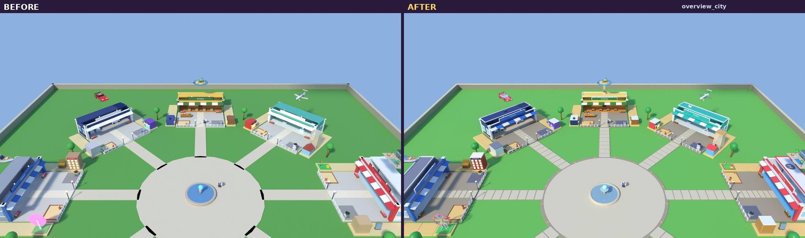

**A workplace through the game's own camera**

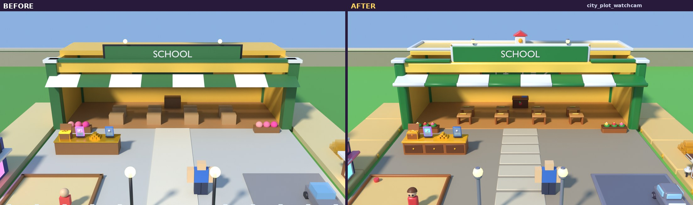

**What a player sees, standing on the plaza**

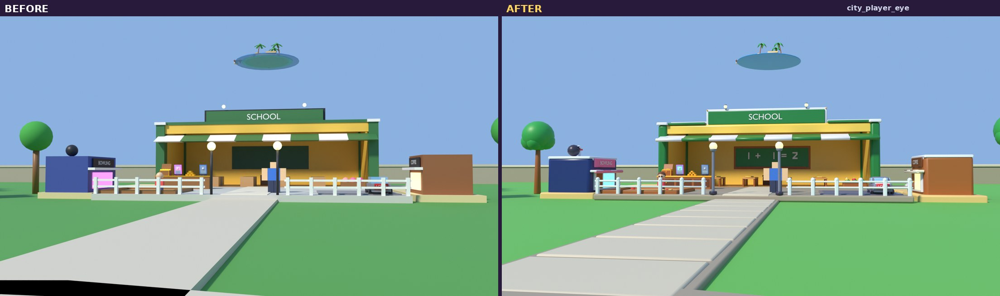

**The lobby**

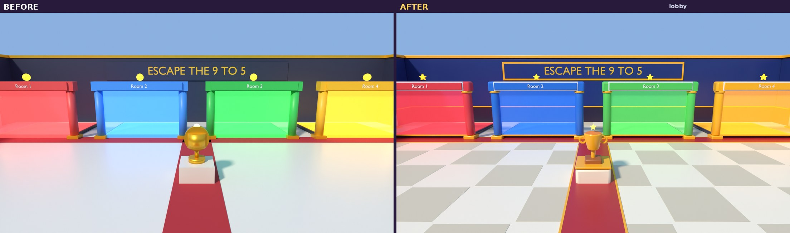

**The auction room**

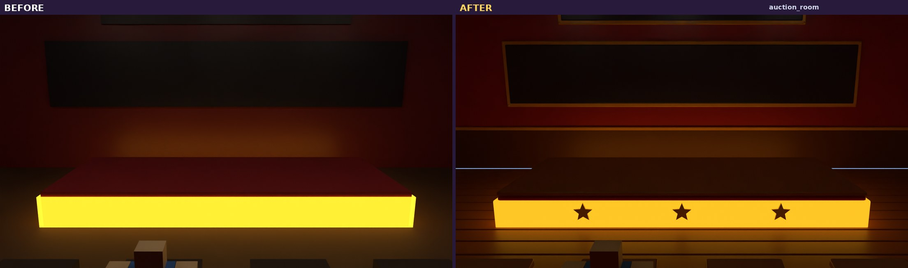

**The podium room**

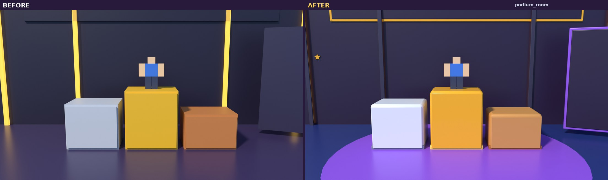

**The whole world (lobby + 4 cities)**

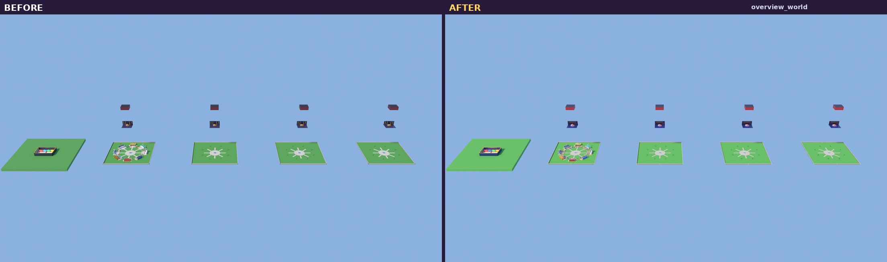

### Every object type, category by category (before | after)

- [buildings_1](renders/compare/lineup_buildings_1.jpg)
- [buildings_2](renders/compare/lineup_buildings_2.jpg)
- [buildings_3](renders/compare/lineup_buildings_3.jpg)
- [decoration_1](renders/compare/lineup_decoration_1.jpg)
- [decoration_2](renders/compare/lineup_decoration_2.jpg)
- [ground_1](renders/compare/lineup_ground_1.jpg)
- [ground_2](renders/compare/lineup_ground_2.jpg)
- [nature_1](renders/compare/lineup_nature_1.jpg)
- [nature_2](renders/compare/lineup_nature_2.jpg)
- [props_1](renders/compare/lineup_props_1.jpg)
- [props_2](renders/compare/lineup_props_2.jpg)
- [props_3](renders/compare/lineup_props_3.jpg)
- [props_4](renders/compare/lineup_props_4.jpg)
- [props_5](renders/compare/lineup_props_5.jpg)
- [signs_1](renders/compare/lineup_signs_1.jpg)
- [signs_2](renders/compare/lineup_signs_2.jpg)
- [vehicles_1](renders/compare/lineup_vehicles_1.jpg)
- [vehicles_2](renders/compare/lineup_vehicles_2.jpg)

## All models at a glance (contact sheet)

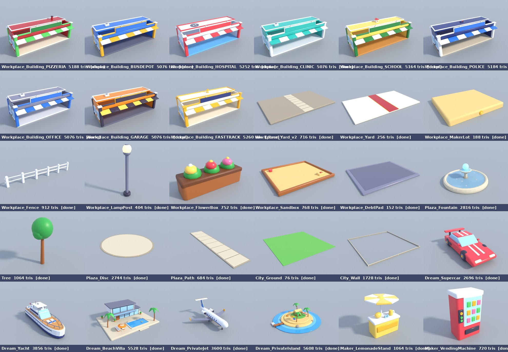

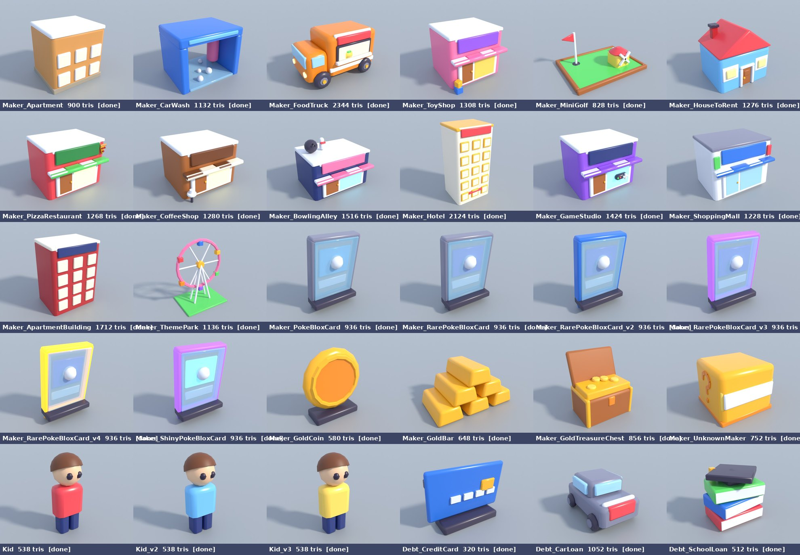

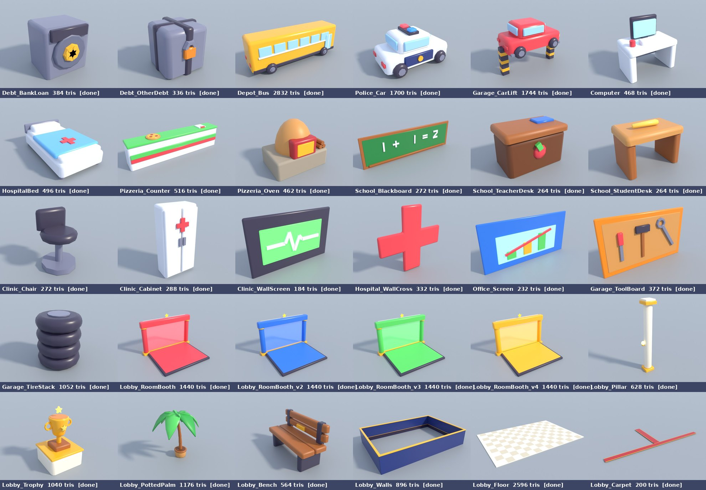

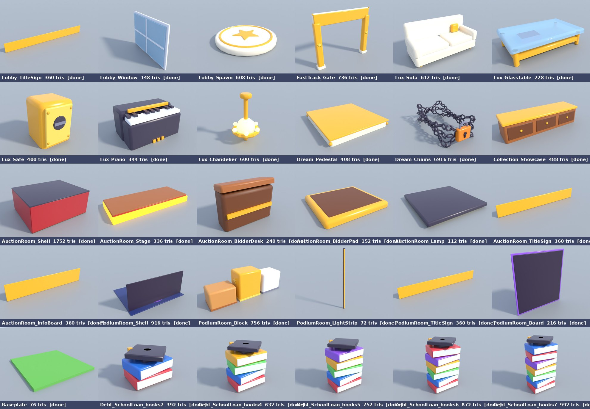

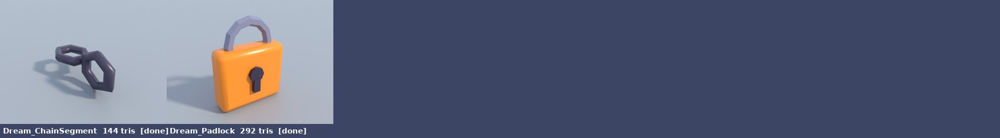

Each model also has 3 renders (front 3/4, back 3/4, eye level with a 5-stud player) in `renders/objects/<name>/`.

## Decisions I need from you

1. **Outline or no outline?** The world has no outline (the icons have one). One building with and without an outline is in `renders/outline_comparison.png`. An outline doubles the triangles of every model and Roblox has no cheap way to draw it, so I recommend: no outline.
2. **Chains on the locked dream.** The game builds them link by link in code. I made one finished chain model AND two kit pieces (one link, the padlock) - see DECISIONS #15. Which one do you want to use?
3. **Lit windows.** Workplace and Money Maker windows that were Neon in the game are still Neon (warm yellow). In bright daylight they look almost white. Keep them glowing, or switch them to the shiny blue WINDOW color (the icon look)?
4. **FOR SALE copies.** The game makes every part of a FOR SALE Money Maker see-through ForceField. The new meshes will get the same treatment automatically (they are BaseParts inside the same Model). Check in Studio that the ForceField look on a textured mesh is what you want (it shows the texture's colors, not one flat color).
5. **Bounding boxes.** Every new mesh stays within 0.15 studs of the original box, except: `Clinic_WallScreen` (wall board, details stand up to 0.24 out from the wall), `Dream_BeachVilla` (0.22 shallower at the front), `Dream_Chains` (chunky links, up to 0.48 out), `Garage_ToolBoard` (wall board, details stand up to 0.30 out from the wall), `Lobby_Carpet` (0.2 deeper, hidden in the floor), `Office_Screen` (wall board, details stand up to 0.25 out from the wall), `School_Blackboard` (wall board, details stand up to 0.28 out from the wall). The game measures some models with `GetBoundingBox` (Money Maker stacking, labels, tutorial arrow), so a 0.1 stud difference can move a label by 0.1 stud. Is that close enough, or do you want those exact?
6. **Text.** All words stay on the old parts (now invisible), so prices and names still update. The new sign boards were made to sit right behind that text. Please look at one sign in Studio to check the text is not hidden or floating.
7. **Texture size.** The whole world uses ONE 256 x 128 palette texture (32 flat color swatches; every face samples the middle of one swatch). If the colors bleed into each other on low-end phones, use the same image scaled 4x with nearest-neighbour (1024 x 512): the UVs stay the same. Keep it small, or go 4x?

## What I could not do

- **No Blender window and no Blender MCP connection** were available in this cloud session, and Blender downloads were blocked. I used Blender 5.0.1 as a Python module (same engine, no window) and drove everything with scripts (`tools/blender/`). You can open every `.blend` in normal Blender.
- **No place file with the world in it.** The world is made by the game's Luau code while it runs, so I ran that code on a small copy of the Roblox engine to get every part (DECISIONS #2-#3). Things that only exist during a game (workplaces, Money Makers, debts, dreams) come from a mid-game snapshot I set up.
- **Nothing was tested inside Roblox Studio** (no Studio here, and I was not allowed to upload). Renders are from Blender with lighting similar to the game; Studio's Future lighting will look a bit different.
- **Words on signs** are drawn in the renders as simple 3D text so the pictures make sense; in the game the real SurfaceGui text stays on the old parts.
- **Particle effects, sounds, UI and the players' avatars** are not part of this overhaul. The ball and chain on a player's leg (`DebtChain.luau`) is a physics object attached to the character during a match; it is not part of the world and was left as it is.
- **The swap itself was not run** (not allowed tonight). What I could check without Studio: the generated `WorldSkin` modules compile with the Luau compiler, and the placement lists reproduce all 35 places the game builds exactly (`tools/verify_placements.py`).

## Every object type

`template` = one model (variants in color or size count separately, see INVENTORY.md). *Script-referenced* = some game script finds it by name, measures it or changes it; those keep the original names and boxes exactly, see `data/script_refs.json` for the evidence.

| # | template | category | copies | status | triangles / budget | script-referenced | file |
|---|---|---|---|---|---|---|---|
| 1 | Workplace_Building_PIZZERIA | buildings | 1 | done | 5188 / 6000 |  | [fbx](export/buildings/Workplace_Building_PIZZERIA.fbx) |
| 2 | Workplace_Building_BUSDEPOT | buildings | 1 | done | 5076 / 6000 |  | [fbx](export/buildings/Workplace_Building_BUSDEPOT.fbx) |
| 3 | Workplace_Building_HOSPITAL | buildings | 1 | done | 5252 / 6000 |  | [fbx](export/buildings/Workplace_Building_HOSPITAL.fbx) |
| 4 | Workplace_Building_CLINIC | buildings | 1 | done | 5076 / 6000 |  | [fbx](export/buildings/Workplace_Building_CLINIC.fbx) |
| 5 | Workplace_Building_SCHOOL | buildings | 1 | done | 5164 / 6000 |  | [fbx](export/buildings/Workplace_Building_SCHOOL.fbx) |
| 6 | Workplace_Building_POLICE | buildings | 1 | done | 5184 / 6000 |  | [fbx](export/buildings/Workplace_Building_POLICE.fbx) |
| 7 | Workplace_Building_OFFICE | buildings | 1 | done | 5076 / 6000 |  | [fbx](export/buildings/Workplace_Building_OFFICE.fbx) |
| 8 | Workplace_Building_GARAGE | buildings | 1 | done | 5076 / 6000 |  | [fbx](export/buildings/Workplace_Building_GARAGE.fbx) |
| 9 | Workplace_Building_FASTTRACK | buildings | 2 | done | 5260 / 6000 |  | [fbx](export/buildings/Workplace_Building_FASTTRACK.fbx) |
| 10 | Workplace_Yard_v2 | ground | 8 | done | 716 / 1500 |  | [fbx](export/ground/Workplace_Yard_v2.fbx) |
| 11 | Workplace_Yard | ground | 2 | done | 256 / 1500 | yes | [fbx](export/ground/Workplace_Yard.fbx) |
| 12 | Workplace_MakerLot | ground | 80 | done | 188 / 1500 | yes | [fbx](export/ground/Workplace_MakerLot.fbx) |
| 13 | Workplace_Fence | decoration | 20 | done | 912 / 1500 | yes | [fbx](export/decoration/Workplace_Fence.fbx) |
| 14 | Workplace_LampPost | decoration | 20 | done | 404 / 1500 | yes | [fbx](export/decoration/Workplace_LampPost.fbx) |
| 15 | Workplace_FlowerBox | decoration | 20 | done | 752 / 1500 | yes | [fbx](export/decoration/Workplace_FlowerBox.fbx) |
| 16 | Workplace_Sandbox | props | 10 | done | 768 / 1500 | yes | [fbx](export/props/Workplace_Sandbox.fbx) |
| 17 | Workplace_DebtPad | ground | 8 | done | 152 / 1500 | yes | [fbx](export/ground/Workplace_DebtPad.fbx) |
| 18 | Plaza_Fountain | decoration | 4 | done | 2816 / 6000 |  | [fbx](export/decoration/Plaza_Fountain.fbx) |
| 19 | Tree | nature | 32 | done | 1064 / 1500 |  | [fbx](export/nature/Tree.fbx) |
| 20 | Plaza_Disc | ground | 4 | done | 2744 / 6000 |  | [fbx](export/ground/Plaza_Disc.fbx) |
| 21 | Plaza_Path | ground | 32 | done | 684 / 1500 |  | [fbx](export/ground/Plaza_Path.fbx) |
| 22 | City_Ground | ground | 4 | done | 76 / 1500 |  | [fbx](export/ground/City_Ground.fbx) |
| 23 | City_Wall | decoration | 4 | done | 1728 / 6000 |  | [fbx](export/decoration/City_Wall.fbx) |
| 24 | Dream_Supercar | vehicles | 4 | done | 2696 / 4000 | yes | [fbx](export/vehicles/Supercar.fbx) |
| 25 | Dream_Yacht | vehicles | 4 | done | 3856 / 4000 | yes | [fbx](export/vehicles/Yacht.fbx) |
| 26 | Dream_BeachVilla | buildings | 3 | done | 5528 / 6000 | yes | [fbx](export/buildings/BeachVilla.fbx) |
| 27 | Dream_PrivateJet | vehicles | 2 | done | 3600 / 4000 | yes | [fbx](export/vehicles/PrivateJet.fbx) |
| 28 | Dream_PrivateIsland | nature | 2 | done | 5608 / 6000 | yes | [fbx](export/nature/PrivateIsland.fbx) |
| 29 | Maker_LemonadeStand | props | 3 | done | 1064 / 1500 | yes | [fbx](export/props/Lemonade%20Stand.fbx) |
| 30 | Maker_VendingMachine | props | 3 | done | 720 / 1500 | yes | [fbx](export/props/Vending%20Machine.fbx) |
| 31 | Maker_Apartment | buildings | 2 | done | 900 / 6000 | yes | [fbx](export/buildings/Apartment.fbx) |
| 32 | Maker_CarWash | buildings | 4 | done | 1132 / 6000 | yes | [fbx](export/buildings/Car%20Wash.fbx) |
| 33 | Maker_FoodTruck | vehicles | 2 | done | 2344 / 4000 | yes | [fbx](export/vehicles/Food%20Truck.fbx) |
| 34 | Maker_ToyShop | buildings | 2 | done | 1308 / 6000 | yes | [fbx](export/buildings/Toy%20Shop.fbx) |
| 35 | Maker_MiniGolf | props | 2 | done | 828 / 1500 | yes | [fbx](export/props/Mini%20Golf.fbx) |
| 36 | Maker_HouseToRent | buildings | 2 | done | 1276 / 6000 | yes | [fbx](export/buildings/House%20to%20Rent.fbx) |
| 37 | Maker_PizzaRestaurant | buildings | 2 | done | 1268 / 6000 | yes | [fbx](export/buildings/Pizza%20Restaurant.fbx) |
| 38 | Maker_CoffeeShop | buildings | 2 | done | 1280 / 6000 | yes | [fbx](export/buildings/Coffee%20Shop.fbx) |
| 39 | Maker_BowlingAlley | buildings | 2 | done | 1516 / 6000 | yes | [fbx](export/buildings/Bowling%20Alley.fbx) |
| 40 | Maker_Hotel | buildings | 2 | done | 2124 / 6000 | yes | [fbx](export/buildings/Hotel.fbx) |
| 41 | Maker_GameStudio | buildings | 2 | done | 1424 / 6000 | yes | [fbx](export/buildings/Game%20Studio.fbx) |
| 42 | Maker_ShoppingMall | buildings | 2 | done | 1228 / 6000 | yes | [fbx](export/buildings/Shopping%20Mall.fbx) |
| 43 | Maker_ApartmentBuilding | buildings | 2 | done | 1712 / 6000 | yes | [fbx](export/buildings/Apartment%20Building.fbx) |
| 44 | Maker_ThemePark | props | 2 | done | 1136 / 3000 | yes | [fbx](export/props/Theme%20Park.fbx) |
| 45 | Maker_PokeBloxCard | props | 4 | done | 936 / 1500 | yes | [fbx](export/props/PokeBlox%20Card.fbx) |
| 46 | Maker_RarePokeBloxCard | props | 2 | done | 936 / 1500 | yes | [fbx](export/props/Rare%20PokeBlox%20Card.fbx) |
| 47 | Maker_RarePokeBloxCard_v2 | props | 3 | done | 936 / 1500 |  | [fbx](export/props/Rare%20PokeBlox%20Card%20(case%202).fbx) |
| 48 | Maker_RarePokeBloxCard_v3 | props | 1 | done | 936 / 1500 |  | [fbx](export/props/Rare%20PokeBlox%20Card%20(case%203).fbx) |
| 49 | Maker_RarePokeBloxCard_v4 | props | 1 | done | 936 / 1500 |  | [fbx](export/props/Rare%20PokeBlox%20Card%20(case%204).fbx) |
| 50 | Maker_ShinyPokeBloxCard | props | 3 | done | 936 / 1500 | yes | [fbx](export/props/Shiny%20PokeBlox%20Card.fbx) |
| 51 | Maker_GoldCoin | props | 5 | done | 580 / 1500 | yes | [fbx](export/props/Gold%20Coin.fbx) |
| 52 | Maker_GoldBar | props | 3 | done | 648 / 1500 | yes | [fbx](export/props/Gold%20Bar.fbx) |
| 53 | Maker_GoldTreasureChest | props | 3 | done | 856 / 1500 | yes | [fbx](export/props/Gold%20Treasure%20Chest.fbx) |
| 54 | Maker_UnknownMaker | props | 1 | done | 752 / 1500 | yes | [fbx](export/props/Unknown%20Maker.fbx) |
| 55 | Kid | props | 8 | done | 538 / 1500 | yes | [fbx](export/props/Kid.fbx) |
| 56 | Kid_v2 | props | 4 | done | 538 / 1500 |  | [fbx](export/props/Kid%20(blue).fbx) |
| 57 | Kid_v3 | props | 1 | done | 538 / 1500 |  | [fbx](export/props/Kid%20(yellow).fbx) |
| 58 | Debt_CreditCard | props | 2 | done | 320 / 1500 | yes | [fbx](export/props/Credit%20Card.fbx) |
| 59 | Debt_CarLoan | props | 2 | done | 1052 / 1500 | yes | [fbx](export/props/Car%20Loan.fbx) |
| 60 | Debt_SchoolLoan | props | 2 | done | 512 / 1500 | yes | [fbx](export/props/School%20Loan.fbx) |
| 61 | Debt_BankLoan | props | 1 | done | 384 / 1500 | yes | [fbx](export/props/Bank%20Loan.fbx) |
| 62 | Debt_OtherDebt | props | 1 | done | 336 / 1500 | yes | [fbx](export/props/Debt%20Crate.fbx) |
| 63 | Depot_Bus | vehicles | 1 | done | 2832 / 4000 |  | [fbx](export/vehicles/Depot_Bus.fbx) |
| 64 | Police_Car | vehicles | 1 | done | 1700 / 4000 |  | [fbx](export/vehicles/Police_Car.fbx) |
| 65 | Garage_CarLift | vehicles | 1 | done | 1744 / 4000 |  | [fbx](export/vehicles/Garage_CarLift.fbx) |
| 66 | Computer | props | 7 | done | 468 / 1500 |  | [fbx](export/props/Computer.fbx) |
| 67 | HospitalBed | props | 4 | done | 496 / 1500 |  | [fbx](export/props/HospitalBed.fbx) |
| 68 | Pizzeria_Counter | props | 1 | done | 516 / 1500 |  | [fbx](export/props/Pizzeria_Counter.fbx) |
| 69 | Pizzeria_Oven | props | 1 | done | 462 / 1500 |  | [fbx](export/props/Pizzeria_Oven.fbx) |
| 70 | School_Blackboard | decoration | 1 | done | 272 / 1500 |  | [fbx](export/decoration/School_Blackboard.fbx) |
| 71 | School_TeacherDesk | props | 1 | done | 264 / 1500 |  | [fbx](export/props/School_TeacherDesk.fbx) |
| 72 | School_StudentDesk | props | 8 | done | 264 / 1500 |  | [fbx](export/props/School_StudentDesk.fbx) |
| 73 | Clinic_Chair | props | 1 | done | 272 / 1500 |  | [fbx](export/props/Clinic_Chair.fbx) |
| 74 | Clinic_Cabinet | props | 1 | done | 288 / 1500 |  | [fbx](export/props/Clinic_Cabinet.fbx) |
| 75 | Clinic_WallScreen | decoration | 1 | done | 184 / 1500 |  | [fbx](export/decoration/Clinic_WallScreen.fbx) |
| 76 | Hospital_WallCross | decoration | 1 | done | 332 / 1500 |  | [fbx](export/decoration/Hospital_WallCross.fbx) |
| 77 | Office_Screen | decoration | 1 | done | 232 / 1500 |  | [fbx](export/decoration/Office_Screen.fbx) |
| 78 | Garage_ToolBoard | decoration | 1 | done | 372 / 1500 |  | [fbx](export/decoration/Garage_ToolBoard.fbx) |
| 79 | Garage_TireStack | props | 1 | done | 1052 / 1500 |  | [fbx](export/props/Garage_TireStack.fbx) |
| 80 | Lobby_RoomBooth | buildings | 1 | done | 1440 / 6000 | yes | [fbx](export/buildings/Lobby_RoomBooth.fbx) |
| 81 | Lobby_RoomBooth_v2 | buildings | 1 | done | 1440 / 6000 |  | [fbx](export/buildings/Lobby_RoomBooth_v2.fbx) |
| 82 | Lobby_RoomBooth_v3 | buildings | 1 | done | 1440 / 6000 |  | [fbx](export/buildings/Lobby_RoomBooth_v3.fbx) |
| 83 | Lobby_RoomBooth_v4 | buildings | 1 | done | 1440 / 6000 |  | [fbx](export/buildings/Lobby_RoomBooth_v4.fbx) |
| 84 | Lobby_Pillar | decoration | 8 | done | 628 / 1500 |  | [fbx](export/decoration/Lobby_Pillar.fbx) |
| 85 | Lobby_Trophy | props | 1 | done | 1040 / 1500 |  | [fbx](export/props/Lobby_Trophy.fbx) |
| 86 | Lobby_PottedPalm | nature | 2 | done | 1176 / 1500 |  | [fbx](export/nature/Lobby_PottedPalm.fbx) |
| 87 | Lobby_Bench | props | 4 | done | 564 / 1500 |  | [fbx](export/props/Lobby_Bench.fbx) |
| 88 | Lobby_Walls | buildings | 1 | done | 896 / 6000 |  | [fbx](export/buildings/Lobby_Walls.fbx) |
| 89 | Lobby_Floor | ground | 1 | done | 2596 / 6000 |  | [fbx](export/ground/Lobby_Floor.fbx) |
| 90 | Lobby_Carpet | ground | 1 | done | 200 / 1500 |  | [fbx](export/ground/Lobby_Carpet.fbx) |
| 91 | Lobby_TitleSign | signs | 1 | done | 360 / 1500 |  | [fbx](export/signs/Lobby_TitleSign.fbx) |
| 92 | Lobby_Window | buildings | 6 | done | 148 / 6000 |  | [fbx](export/buildings/Lobby_Window.fbx) |
| 93 | Lobby_Spawn | ground | 1 | done | 608 / 1500 | yes | [fbx](export/ground/Lobby_Spawn.fbx) |
| 94 | FastTrack_Gate | decoration | 2 | done | 736 / 1500 |  | [fbx](export/decoration/FastTrack_Gate.fbx) |
| 95 | Lux_Sofa | props | 4 | done | 612 / 1500 |  | [fbx](export/props/Lux_Sofa.fbx) |
| 96 | Lux_GlassTable | props | 2 | done | 228 / 1500 |  | [fbx](export/props/Lux_GlassTable.fbx) |
| 97 | Lux_Safe | props | 2 | done | 400 / 1500 |  | [fbx](export/props/Lux_Safe.fbx) |
| 98 | Lux_Piano | props | 2 | done | 344 / 1500 |  | [fbx](export/props/Lux_Piano.fbx) |
| 99 | Lux_Chandelier | decoration | 2 | done | 600 / 1500 |  | [fbx](export/decoration/Lux_Chandelier.fbx) |
| 100 | Dream_Pedestal | props | 2 | done | 408 / 1500 |  | [fbx](export/props/Dream_Pedestal.fbx) |
| 101 | Dream_Chains | props | 1 | done | 6916 / 8000 |  | [fbx](export/props/Dream_Chains.fbx) |
| 102 | Collection_Showcase | props | 3 | done | 488 / 1500 |  | [fbx](export/props/Collection_Showcase.fbx) |
| 103 | AuctionRoom_Shell | buildings | 4 | done | 1752 / 6000 |  | [fbx](export/buildings/AuctionRoom_Shell.fbx) |
| 104 | AuctionRoom_Stage | props | 4 | done | 336 / 1500 |  | [fbx](export/props/AuctionRoom_Stage.fbx) |
| 105 | AuctionRoom_BidderDesk | props | 32 | done | 240 / 1500 | yes | [fbx](export/props/AuctionRoom_BidderDesk.fbx) |
| 106 | AuctionRoom_BidderPad | ground | 32 | done | 152 / 1500 |  | [fbx](export/ground/AuctionRoom_BidderPad.fbx) |
| 107 | AuctionRoom_Lamp | decoration | 12 | done | 112 / 1500 |  | [fbx](export/decoration/AuctionRoom_Lamp.fbx) |
| 108 | AuctionRoom_TitleSign | signs | 4 | done | 360 / 1500 |  | [fbx](export/signs/AuctionRoom_TitleSign.fbx) |
| 109 | AuctionRoom_InfoBoard | signs | 4 | done | 360 / 1500 | yes | [fbx](export/signs/AuctionRoom_InfoBoard.fbx) |
| 110 | PodiumRoom_Shell | buildings | 4 | done | 916 / 6000 |  | [fbx](export/buildings/PodiumRoom_Shell.fbx) |
| 111 | PodiumRoom_Block | props | 4 | done | 756 / 1500 | yes | [fbx](export/props/PodiumRoom_Block.fbx) |
| 112 | PodiumRoom_LightStrip | decoration | 16 | done | 72 / 1500 |  | [fbx](export/decoration/PodiumRoom_LightStrip.fbx) |
| 113 | PodiumRoom_TitleSign | signs | 4 | done | 360 / 1500 | yes | [fbx](export/signs/PodiumRoom_TitleSign.fbx) |
| 114 | PodiumRoom_Board | signs | 4 | done | 216 / 1500 | yes | [fbx](export/signs/PodiumRoom_Board.fbx) |
| 115 | Baseplate | ground | 1 | done | 76 / 1500 | yes | [fbx](export/ground/Baseplate.fbx) |
| 116 | Debt_BankLoan_v2 | props | 1 | uses Debt_BankLoan | 384 |  | [fbx](export/props/Bank%20Loan.fbx) |
| 117 | Debt_CarLoan_v2 | props | 1 | uses Debt_CarLoan | 1052 |  | [fbx](export/props/Car%20Loan.fbx) |
| 118 | Debt_CarLoan_v3 | props | 1 | uses Debt_CarLoan | 1052 |  | [fbx](export/props/Car%20Loan.fbx) |
| 119 | Debt_CarLoan_v4 | props | 1 | uses Debt_CarLoan | 1052 |  | [fbx](export/props/Car%20Loan.fbx) |
| 120 | Debt_CreditCard_v2 | props | 1 | uses Debt_CreditCard | 320 |  | [fbx](export/props/Credit%20Card.fbx) |
| 121 | Debt_CreditCard_v3 | props | 1 | uses Debt_CreditCard | 320 |  | [fbx](export/props/Credit%20Card.fbx) |
| 122 | Debt_OtherDebt_v2 | props | 1 | uses Debt_OtherDebt | 336 |  | [fbx](export/props/Debt%20Crate.fbx) |
| 123 | Debt_SchoolLoan_v2 | props | 2 | uses Debt_SchoolLoan | 512 |  | [fbx](export/props/School%20Loan.fbx) |
| 124 | Debt_SchoolLoan_v3 | props | 1 | uses Debt_SchoolLoan | 512 |  | [fbx](export/props/School%20Loan.fbx) |
| 125 | Lobby_PottedPalm_v2 | nature | 2 | uses Lobby_PottedPalm | 1176 |  | [fbx](export/nature/Lobby_PottedPalm.fbx) |

Extra meshes (kit pieces and size steps the game builds in code): `Debt_SchoolLoan_books2` (392 tris), `Debt_SchoolLoan_books4` (632 tris), `Debt_SchoolLoan_books5` (752 tris), `Debt_SchoolLoan_books6` (872 tris), `Debt_SchoolLoan_books7` (992 tris), `Dream_ChainSegment` (144 tris), `Dream_Padlock` (292 tris).

## Where things are

| what | where |
|---|---|
| style rules, palette, kit, budgets, Roblox settings | `STYLE_GUIDE.md` |
| list of every object in the world | `INVENTORY.md`, `data/objects.csv` |
| how to swap the new models in (not executed) | `IMPORT_PLAN.md` |
| my decisions | `DECISIONS.md` |
| progress log | `PROGRESS.md` |
| FBX files | `export/<category>/<name>.fbx` |
| Blender files (one per category, plus before/after scenes) | `blend/` |
| renders | `renders/before`, `renders/after`, `renders/compare`, `renders/objects` |
| all scripts (re-run everything) | `tools/` |

