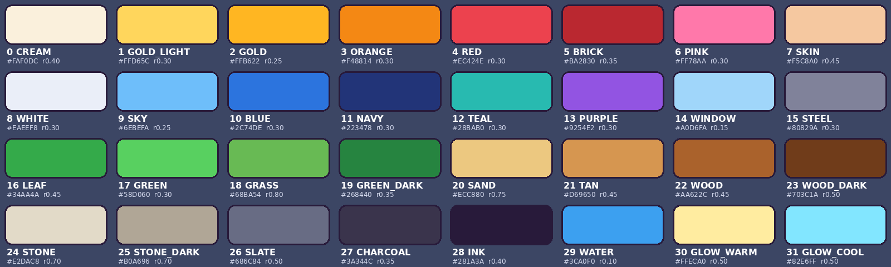

# Style guide - the world of Rags to Riches

Every object in the world follows this page. If a rule turns out to be impossible, it is changed **here**,
the reason goes into the change log at the bottom, and models that were already made are checked again.

## 1. The look in one paragraph

The world must look like the new 3D icons (`assets/icons_3d/_sheet.png`) grew up into a town: **chunky toys**.
Few, big, rounded shapes. Thick parts. Glossy, bright, saturated plastic colors from one small palette. Soft
shading, no textures with detail, no noise, no realism. Proportions a little exaggerated (thick trims, big wheels,
fat roofs, round trees). Every object gets one or two small deliberate details that make it feel hand-made.
One artist, one rulebook: the same window, door, wheel, lamp and plant everywhere.

## 2. Palette (one texture for the whole world)

- `palette/palette_color.png` (256 x 128 px): 8 x 4 swatches, 32 x 32 px each. **Every model uses only this
  texture.** Every face has its UVs on the **center** of one swatch, so colors stay exact even when Roblox
  shrinks the texture on phones (each swatch is still a solid color down to 8 x 4 px).
- `palette/palette_roughness.png`: same layout, gloss per color (plastic 0.25-0.45, ground 0.7-0.8 so big
  floors never shine). `palette/palette.json` has every name, RGB, roughness and UV.
- 30 surface colors + 2 glow colors. The colors are the icon colors (`icon_defs.py`: GOLD, GOLD_LIGHT,
  GOLD_ORANGE, RED, SIGN_RED, SKY, BOOK_BLUE, NAVY, LEAF_GREEN, GREEN, GREEN_DARK, SAND, WOOD, WOOD_DARK,
  STEEL, TYRE/DARK, OUTLINE, WATER, WINDOW_LIGHT...) plus a few the world needs (GRASS, STONE, STONE_DARK, TEAL,
  PURPLE, CREAM). The brief said "about 24"; I needed 30 because the 9 workplaces must each have their own
  clearly different wall color (that is how players find each other) - see DECISIONS.md.
- **No other colors. No default grey.** A color that is not in `palette.json` makes the build fail.
- Glow colors (`GLOW_WARM`, `GLOW_COOL`) are only used on glowing parts, which are separate meshes with
  `Material = Neon` in Roblox (Neon ignores textures).
- Never pure white or pure black: WHITE is a cool off-white, INK is a dark purple-navy (same as the icon outline).

### Color roles (so the same thing is always the same color)

| role | color |
|---|---|
| money, trophies, gold trim, Money Makers' accents | GOLD (GOLD_LIGHT for highlights) |
| debt | SLATE / STEEL (grey, like the game's "Debt = grey" rule) |
| Free Money / good | GREEN |
| windows | WINDOW panes in a WHITE frame |
| doors | WOOD with a GOLD knob |
| roofs | RED or SLATE, or the theme accent |
| ground: grass / paths / yard | GRASS / STONE / STONE_DARK |
| tires, openings, screens (off) | CHARCOAL |
| lamps | GLOW_WARM bulb on a STEEL post |

### Workplace themes (wall / accent / floor)

| job | wall | accent | floor |
|---|---|---|---|
| Pizza Cook (PIZZERIA) | BRICK | GREEN | CREAM |
| Bus Driver (BUS DEPOT) | BLUE | GOLD | SLATE |
| Nurse (HOSPITAL) | WHITE | RED | SKY |
| Doctor (CLINIC) | TEAL | WHITE | WHITE |
| Teacher (SCHOOL) | GOLD_LIGHT | GREEN_DARK | TAN |
| Police Officer (POLICE) | NAVY | WHITE | STONE |
| Engineer (OFFICE) | STEEL | BLUE | WHITE |
| Mechanic (GARAGE) | ORANGE | CHARCOAL | SLATE |
| Fast Track (escaped) | CREAM | GOLD | CREAM |

These follow the game's own theme colors (`Themes.luau`), moved to the nearest palette color.

## 3. Shape language

### One bevel scale, used everywhere

| name | radius | segments | used for |
|---|---|---|---|
| XS | 0.06 | 1 | only tiny inset details (screen glass, keyholes) |
| S | 0.12 | 2 | small props, trims, frames, signs, anything under ~1.5 studs |
| M | 0.25 | 2 | furniture, vehicles, props, posts, window/door frames |
| L | 0.5 | 3 | building walls, pillars, big blocks, roofs |
| XL | 0.9 | 3 | very big soft shapes: tree crowns' bases, big rounded roofs, fountain rims |

- **No sharp 90-degree edges.** Every box, cylinder rim and slab is beveled with one of these radii
  (the bevel can never be more than 45% of the piece's thinnest side, so thin parts stay solid).
- Rounded edges are smooth-shaded, flat faces stay flat ("hardened normals") - exactly the icon look.
- **Nothing thinner than 0.3 studs.** The kit refuses thinner pieces and logs them.
- Slightly exaggerated proportions: trims and frames 1.5x thicker than real, overhangs 0.5-1 stud,
  wheels big, tree crowns fat and round, legs short and thick.
- Round things are low-poly but smooth: cylinders 16-24 sides, spheres 16 x 10, so silhouettes stay round
  without wasting triangles.

## 4. Shared kit (built once, reused everywhere)

All in `tools/blender/kit.py` (primitives) and `tools/blender/parts.py` (kit parts). Models are written in
Roblox local coordinates, with the same numbers as the game code, so they fit the original exactly.

| kit part (`parts.py`) | what | used by |
|---|---|---|
| `window` | shiny pane in a thick rounded frame slab, optional sill / cross bars | workplaces, house, lobby windows |
| `door` | door with a raised panel, frame, gold knob, optional red doormat (its detail) | house, shops, booths |
| `stripes_awning` | striped rounded awning (theme accent + WHITE) | every workplace |
| `shop` | Money Maker shop: box with roof rim, window + door frame, 2-color awning, sign board | toy shop, coffee shop, bowling, game studio, mall, pizza restaurant |
| `tower` | Money Maker tower: lit window grid, roof rim, optional sign | hotel, apartments, apartment building |
| `sign_board` | rounded board in a frame; the game's SurfaceGui text stays on the old part right in front of it | every sign |
| `plus_sign` | a cross from 3 non-overlapping boxes | hospital bed, cabinet, blackboard sum |
| `pillar` | column with cap and base | lobby, rooms |
| `wheel` | fat CHARCOAL tire, STEEL hub, colored cap (stays inside the original wheel box) | every vehicle |
| `lamp_post`, `bulb` | STEEL post + glowing bulb with a cap | workplace lamps, lobby, auction room |
| `round_tree`, `bush`, `flower` | rounded plants | trees, flower boxes, villa |
| `palm`, `palm_leaf` | the icon palm (curved leaves, coconuts) | plaza, lobby palms, villa, island |
| `chunky_rail` | thick round rail | fences, railings, yacht |

Primitives (`kit.py`): `box`, `cyl`, `sphere`, `dome`, `torus`, `prism`, `wedge`, `capsule`, `stick`, `bar`, `custom`,
all with the shared bevel sizes, the 0.3 stud minimum thickness and palette UVs.

## 5. Scale (the player is 5 studs tall)

- A 5-stud dummy (`PlayerDummy_5studs`) stands next to every object in the eye-level render.
- Doors a player can walk through: at least 4.5 wide and 7 tall (the open front of the workplace is 46 wide).
- Counters, desks and tables at hand height: 2.5-4 studs (the game already uses these heights).
- Seats ~1.6-2 studs high, beds ~2, steps at most 1 stud.
- **Gameplay sizes never change**: every model keeps the original object's position, rotation, footprint and
  bounding box (checked automatically, tolerance 0.15 studs per side). Where the game puts something ON an
  object (stage top 3.0, pedestal top 1.8, showcase top 2.6, podium blocks), that height is kept exactly.

## 6. Detail rule

Each object gets **one or two** small, deliberate details that make it feel made by hand - never noise or
random clutter. Examples: a doormat at a door, a chimney cap, a flower box under a window, a bolt on a sign,
a little flag, a coin slot on a vending machine, a bow on a gift. The detail must read from the eye-level view
and must not change the silhouette from 50 studs away.

## 7. Budgets (Roblox limits, with sources)

| limit | value | source |
|---|---|---|
| triangles per mesh | **20,000 max** ("Individual meshes can not exceed 20,000 triangles") | [Roblox creator docs - mesh specifications](https://github.com/Roblox/creator-docs/blob/main/content/en-us/art/modeling/specifications.md) |
| texture size | up to 4096 x 4096; guidance 256 px for 5-stud objects, 1024 px for 20-stud objects; Roblox may downsample when many textures render | [Roblox creator docs - texture specifications](https://github.com/Roblox/creator-docs/blob/main/content/en-us/art/modeling/texture-specifications.md) |
| FBX from Blender | Transform > Apply Scalings: **FBX Unit Scale** (or Scale 0.01) | [Roblox creator docs - export requirements](https://github.com/Roblox/creator-docs/blob/main/content/en-us/art/modeling/export-requirements.md), [Blender page](https://github.com/Roblox/creator-docs/blob/main/content/en-us/art/blender.md) |
| importer scale | File Geometry > **Scale Unit = Stud** (no conversion) | [MeshScaleUnit enum](https://robloxapi.github.io/ref/enum/MeshScaleUnit.html) |
| axes | Blender is Z-up, Studio is Y-up; the FBX exporter converts (Forward -Z, Up Y) | [Roblox creator docs - Blender](https://github.com/Roblox/creator-docs/blob/main/content/en-us/art/blender.md) |
| collision cost | Box < Hull < Default < PreciseConvexDecomposition (most expensive) | [Roblox docs - meshes / CollisionFidelity](https://create.roblox.com/docs/en-us/parts/meshes) |

Our targets are far below the limits, because the game must run on phones:

| object type | triangle target |
|---|---|
| small props | < 1,500 |
| vehicles | < 4,000 |
| buildings | < 6,000 |
| the whole palette texture | 256 x 128 px, ONE texture for the entire world |

## 8. Outline

No outline in the world by default (the icons have one, but in 3D a black hull doubles triangles and looks
noisy at distance). One comparison render of one building WITH an inverted-hull outline (INK, 0.14 studs) is in
`renders/outline_comparison.png` so you can choose.

## 9. The glossy toy look in Roblox

- **MeshPart + SurfaceAppearance** on every body mesh: `ColorMap = palette_color.png`,
  `RoughnessMap = palette_roughness.png`, no normal map, no metalness map (plastic, metalness 0).
  The game already uses `Lighting.Technology = Future`, so the low roughness gives the shiny toy highlights.
- `MeshPart.Material = SmoothPlastic` (affects sounds/physics only; the look comes from SurfaceAppearance),
  `Reflectance = 0`.
- **Glow meshes** (`*_Glow_<COLOR>`): `Material = Neon`, `Color` = the glow color from `palette.json`,
  `Transparency = 0.35` (the game's own NEON_SOFTNESS), no SurfaceAppearance.
- **Glass meshes** (`*_Glass`): `Material = Glass`, `Color = WINDOW`, `Transparency = 0.3`.
- Fallback for very weak phones (only if needed): drop SurfaceAppearance and set `MeshPart.TextureID` to the
  same palette PNG - same colors, less gloss.

## 10. Collision per object type

The new meshes are **visual only**; the old Parts stay as the physical world, made invisible. That keeps every
collision, trigger and prompt exactly as it is today and makes switching back one flag.

| object type | new mesh | old parts |
|---|---|---|
| buildings, walls, floors, ground | `CanCollide = false`, `CanQuery = false`, `CanTouch = false`, `CollisionFidelity = Box` | kept, `Transparency = 1`, collide as before |
| props, furniture, Money Makers, debts | same as above | kept invisible; their prompt / click parts unchanged |
| vehicles, dreams | same as above | kept invisible (dreams already have `CanCollide = false`) |
| small details (< 6 cubic studs, like ModelKit's rule) | also `CastShadow = false` | |
| trigger parts (room platforms, buy buttons) | never replaced | unchanged |

## 11. Files, names, origins

- One FBX per model: `export/<category>/<name>.fbx`. `<name>` = the original Roblox name when the object is a
  named Model in the game (Money Makers, debts, dreams, `Kid`), otherwise the template name from `INVENTORY.md`.
- The FBX origin (0, 0, 0) **is the original object's frame** (`data/objects.json` -> `frame`): the model drops
  into the old position with the same rotation and no offset. Front = -Z in Roblox (+Y in Blender).
- Inside each FBX: `<name>` (body), optional `<name>_Glow_<COLOR>`, optional `<name>_Glass`.
- One `.blend` per category in `blend/`, saved after every finished model.

## 12. Review checklist (every model, max 3 fix rounds)

1. matches the icon style and this guide (palette only, bevels, chunky, 1-2 details)
2. reads clearly from 50 studs away
3. no floating parts, gaps, overlaps, z-fighting or flipped normals
4. no accidental symmetry errors (mirrored parts checked from the top view)
5. within triangle budget, one clean mesh per logical part (body / glow / glass)
6. same name, origin and bounding box as the original (automatic check)

## Change log

| when | rule | change | why |
|---|---|---|---|
| start | palette | 30 + 2 colors instead of "about 24" | 9 workplace themes need clearly different walls |
| modelling | glow colors | any palette color may glow (Neon); a transparency other than 0.35 is in the mesh name (`_T55`) | the game uses Neon in red, blue, green, orange and gold too |
| modelling | budgets | large structures have their own budget (DECISIONS #16) | a 368-stud wall is not a prop |
| modelling | round parts | the number of segments follows the size (small round things use fewer) | saves triangles where nobody can see them |
| modelling | min thickness | the 0.3 stud minimum also applies to round parts (cylinders, tori, spheres) | thin spokes flickered at distance |
| palette | STONE / STONE_DARK | darker and warmer than first drafted | the plaza and yards looked white and flat in the renders |
| modelling | windows | window panes are opaque shiny WINDOW color; only real glass cases are `_Glass` | see-through panes show empty boxes behind them |
| bbox | wall boards | tolerance 0.3 instead of 0.15 (DECISIONS #13) | 0.3 minimum thickness on 0.2 thick boards |
| kit | wheel | hub and cap stand out at most 0.13 from the tire | wheels stay inside the original wheel box |
| kit | plus_sign | crosses are built from non-overlapping pieces | coplanar overlaps z-fight |

